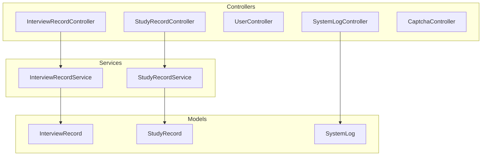
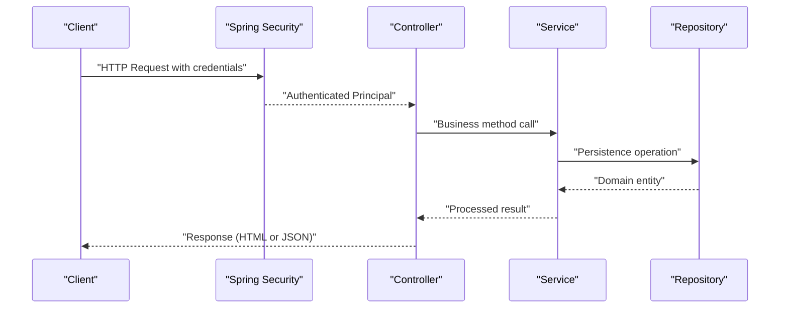
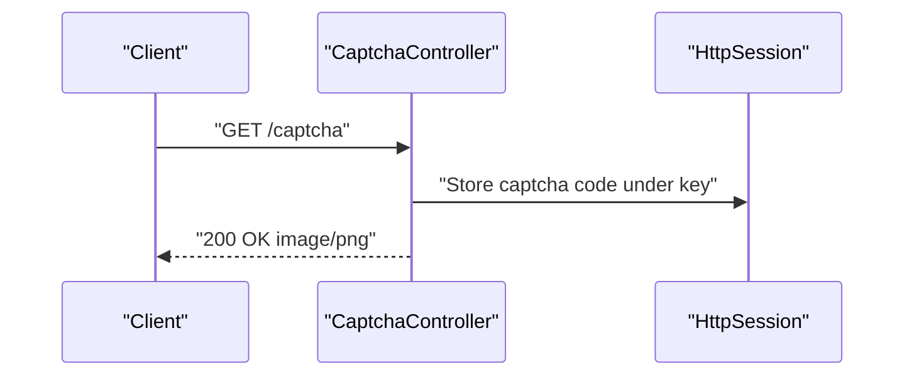
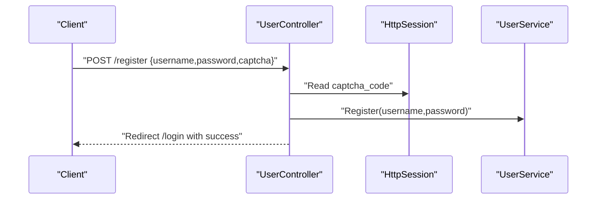
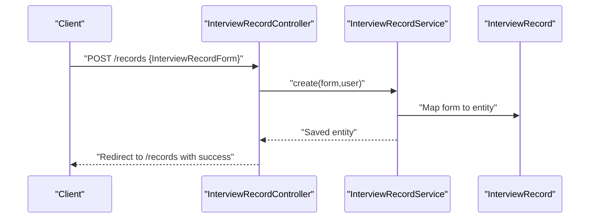
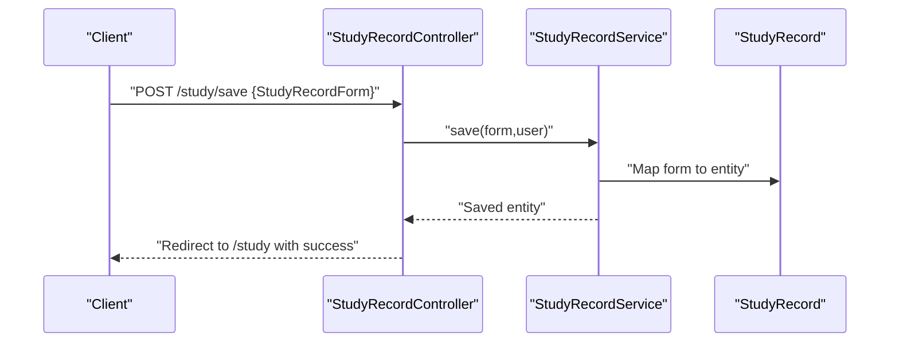
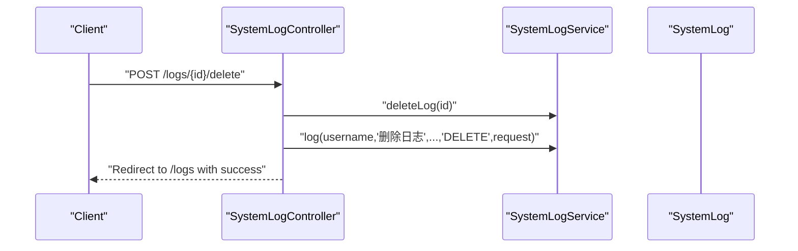
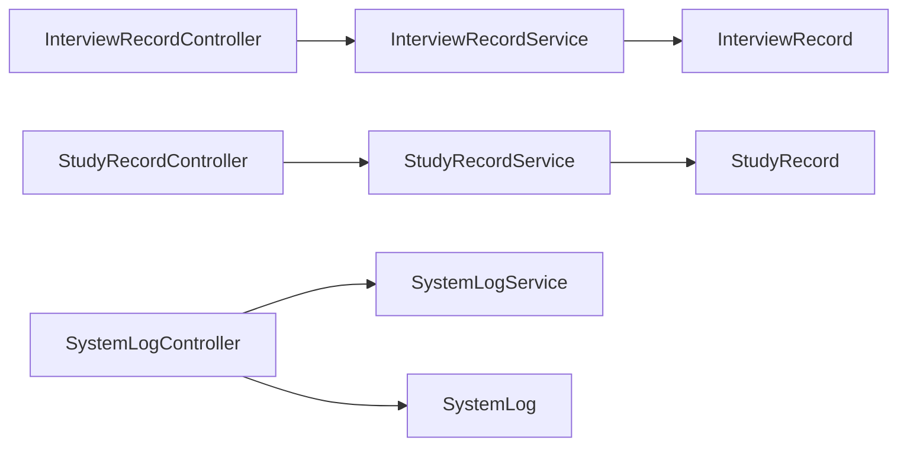

# API Reference

<cite>
**Referenced Files in This Document**
- [InterviewRecordController.java](file://src/main/java/com/wu/web/InterviewRecordController.java)
- [StudyRecordController.java](file://src/main/java/com/wu/web/StudyRecordController.java)
- [UserController.java](file://src/main/java/com/wu/web/UserController.java)
- [SystemLogController.java](file://src/main/java/com/wu/web/SystemLogController.java)
- [CaptchaController.java](file://src/main/java/com/wu/web/CaptchaController.java)
- [InterviewRecordForm.java](file://src/main/java/com/wu/web/dto/InterviewRecordForm.java)
- [StudyRecordForm.java](file://src/main/java/com/wu/web/dto/StudyRecordForm.java)
- [InterviewSearchForm.java](file://src/main/java/com/wu/web/dto/InterviewSearchForm.java)
- [StudySearchForm.java](file://src/main/java/com/wu/web/dto/StudySearchForm.java)
- [LogSearchForm.java](file://src/main/java/com/wu/web/dto/LogSearchForm.java)
- [InterviewRecord.java](file://src/main/java/com/wu/model/InterviewRecord.java)
- [StudyRecord.java](file://src/main/java/com/wu/model/StudyRecord.java)
- [SystemLog.java](file://src/main/java/com/wu/model/SystemLog.java)
- [InterviewRecordService.java](file://src/main/java/com/wu/service/InterviewRecordService.java)
- [StudyRecordService.java](file://src/main/java/com/wu/service/StudyRecordService.java)
- [SecurityConfig.java](file://src/main/java/com/wu/config/SecurityConfig.java)
- [application.properties](file://src/main/resources/application.properties)
</cite>

## Table of Contents
1. [Introduction](#introduction)
2. [Project Structure](#project-structure)
3. [Core Components](#core-components)
4. [Architecture Overview](#architecture-overview)
5. [Detailed Component Analysis](#detailed-component-analysis)
6. [Dependency Analysis](#dependency-analysis)
7. [Performance Considerations](#performance-considerations)
8. [Troubleshooting Guide](#troubleshooting-guide)
9. [Conclusion](#conclusion)
10. [Appendices](#appendices)

## Introduction
This document provides comprehensive API documentation for the REST endpoints exposed by the Interview Record Management System. It covers HTTP methods, URL patterns, request/response schemas, authentication requirements, error handling, and practical integration guidance. The system exposes controllers for managing Interview Records, Study Records, Users, System Logs, and Captcha generation. All endpoints are secured via Spring Security and require proper authentication for protected operations.

## Project Structure
The backend is a Spring MVC application with controllers under the web package, domain models under model, DTOs under web/dto, services under service, repositories under repo/repository, and configuration under config. Controllers expose endpoints grouped by resource, while services encapsulate business logic and repositories handle persistence.

**Diagram sources**
- [InterviewRecordController.java:28-167](file://src/main/java/com/wu/web/InterviewRecordController.java#L28-L167)
- [StudyRecordController.java:23-166](file://src/main/java/com/wu/web/StudyRecordController.java#L23-L166)
- [UserController.java:15-58](file://src/main/java/com/wu/web/UserController.java#L15-L58)
- [SystemLogController.java:21-111](file://src/main/java/com/wu/web/SystemLogController.java#L21-L111)
- [CaptchaController.java:12-28](file://src/main/java/com/wu/web/CaptchaController.java#L12-L28)
- [InterviewRecordService.java:19-153](file://src/main/java/com/wu/service/InterviewRecordService.java#L19-L153)
- [StudyRecordService.java:21-165](file://src/main/java/com/wu/service/StudyRecordService.java#L21-L165)
- [InterviewRecord.java:21-202](file://src/main/java/com/wu/model/InterviewRecord.java#L21-L202)
- [StudyRecord.java:9-188](file://src/main/java/com/wu/model/StudyRecord.java#L9-L188)
- [SystemLog.java:6-93](file://src/main/java/com/wu/model/SystemLog.java#L6-L93)

**Section sources**
- [InterviewRecordController.java:28-167](file://src/main/java/com/wu/web/InterviewRecordController.java#L28-L167)
- [StudyRecordController.java:23-166](file://src/main/java/com/wu/web/StudyRecordController.java#L23-L166)
- [UserController.java:15-58](file://src/main/java/com/wu/web/UserController.java#L15-L58)
- [SystemLogController.java:21-111](file://src/main/java/com/wu/web/SystemLogController.java#L21-L111)
- [CaptchaController.java:12-28](file://src/main/java/com/wu/web/CaptchaController.java#L12-L28)

## Core Components
- InterviewRecordController: Manages CRUD operations for interview records with search, create, update, delete, and detail views. Uses InterviewRecordForm and InterviewSearchForm DTOs.
- StudyRecordController: Manages CRUD operations for study records with search, create/edit forms, and detail views. Uses StudyRecordForm and StudySearchForm DTOs.
- UserController: Provides login and registration pages and handles registration with captcha verification.
- SystemLogController: Provides administrative log listing, deletion, and clearing old logs with role checks.
- CaptchaController: Generates image-based captcha and stores the expected code in the session.

**Section sources**
- [InterviewRecordController.java:28-167](file://src/main/java/com/wu/web/InterviewRecordController.java#L28-L167)
- [StudyRecordController.java:23-166](file://src/main/java/com/wu/web/StudyRecordController.java#L23-L166)
- [UserController.java:15-58](file://src/main/java/com/wu/web/UserController.java#L15-L58)
- [SystemLogController.java:21-111](file://src/main/java/com/wu/web/SystemLogController.java#L21-L111)
- [CaptchaController.java:12-28](file://src/main/java/com/wu/web/CaptchaController.java#L12-L28)

## Architecture Overview
The controllers delegate to services, which encapsulate business rules and interact with repositories. Authentication is enforced via Spring Security. Some endpoints are HTML-rendering controllers, while others are used by client applications.

**Diagram sources**
- [SecurityConfig.java](file://src/main/java/com/wu/config/SecurityConfig.java)
- [InterviewRecordController.java:40-167](file://src/main/java/com/wu/web/InterviewRecordController.java#L40-L167)
- [StudyRecordController.java:45-166](file://src/main/java/com/wu/web/StudyRecordController.java#L45-L166)
- [SystemLogController.java:36-111](file://src/main/java/com/wu/web/SystemLogController.java#L36-L111)
- [InterviewRecordService.java:28-153](file://src/main/java/com/wu/service/InterviewRecordService.java#L28-L153)
- [StudyRecordService.java:33-165](file://src/main/java/com/wu/service/StudyRecordService.java#L33-L165)

## Detailed Component Analysis

### Authentication and Authorization
- All endpoints require authentication. Administrative actions (e.g., log listing, deletion, clearing logs) additionally require admin user privileges.
- Authentication is managed by Spring Security. Session-based authentication is used for HTML flows; clients integrating via REST should use the same session or appropriate bearer tokens depending on configuration.

**Section sources**
- [SystemLogController.java:36-111](file://src/main/java/com/wu/web/SystemLogController.java#L36-L111)
- [SecurityConfig.java](file://src/main/java/com/wu/config/SecurityConfig.java)

### Captcha Endpoint
- Purpose: Generate a PNG image captcha and store the expected code in the HTTP session.
- URL: GET /captcha
- Response: 200 OK with image/png body; sets cache-control headers.
- Session storage key: captcha_code
- Usage: Call to retrieve image, then submit registration with matching captcha value.

**Diagram sources**
- [CaptchaController.java:17-27](file://src/main/java/com/wu/web/CaptchaController.java#L17-L27)

**Section sources**
- [CaptchaController.java:12-28](file://src/main/java/com/wu/web/CaptchaController.java#L12-L28)

### User Registration Endpoint
- Purpose: Register a new user after validating captcha stored in session.
- URL: POST /register
- Form parameters:
  - username: string
  - password: string
  - captcha: string
- Session key used: captcha_code
- Success: Redirects to login with success flash message.
- Errors: Redirects back to register with error flash message.

**Diagram sources**
- [UserController.java:36-57](file://src/main/java/com/wu/web/UserController.java#L36-L57)

**Section sources**
- [UserController.java:15-58](file://src/main/java/com/wu/web/UserController.java#L15-L58)

### Interview Records Endpoints
- Base path: /records
- Supported operations:
  - GET /records: List records with optional filters and sorting.
  - GET /records/new: Render creation form.
  - POST /records: Create a new record.
  - GET /records/{id}: View record detail.
  - GET /records/{id}/edit: Render edit form.
  - POST /records/{id}: Update existing record.
  - POST /records/{id}/delete: Delete record.

Request/response schemas:
- Request: multipart/form-data or application/x-www-form-urlencoded containing InterviewRecordForm fields.
- Response: HTML views rendered by Thymeleaf templates.

Important validations and behaviors:
- Sanitization of question list from questionText delimiter.
- Access control: Non-admin users can only access their own records.
- Error handling: Validation errors render the form with error messages; not-found exceptions redirect with error messages.

**Diagram sources**
- [InterviewRecordController.java:67-87](file://src/main/java/com/wu/web/InterviewRecordController.java#L67-L87)
- [InterviewRecordService.java:28-34](file://src/main/java/com/wu/service/InterviewRecordService.java#L28-L34)
- [InterviewRecord.java:21-202](file://src/main/java/com/wu/model/InterviewRecord.java#L21-L202)

**Section sources**
- [InterviewRecordController.java:28-167](file://src/main/java/com/wu/web/InterviewRecordController.java#L28-L167)
- [InterviewRecordService.java:19-153](file://src/main/java/com/wu/service/InterviewRecordService.java#L19-L153)
- [InterviewRecordForm.java:14-134](file://src/main/java/com/wu/web/dto/InterviewRecordForm.java#L14-L134)
- [InterviewSearchForm.java:3-59](file://src/main/java/com/wu/web/dto/InterviewSearchForm.java#L3-L59)
- [InterviewRecord.java:21-202](file://src/main/java/com/wu/model/InterviewRecord.java#L21-L202)

### Study Records Endpoints
- Base path: /study
- Supported operations:
  - GET /study: List records with filters and sorting.
  - GET /study/new: Render creation form.
  - GET /study/{id}/edit: Render edit form.
  - GET /study/{id}: View detail.
  - POST /study/save: Save record (create or update).
  - POST /study/{id}/delete: Delete record.

Request/response schemas:
- Request: multipart/form-data or application/x-www-form-urlencoded containing StudyRecordForm fields.
- Response: HTML views rendered by Thymeleaf templates.

Access control:
- Non-admin users can only access their own records.

**Diagram sources**
- [StudyRecordController.java:104-126](file://src/main/java/com/wu/web/StudyRecordController.java#L104-L126)
- [StudyRecordService.java:102-131](file://src/main/java/com/wu/service/StudyRecordService.java#L102-L131)
- [StudyRecord.java:9-188](file://src/main/java/com/wu/model/StudyRecord.java#L9-L188)

**Section sources**
- [StudyRecordController.java:23-166](file://src/main/java/com/wu/web/StudyRecordController.java#L23-L166)
- [StudyRecordService.java:21-165](file://src/main/java/com/wu/service/StudyRecordService.java#L21-L165)
- [StudyRecordForm.java:14-148](file://src/main/java/com/wu/web/dto/StudyRecordForm.java#L14-L148)
- [StudySearchForm.java:10-68](file://src/main/java/com/wu/web/dto/StudySearchForm.java#L10-L68)
- [StudyRecord.java:9-188](file://src/main/java/com/wu/model/StudyRecord.java#L9-L188)

### System Logs Endpoints
- Base path: /logs
- Supported operations:
  - GET /logs: List logs with pagination and filters (admin only).
  - POST /logs/{id}/delete: Delete a log (admin only).
  - POST /logs/clear: Clear logs older than N days (admin only).

Request/response schemas:
- Request: application/x-www-form-urlencoded for delete/clear.
- Response: HTML views rendered by Thymeleaf templates.

Access control:
- Requires admin user; otherwise redirects with access denied.

**Diagram sources**
- [SystemLogController.java:59-78](file://src/main/java/com/wu/web/SystemLogController.java#L59-L78)
- [SystemLog.java:6-93](file://src/main/java/com/wu/model/SystemLog.java#L6-L93)

**Section sources**
- [SystemLogController.java:21-111](file://src/main/java/com/wu/web/SystemLogController.java#L21-L111)
- [LogSearchForm.java:7-69](file://src/main/java/com/wu/web/dto/LogSearchForm.java#L7-L69)
- [SystemLog.java:6-93](file://src/main/java/com/wu/model/SystemLog.java#L6-L93)

## Dependency Analysis
- Controllers depend on services for business logic.
- Services depend on repositories for persistence.
- Controllers rely on Spring Security for authentication and authorization.
- DTOs define request/response shapes for forms.

**Diagram sources**
- [InterviewRecordController.java:32-38](file://src/main/java/com/wu/web/InterviewRecordController.java#L32-L38)
- [StudyRecordController.java:27-31](file://src/main/java/com/wu/web/StudyRecordController.java#L27-L31)
- [SystemLogController.java:25-33](file://src/main/java/com/wu/web/SystemLogController.java#L25-L33)
- [InterviewRecordService.java:22-26](file://src/main/java/com/wu/service/InterviewRecordService.java#L22-L26)
- [StudyRecordService.java:24-28](file://src/main/java/com/wu/service/StudyRecordService.java#L24-L28)
- [InterviewRecord.java:21-202](file://src/main/java/com/wu/model/InterviewRecord.java#L21-L202)
- [StudyRecord.java:9-188](file://src/main/java/com/wu/model/StudyRecord.java#L9-L188)
- [SystemLog.java:6-93](file://src/main/java/com/wu/model/SystemLog.java#L6-L93)

**Section sources**
- [InterviewRecordController.java:32-38](file://src/main/java/com/wu/web/InterviewRecordController.java#L32-L38)
- [StudyRecordController.java:27-31](file://src/main/java/com/wu/web/StudyRecordController.java#L27-L31)
- [SystemLogController.java:25-33](file://src/main/java/com/wu/web/SystemLogController.java#L25-L33)
- [InterviewRecordService.java:22-26](file://src/main/java/com/wu/service/InterviewRecordService.java#L22-L26)
- [StudyRecordService.java:24-28](file://src/main/java/com/wu/service/StudyRecordService.java#L24-L28)

## Performance Considerations
- Pagination and sorting: Use page and size parameters for log listing to avoid large payloads.
- Filtering: Apply filters early in services to reduce database load.
- Validation: DTOs enforce field constraints server-side; clients should validate early to reduce round trips.
- Rate limiting: Not configured in the current codebase; consider adding rate limiting at the gateway or controller level for public endpoints.

[No sources needed since this section provides general guidance]

## Troubleshooting Guide
Common issues and resolutions:
- Access denied: Ensure the user has admin privileges for log operations (/logs/*).
- Record not found: Verify ownership for non-admin users; only their records are accessible.
- Validation errors: Review form fields and constraints defined in DTOs.
- Captcha mismatch: Ensure the captcha value matches the session-stored code.

**Section sources**
- [SystemLogController.java:36-111](file://src/main/java/com/wu/web/SystemLogController.java#L36-L111)
- [InterviewRecordService.java:62-95](file://src/main/java/com/wu/service/InterviewRecordService.java#L62-L95)
- [StudyRecordService.java:37-51](file://src/main/java/com/wu/service/StudyRecordService.java#L37-L51)
- [UserController.java:36-57](file://src/main/java/com/wu/web/UserController.java#L36-L57)

## Conclusion
The Interview Record Management System exposes a set of HTML-rendering endpoints for managing interview and study records, along with administrative log management and captcha generation. Authentication and authorization are enforced centrally via Spring Security. Clients integrating via REST should align with the session-based authentication used by the controllers and respect access control rules.

[No sources needed since this section summarizes without analyzing specific files]

## Appendices

### API Summary Table
- Interview Records
  - GET /records
  - GET /records/new
  - POST /records
  - GET /records/{id}
  - GET /records/{id}/edit
  - POST /records/{id}
  - POST /records/{id}/delete
- Study Records
  - GET /study
  - GET /study/new
  - GET /study/{id}/edit
  - GET /study/{id}
  - POST /study/save
  - POST /study/{id}/delete
- System Logs
  - GET /logs
  - POST /logs/{id}/delete
  - POST /logs/clear
- Captcha
  - GET /captcha
- User Registration
  - POST /register

**Section sources**
- [InterviewRecordController.java:40-153](file://src/main/java/com/wu/web/InterviewRecordController.java#L40-L153)
- [StudyRecordController.java:45-145](file://src/main/java/com/wu/web/StudyRecordController.java#L45-L145)
- [SystemLogController.java:36-101](file://src/main/java/com/wu/web/SystemLogController.java#L36-L101)
- [CaptchaController.java:17-27](file://src/main/java/com/wu/web/CaptchaController.java#L17-L27)
- [UserController.java:36-57](file://src/main/java/com/wu/web/UserController.java#L36-L57)

### Request/Response Schemas

- InterviewRecordForm
  - Fields: interviewId (Long), interviewTime (datetime), companyName (string), interviewRound (integer), companyType (enum), salaryRange (string), companyAddress (string), passed (boolean), remark (text), questions (array of strings), questionText (multiline text).
  - Constraints: Non-null datetime, non-blank company name, positive round, non-null company type, non-blank salary range/address, non-null passed, questionText split into questions, at least one question required.

- StudyRecordForm
  - Fields: studyId (Long), subject (string), studyType (enum), difficulty (enum), masteryLevel (enum), duration (integer), progress (integer), content (text), keyPoints (text), questions (text), studyDate (datetime).
  - Defaults: progress defaults to 0; studyDate defaults to now.
  - Constraints: Subject length limits, duration min/max, progress min/max, date-time format.

- InterviewSearchForm
  - Filters: companyName (string), passed (boolean), salaryRange (string), companyAddress (string), sortBy (string among specific fields), direction (asc/desc).

- StudySearchForm
  - Filters: subject (string), studyType (enum), difficulty (enum), masteryLevel (enum), sortBy (string among specific fields), direction (asc/desc).

- LogSearchForm
  - Filters: username (string), logType (string), startTime (datetime), endTime (datetime), page (integer), size (integer).

**Section sources**
- [InterviewRecordForm.java:14-134](file://src/main/java/com/wu/web/dto/InterviewRecordForm.java#L14-L134)
- [StudyRecordForm.java:14-148](file://src/main/java/com/wu/web/dto/StudyRecordForm.java#L14-L148)
- [InterviewSearchForm.java:3-59](file://src/main/java/com/wu/web/dto/InterviewSearchForm.java#L3-L59)
- [StudySearchForm.java:10-68](file://src/main/java/com/wu/web/dto/StudySearchForm.java#L10-L68)
- [LogSearchForm.java:7-69](file://src/main/java/com/wu/web/dto/LogSearchForm.java#L7-L69)

### Practical Curl Examples
- Get interview records list
  - curl -H "Cookie: JSESSIONID=<session>" "http://localhost:8080/records?sortBy=interviewTime&direction=desc"
- Create interview record
  - curl -X POST -F "interviewTime=2025-01-15T14:30" -F "companyName=ABC" -F "interviewRound=1" -F "companyType=PRIVATE" -F "salaryRange=20k-30k" -F "companyAddress=Beijing" -F "passed=true" -F "questionText=Tell me about yourself.// What is your greatest weakness." -H "Cookie: JSESSIONID=<session>" "http://localhost:8080/records"
- Get study record detail
  - curl -H "Cookie: JSESSIONID=<session>" "http://localhost:8080/study/1"
- Save study record
  - curl -X POST -F "subject=Java" -F "studyType=THEORY" -F "difficulty=INTERMEDIATE" -F "masteryLevel=PROFICIENT" -F "duration=60" -F "progress=25" -F "studyDate=2025-01-15T10:00" -H "Cookie: JSESSIONID=<session>" "http://localhost:8080/study/save"
- Get logs list (admin)
  - curl -H "Cookie: JSESSIONID=<session>" "http://localhost:8080/logs?page=0&size=20"
- Delete log (admin)
  - curl -X POST -F "_method=delete" -H "Cookie: JSESSIONID=<session>" "http://localhost:8080/logs/1/delete"
- Clear old logs (admin)
  - curl -X POST -F "days=30" -H "Cookie: JSESSIONID=<session>" "http://localhost:8080/logs/clear"
- Get captcha image
  - curl -c cookies.txt -o captcha.png "http://localhost:8080/captcha"
- Register user with captcha
  - curl -X POST --data-urlencode "username=user" --data-urlencode "password=pass" --data-urlencode "captcha=$(grep 'captcha_code' cookies.txt | cut -f\t)" -b cookies.txt "http://localhost:8080/register"

[No sources needed since this section provides general guidance]

### Client Implementation Guidelines
- Authentication: Use persistent sessions for HTML flows; ensure cookies are preserved across requests.
- CSRF: For HTML forms, include hidden CSRF tokens if enabled by security configuration.
- Content-Type: Submit forms as multipart/form-data or application/x-www-form-urlencoded as per controller mappings.
- Error handling: Expect flash attributes for success/error messages; display accordingly.
- Pagination: Respect page and size parameters for log listing.

[No sources needed since this section provides general guidance]

### Security Requirements
- Authentication: All endpoints require authentication.
- Authorization: Admin-only endpoints require admin user.
- Captcha: Registration requires a valid captcha stored in session.

**Section sources**
- [SystemLogController.java:36-111](file://src/main/java/com/wu/web/SystemLogController.java#L36-L111)
- [UserController.java:36-57](file://src/main/java/com/wu/web/UserController.java#L36-L57)
- [CaptchaController.java:17-27](file://src/main/java/com/wu/web/CaptchaController.java#L17-L27)

### Rate Limiting Considerations
- Not configured in the current codebase. Consider implementing at the web layer or gateway.

[No sources needed since this section provides general guidance]

### API Versioning Approach
- No explicit versioning scheme is present in the controllers. Consider path-based versioning (/v1/records) or header-based versioning for future-proofing.

[No sources needed since this section provides general guidance]