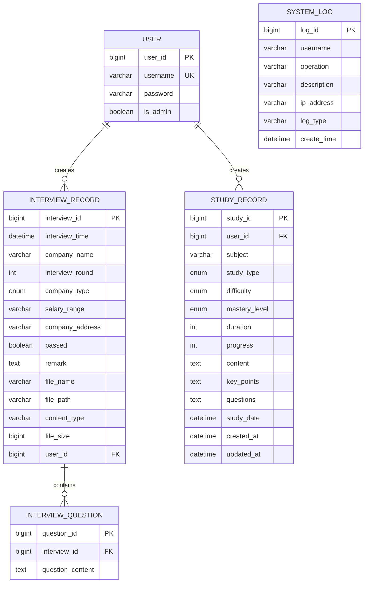
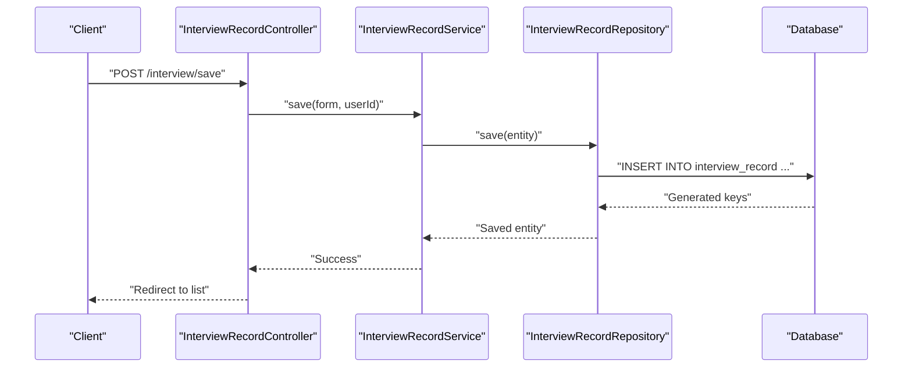
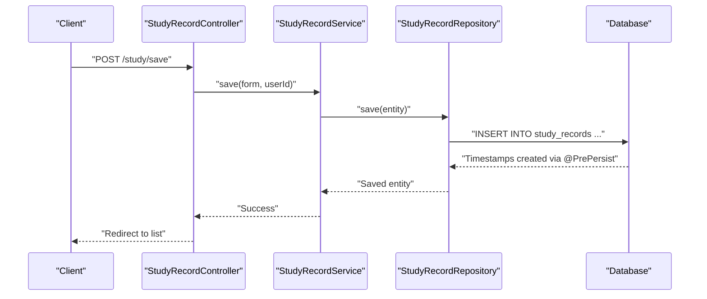
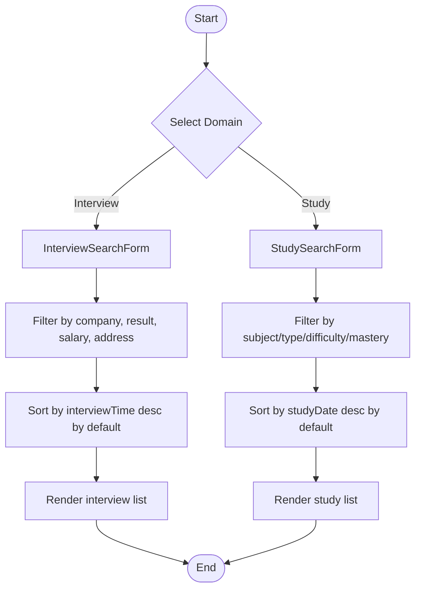
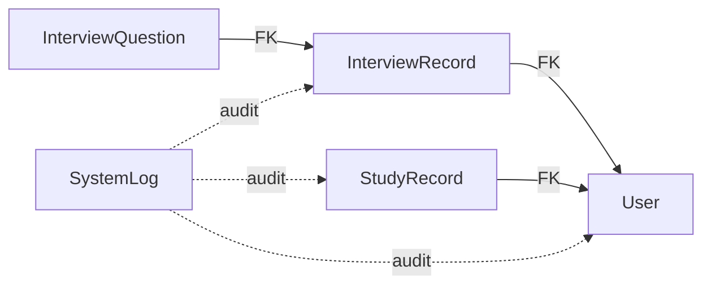

# Database Design

<cite>
**Referenced Files in This Document**
- [User.java](file://src/main/java/com/wu/model/User.java)
- [InterviewRecord.java](file://src/main/java/com/wu/model/InterviewRecord.java)
- [InterviewQuestion.java](file://src/main/java/com/wu/model/InterviewQuestion.java)
- [StudyRecord.java](file://src/main/java/com/wu/model/StudyRecord.java)
- [SystemLog.java](file://src/main/java/com/wu/model/SystemLog.java)
- [CompanyType.java](file://src/main/java/com/wu/model/CompanyType.java)
- [Difficulty.java](file://src/main/java/com/wu/model/Difficulty.java)
- [StudyType.java](file://src/main/java/com/wu/model/StudyType.java)
- [MasteryLevel.java](file://src/main/java/com/wu/model/MasteryLevel.java)
- [InterviewRecordRepository.java](file://src/main/java/com/wu/repo/InterviewRecordRepository.java)
- [StudyRecordRepository.java](file://src/main/java/com/wu/repo/StudyRecordRepository.java)
- [SystemLogRepository.java](file://src/main/java/com/wu/repo/SystemLogRepository.java)
- [InterviewRecordForm.java](file://src/main/java/com/wu/web/dto/InterviewRecordForm.java)
- [StudyRecordForm.java](file://src/main/java/com/wu/web/dto/StudyRecordForm.java)
- [InterviewSearchForm.java](file://src/main/java/com/wu/web/dto/InterviewSearchForm.java)
- [StudySearchForm.java](file://src/main/java/com/wu/web/dto/StudySearchForm.java)
- [application.properties](file://src/main/resources/application.properties)
</cite>

## Table of Contents
1. [Introduction](#introduction)
2. [Project Structure](#project-structure)
3. [Core Components](#core-components)
4. [Architecture Overview](#architecture-overview)
5. [Detailed Component Analysis](#detailed-component-analysis)
6. [Dependency Analysis](#dependency-analysis)
7. [Performance Considerations](#performance-considerations)
8. [Troubleshooting Guide](#troubleshooting-guide)
9. [Conclusion](#conclusion)
10. [Appendices](#appendices)

## Introduction
This document provides comprehensive database design documentation for the Interview Record Management System. It details the entity relationships among User, InterviewRecord, StudyRecord, and SystemLog, along with supporting enums and their business significance. It also documents field definitions, data types, primary and foreign keys, indexes and constraints, schema diagrams, sample data examples, validation rules, and data access patterns. Performance considerations for interview and study tracking workflows are included.

## Project Structure
The system follows a layered Spring Boot architecture with JPA/Hibernate for persistence. Entities are mapped to relational tables, repositories define typed data access methods, and DTOs encapsulate form-level validation and presentation concerns.

```mermaid
graph TB
subgraph "Persistence Layer"
U["User"]
IR["InterviewRecord"]
IQ["InterviewQuestion"]
SR["StudyRecord"]
SL["SystemLog"]
end
subgraph "Repositories"
RIR["InterviewRecordRepository"]
RS["StudyRecordRepository"]
RSL["SystemLogRepository"]
end
U --> IR
IR <- --> IQ
U --> SR
SL -. logs operations .-> U
SL -. logs operations .-> IR
SL -. logs operations .-> SR
RIR --> IR
RS --> SR
RSL --> SL
```

**Diagram sources**
- [User.java:10-58](file://src/main/java/com/wu/model/User.java#L10-L58)
- [InterviewRecord.java:21-202](file://src/main/java/com/wu/model/InterviewRecord.java#L21-L202)
- [InterviewQuestion.java:13-52](file://src/main/java/com/wu/model/InterviewQuestion.java#L13-L52)
- [StudyRecord.java:9-188](file://src/main/java/com/wu/model/StudyRecord.java#L9-L188)
- [SystemLog.java:6-93](file://src/main/java/com/wu/model/SystemLog.java#L6-L93)
- [InterviewRecordRepository.java:8-11](file://src/main/java/com/wu/repo/InterviewRecordRepository.java#L8-L11)
- [StudyRecordRepository.java:18-45](file://src/main/java/com/wu/repo/StudyRecordRepository.java#L18-L45)
- [SystemLogRepository.java:12-22](file://src/main/java/com/wu/repo/SystemLogRepository.java#L12-L22)

**Section sources**
- [application.properties:1-14](file://src/main/resources/application.properties#L1-L14)

## Core Components
This section documents the core entities and their attributes, constraints, and relationships.

- User
  - Purpose: Authenticates and authorizes system users; supports admin flag.
  - Primary Key: userId (auto-generated)
  - Constraints: username is unique and not null; password is not null; isAdmin defaults to false.
  - Typical Fields: userId, username, password, isAdmin.

- InterviewRecord
  - Purpose: Stores interview session metadata and associated attachments.
  - Primary Key: interviewId (auto-generated)
  - Foreign Keys: user_id references User(userId)
  - Enumerations: companyType (CompanyType)
  - Constraints: interviewTime, companyName, interviewRound, companyType, salaryRange, companyAddress, passed are not null.
  - Additional Fields: remark (TEXT), fileName, filePath, contentType, fileSize; lazy-loaded questions via OneToMany.

- InterviewQuestion
  - Purpose: Stores individual questions linked to an InterviewRecord.
  - Primary Key: questionId (auto-generated)
  - Foreign Keys: interview_id references InterviewRecord(interviewId)
  - Constraints: questionContent is not null (TEXT); belongs to one InterviewRecord.

- StudyRecord
  - Purpose: Tracks learning sessions with type, difficulty, mastery level, duration, progress, and timestamps.
  - Primary Key: study_id (auto-generated)
  - Foreign Keys: user_id references User(userId)
  - Enumerations: studyType (StudyType), difficulty (Difficulty), masteryLevel (MasteryLevel)
  - Timestamps: createdAt, updatedAt managed via @PrePersist/@PreUpdate; studyDate defaults to now if unset.
  - Constraints: subject, duration, progress, studyDate are not null; sizes constrained for TEXT fields.

- SystemLog
  - Purpose: Records user operations and system events with IP and timestamp.
  - Primary Key: logId (auto-generated)
  - Constraints: username, operation, createTime are not null; sizes constrained; createTime managed via @PrePersist.

**Section sources**
- [User.java:10-58](file://src/main/java/com/wu/model/User.java#L10-L58)
- [InterviewRecord.java:21-202](file://src/main/java/com/wu/model/InterviewRecord.java#L21-L202)
- [InterviewQuestion.java:13-52](file://src/main/java/com/wu/model/InterviewQuestion.java#L13-L52)
- [StudyRecord.java:9-188](file://src/main/java/com/wu/model/StudyRecord.java#L9-L188)
- [SystemLog.java:6-93](file://src/main/java/com/wu/model/SystemLog.java#L6-L93)

## Architecture Overview
The database design centers around three core domains:
- Authentication and Authorization: User
- Interview Tracking: InterviewRecord and InterviewQuestion
- Learning Tracking: StudyRecord
- Audit and Monitoring: SystemLog



**Diagram sources**
- [User.java:10-58](file://src/main/java/com/wu/model/User.java#L10-L58)
- [InterviewRecord.java:21-202](file://src/main/java/com/wu/model/InterviewRecord.java#L21-L202)
- [InterviewQuestion.java:13-52](file://src/main/java/com/wu/model/InterviewQuestion.java#L13-L52)
- [StudyRecord.java:9-188](file://src/main/java/com/wu/model/StudyRecord.java#L9-L188)
- [SystemLog.java:6-93](file://src/main/java/com/wu/model/SystemLog.java#L6-L93)

## Detailed Component Analysis

### Enumerations and Business Significance
- CompanyType
  - Values: SELF_RESEARCH, OUTSOURCING
  - Business Use: Classifies interview company origin for reporting and filtering.

- Difficulty
  - Values: EASY, MEDIUM, HARD
  - Business Use: Rates question or topic difficulty for learning analytics.

- StudyType
  - Values: TECH, ALGORITHM, PROJECT, READING, OTHER
  - Business Use: Categorizes learning activities for insights and planning.

- MasteryLevel
  - Values: BEGINNER, FAMILIAR, PROFICIENT, MASTER
  - Business Use: Tracks proficiency progression across subjects.

**Section sources**
- [CompanyType.java:3-7](file://src/main/java/com/wu/model/CompanyType.java#L3-L7)
- [Difficulty.java:6-21](file://src/main/java/com/wu/model/Difficulty.java#L6-L21)
- [StudyType.java:6-23](file://src/main/java/com/wu/model/StudyType.java#L6-L23)
- [MasteryLevel.java:6-22](file://src/main/java/com/wu/model/MasteryLevel.java#L6-L22)

### Entity Field Definitions and Constraints
- User
  - userId: BIGINT, PK, AUTO_INCREMENT
  - username: VARCHAR(255), UNIQUE, NOT NULL
  - password: VARCHAR(255), NOT NULL
  - isAdmin: BOOLEAN, DEFAULT false

- InterviewRecord
  - interviewId: BIGINT, PK, AUTO_INCREMENT
  - interviewTime: DATETIME, NOT NULL
  - companyName: VARCHAR(200), NOT NULL
  - interviewRound: INT, NOT NULL
  - companyType: ENUM (STRING), NOT NULL
  - salaryRange: VARCHAR(100), NOT NULL
  - companyAddress: VARCHAR(300), NOT NULL
  - passed: BOOLEAN
  - remark: TEXT
  - fileName: VARCHAR(255)
  - filePath: VARCHAR(500)
  - contentType: VARCHAR(100)
  - fileSize: BIGINT
  - user_id: BIGINT, FK -> USER(user_id), NOT NULL

- InterviewQuestion
  - questionId: BIGINT, PK, AUTO_INCREMENT
  - interview_id: BIGINT, FK -> INTERVIEW_RECORD(interviewId), NOT NULL
  - questionContent: TEXT, NOT NULL

- StudyRecord
  - study_id: BIGINT, PK, AUTO_INCREMENT
  - user_id: BIGINT, FK -> USER(user_id), NOT NULL
  - subject: VARCHAR(200), NOT NULL
  - study_type: ENUM (STRING), NOT NULL
  - difficulty: ENUM (STRING), NOT NULL
  - mastery_level: ENUM (STRING), NOT NULL
  - duration: INT, NOT NULL
  - progress: INT, NOT NULL
  - content: TEXT
  - key_points: TEXT
  - questions: TEXT
  - study_date: DATETIME, NOT NULL
  - created_at: DATETIME
  - updated_at: DATETIME

- SystemLog
  - logId: BIGINT, PK, AUTO_INCREMENT
  - username: VARCHAR(50), NOT NULL
  - operation: VARCHAR(100), NOT NULL
  - description: VARCHAR(500)
  - ipAddress: VARCHAR(50)
  - logType: VARCHAR(20)
  - createTime: DATETIME, NOT NULL

**Section sources**
- [User.java:10-58](file://src/main/java/com/wu/model/User.java#L10-L58)
- [InterviewRecord.java:21-202](file://src/main/java/com/wu/model/InterviewRecord.java#L21-L202)
- [InterviewQuestion.java:13-52](file://src/main/java/com/wu/model/InterviewQuestion.java#L13-L52)
- [StudyRecord.java:9-188](file://src/main/java/com/wu/model/StudyRecord.java#L9-L188)
- [SystemLog.java:6-93](file://src/main/java/com/wu/model/SystemLog.java#L6-L93)

### Sample Data Examples
- User
  - Example: {userId: 1, username: "alice", password: "...", isAdmin: false}

- InterviewRecord
  - Example: {interviewId: 101, interviewTime: "2025-01-15T14:30:00", companyName: "TechCorp", interviewRound: 2, companyType: "OUTSOURCING", salaryRange: "20K-25K", companyAddress: "123 Silicon Valley", passed: true, remark: "Good communication", fileName: "interview_notes.pdf", filePath: "/uploads/interview_notes.pdf", contentType: "application/pdf", fileSize: 102400, user_id: 1}

- InterviewQuestion
  - Example: {questionId: 501, interview_id: 101, questionContent: "Explain microservices architecture"}

- StudyRecord
  - Example: {study_id: 201, user_id: 1, subject: "Spring Security", study_type: "TECH", difficulty: "MEDIUM", mastery_level: "FAMILIAR", duration: 90, progress: 30, content: "Notes on OAuth2...", key_points: "Key concepts", questions: "What is JWT?", study_date: "2025-01-10T09:00:00", created_at: "2025-01-10T09:00:00", updated_at: "2025-01-10T10:30:00"}

- SystemLog
  - Example: {logId: 301, username: "alice", operation: "CREATE_INTERVIEW", description: "Created interview record", ipAddress: "127.0.0.1", logType: "INTERACTION", createTime: "2025-01-10T10:00:00"}

**Section sources**
- [InterviewRecord.java:21-202](file://src/main/java/com/wu/model/InterviewRecord.java#L21-L202)
- [InterviewQuestion.java:13-52](file://src/main/java/com/wu/model/InterviewQuestion.java#L13-L52)
- [StudyRecord.java:9-188](file://src/main/java/com/wu/model/StudyRecord.java#L9-L188)
- [SystemLog.java:6-93](file://src/main/java/com/wu/model/SystemLog.java#L6-L93)

### Data Validation Rules
- InterviewRecordForm
  - interviewTime: Required, DateTime formatted as yyyy-MM-dd'T'HH:mm
  - companyName: Required, non-blank
  - interviewRound: Required, positive integer
  - companyType: Required enum
  - salaryRange: Required, non-blank
  - companyAddress: Required, non-blank
  - passed: Required boolean
  - remark: Optional

- StudyRecordForm
  - subject: Required, max 200 chars
  - studyType: Required enum
  - difficulty: Required enum
  - masteryLevel: Required enum
  - duration: Required, min 1, max 1440
  - progress: Required, range 0..100
  - content/keyPoints/questions: Optional, max lengths enforced
  - studyDate: Required, DateTime formatted as yyyy-MM-dd'T'HH:mm

**Section sources**
- [InterviewRecordForm.java:14-134](file://src/main/java/com/wu/web/dto/InterviewRecordForm.java#L14-L134)
- [StudyRecordForm.java:14-148](file://src/main/java/com/wu/web/dto/StudyRecordForm.java#L14-L148)

### Data Access Patterns and JPA Annotations
- Repositories
  - InterviewRecordRepository
    - findByUserUserId(Long userId): retrieves records by user ID
  - StudyRecordRepository
    - findByUserUserIdOrderByStudyDateDesc(Long userId): ordered by study date desc
    - findByStudyIdAndUserUserId(Long studyId, Long userId): lookup by composite key
    - findByUserUserIdAndStudyType(Long userId, StudyType): filter by type
    - findByUserUserIdAndDifficulty(Long userId, Difficulty): filter by difficulty
    - findByUserUserIdAndMasteryLevel(Long userId, MasteryLevel): filter by mastery
  - SystemLogRepository
    - findByUsernameOrderByCreateTimeDesc(String username)
    - findByLogTypeOrderByCreateTimeDesc(String logType)
    - findByCreateTimeBetweenOrderByCreateTimeDesc(LocalDateTime start, LocalDateTime end)
    - findTop50ByOrderByCreateTimeDesc()

- JPA Annotations in Entities
  - @Entity, @Table: map classes to tables
  - @Id, @GeneratedValue: primary keys and auto-increment
  - @Column: define columns, lengths, nullability, and defaults
  - @Enumerated(EnumType.STRING): persist enums as strings
  - @ManyToOne/@JoinColumn: foreign keys
  - @OneToMany(mappedBy = "...", cascade = ..., orphanRemoval = true, fetch = LAZY): bidirectional relationship with lazy loading
  - @PrePersist/@PreUpdate: automatic timestamps

**Section sources**
- [InterviewRecordRepository.java:8-11](file://src/main/java/com/wu/repo/InterviewRecordRepository.java#L8-L11)
- [StudyRecordRepository.java:18-45](file://src/main/java/com/wu/repo/StudyRecordRepository.java#L18-L45)
- [SystemLogRepository.java:12-22](file://src/main/java/com/wu/repo/SystemLogRepository.java#L12-L22)
- [InterviewRecord.java:21-202](file://src/main/java/com/wu/model/InterviewRecord.java#L21-L202)
- [StudyRecord.java:9-188](file://src/main/java/com/wu/model/StudyRecord.java#L9-L188)
- [SystemLog.java:6-93](file://src/main/java/com/wu/model/SystemLog.java#L6-L93)

### Sequence of Operations: Creating an Interview Record


**Diagram sources**
- [InterviewRecordRepository.java:8-11](file://src/main/java/com/wu/repo/InterviewRecordRepository.java#L8-L11)
- [InterviewRecord.java:21-202](file://src/main/java/com/wu/model/InterviewRecord.java#L21-L202)

### Sequence of Operations: Recording a Study Session


**Diagram sources**
- [StudyRecordRepository.java:18-45](file://src/main/java/com/wu/repo/StudyRecordRepository.java#L18-L45)
- [StudyRecord.java:9-188](file://src/main/java/com/wu/model/StudyRecord.java#L9-L188)

### Flowchart: Search and Filter Workflows


**Diagram sources**
- [InterviewSearchForm.java:3-59](file://src/main/java/com/wu/web/dto/InterviewSearchForm.java#L3-L59)
- [StudySearchForm.java:10-68](file://src/main/java/com/wu/web/dto/StudySearchForm.java#L10-L68)

## Dependency Analysis
- Coupling and Cohesion
  - Entities maintain low coupling via explicit foreign keys and lazy loading for collections.
  - Repositories encapsulate CRUD and query methods, promoting cohesion around domain queries.
- External Dependencies
  - MySQL connector configured via application properties.
  - JPA/Hibernate DDL auto-update enabled for development convenience.



**Diagram sources**
- [InterviewRecord.java:21-202](file://src/main/java/com/wu/model/InterviewRecord.java#L21-L202)
- [InterviewQuestion.java:13-52](file://src/main/java/com/wu/model/InterviewQuestion.java#L13-L52)
- [StudyRecord.java:9-188](file://src/main/java/com/wu/model/StudyRecord.java#L9-L188)
- [SystemLog.java:6-93](file://src/main/java/com/wu/model/SystemLog.java#L6-L93)

**Section sources**
- [application.properties:9-9](file://src/main/resources/application.properties#L9-L9)

## Performance Considerations
- Indexes and Sorting
  - Add indexes on frequently filtered/sorted columns:
    - User: username (already unique index via constraint)
    - InterviewRecord: user_id, interview_time
    - StudyRecord: user_id, study_date, study_type, difficulty, mastery_level
    - SystemLog: username, log_type, create_time
- Fetch Strategies
  - Keep lazy loading for collections (e.g., InterviewRecord.questions) to avoid N+1 selects.
- Pagination
  - Use Spring Data JPA pagination for large lists (e.g., study records, system logs).
- DDL Auto-Management
  - ddl-auto=update is convenient but should be reviewed for production hardening.
- Query Optimization
  - Prefer repository method names that match indexed columns (as implemented) to leverage database indexes.

[No sources needed since this section provides general guidance]

## Troubleshooting Guide
- Common Issues
  - Unique Constraint Violation on username: ensure uniqueness before save.
  - Foreign Key Constraint Failure: verify user_id exists before saving child entities.
  - Missing Required Fields: DTO validations enforce non-null fields; check form submissions.
  - Unexpected Nulls in StudyRecord: createdAt/updatedAt and studyDate are populated via @PrePersist/@PreUpdate; confirm entity lifecycle hooks are triggered.
- Logging and Auditing
  - Use SystemLogRepository to inspect recent operations and troubleshoot user actions.
- Environment Configuration
  - Verify datasource URL, credentials, and timezone settings in application properties.

**Section sources**
- [application.properties:3-13](file://src/main/resources/application.properties#L3-L13)
- [StudyRecord.java:61-73](file://src/main/java/com/wu/model/StudyRecord.java#L61-L73)
- [SystemLogRepository.java:12-22](file://src/main/java/com/wu/repo/SystemLogRepository.java#L12-L22)

## Conclusion
The Interview Record Management System employs a clean, normalized relational design with strong typing via enums and robust JPA annotations. The schema supports efficient interview and study tracking workflows, while SystemLog provides auditability. By indexing key columns, leveraging lazy loading, and using repository-provided query methods, the system achieves maintainable performance and scalability.

[No sources needed since this section summarizes without analyzing specific files]

## Appendices

### Appendix A: Enumerations Reference
- CompanyType: SELF_RESEARCH, OUTSOURCING
- Difficulty: EASY, MEDIUM, HARD
- StudyType: TECH, ALGORITHM, PROJECT, READING, OTHER
- MasteryLevel: BEGINNER, FAMILIAR, PROFICIENT, MASTER

**Section sources**
- [CompanyType.java:3-7](file://src/main/java/com/wu/model/CompanyType.java#L3-L7)
- [Difficulty.java:6-21](file://src/main/java/com/wu/model/Difficulty.java#L6-L21)
- [StudyType.java:6-23](file://src/main/java/com/wu/model/StudyType.java#L6-L23)
- [MasteryLevel.java:6-22](file://src/main/java/com/wu/model/MasteryLevel.java#L6-L22)

### Appendix B: Configuration Reference
- Database: MySQL 8.x
- Driver: com.mysql.cj.jdbc.Driver
- Datasource URL: jdbc:mysql://localhost:3308/interview_record_db?useUnicode=true&characterEncoding=utf-8&serverTimezone=GMT%2B8
- JPA: ddl-auto=update, show-sql=false, format_sql=true

**Section sources**
- [application.properties:3-13](file://src/main/resources/application.properties#L3-L13)