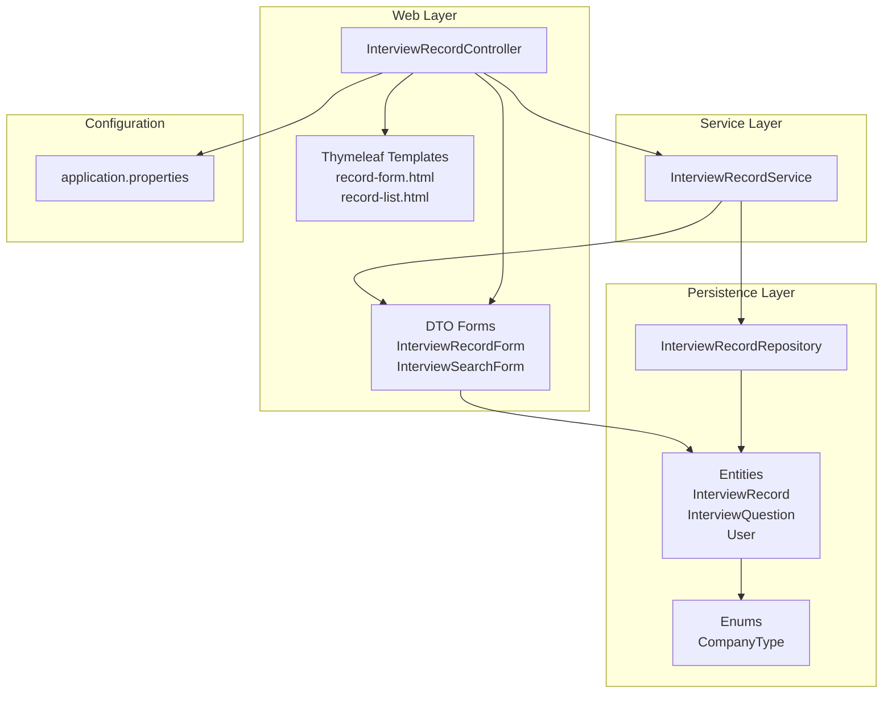
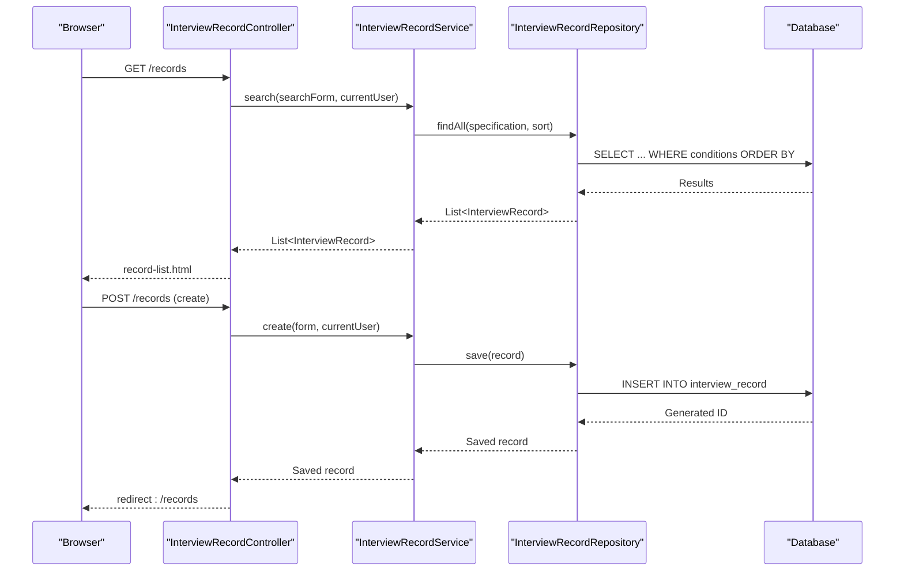
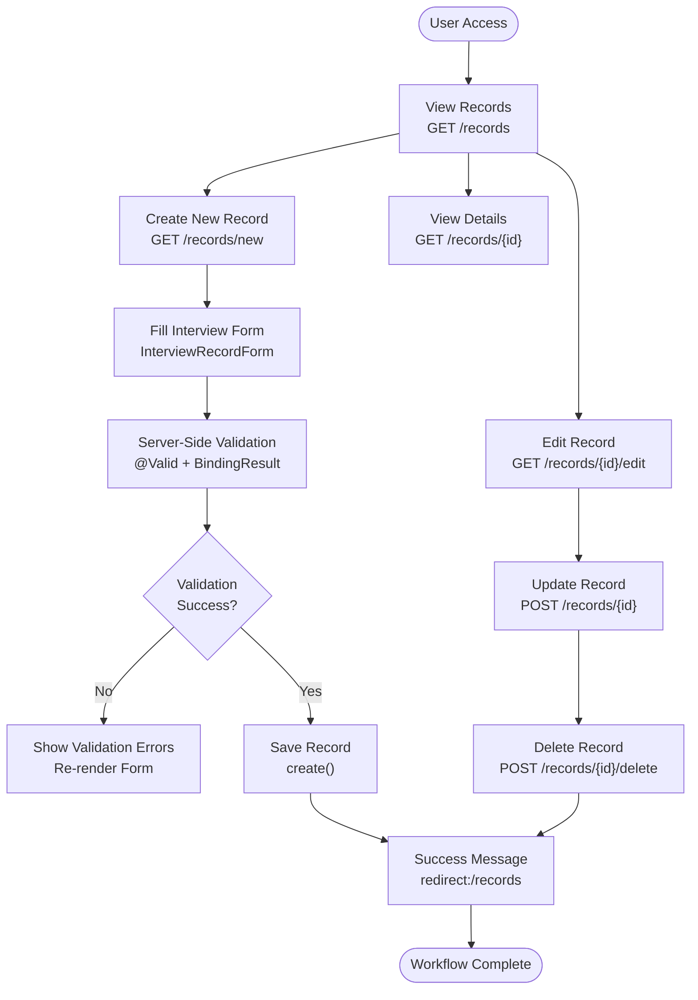
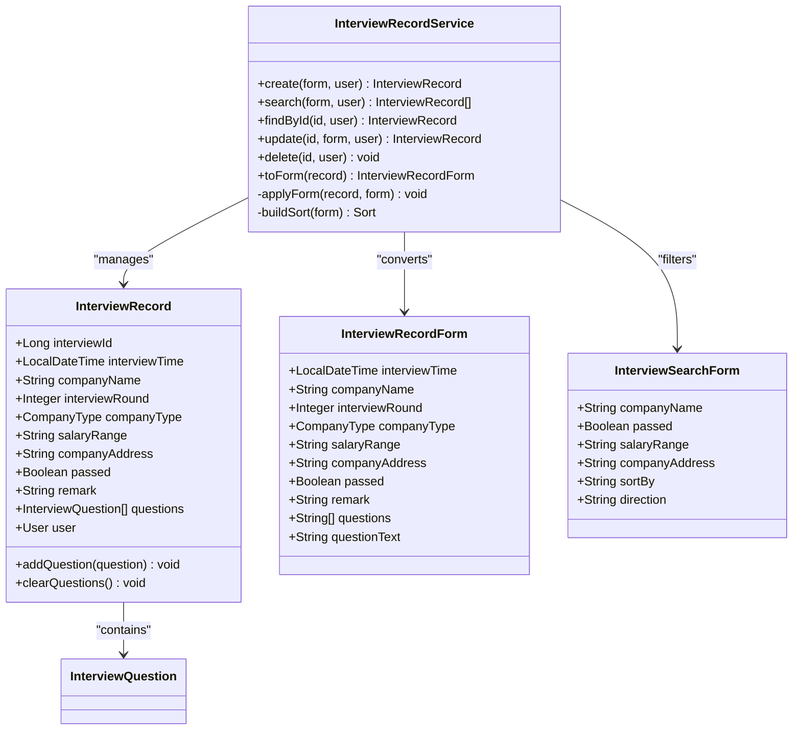
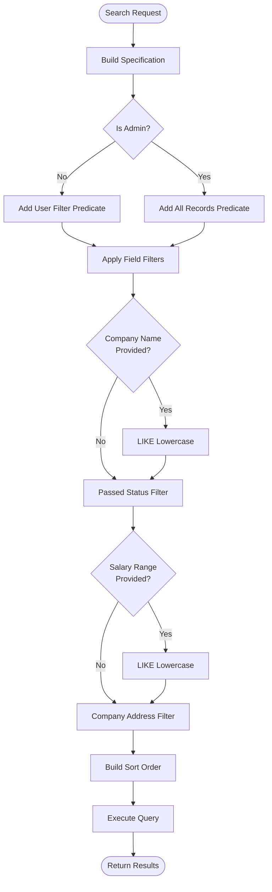
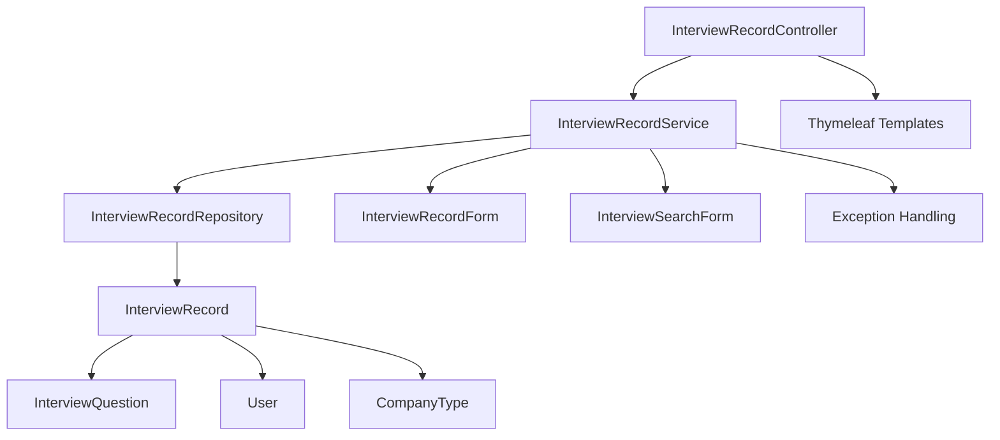

# Interview Record Management

<cite>
**Referenced Files in This Document**
- [InterviewRecord.java](file://src/main/java/com/wu/model/InterviewRecord.java)
- [InterviewQuestion.java](file://src/main/java/com/wu/model/InterviewQuestion.java)
- [CompanyType.java](file://src/main/java/com/wu/model/CompanyType.java)
- [InterviewRecordForm.java](file://src/main/java/com/wu/web/dto/InterviewRecordForm.java)
- [InterviewSearchForm.java](file://src/main/java/com/wu/web/dto/InterviewSearchForm.java)
- [InterviewRecordService.java](file://src/main/java/com/wu/service/InterviewRecordService.java)
- [InterviewRecordController.java](file://src/main/java/com/wu/web/InterviewRecordController.java)
- [InterviewRecordRepository.java](file://src/main/java/com/wu/repo/InterviewRecordRepository.java)
- [record-form.html](file://src/main/resources/templates/record-form.html)
- [record-list.html](file://src/main/resources/templates/record-list.html)
- [application.properties](file://src/main/resources/application.properties)
- [User.java](file://src/main/java/com/wu/model/User.java)
</cite>

## Table of Contents
1. [Introduction](#introduction)
2. [Project Structure](#project-structure)
3. [Core Components](#core-components)
4. [Architecture Overview](#architecture-overview)
5. [Detailed Component Analysis](#detailed-component-analysis)
6. [Dependency Analysis](#dependency-analysis)
7. [Performance Considerations](#performance-considerations)
8. [Troubleshooting Guide](#troubleshooting-guide)
9. [Conclusion](#conclusion)

## Introduction
This document provides comprehensive documentation for the Interview Record Management system. It explains the InterviewRecord entity structure, company type categorization, interview outcome tracking, and question management features. The document covers CRUD operations implementation, search and filtering functionality using InterviewSearchForm, and form handling with InterviewRecordForm. It also details the interview workflow from creation to completion, data validation rules, and business logic for interview status management. Practical examples demonstrate interview recording, editing, deletion, and reporting capabilities.

## Project Structure
The system follows a layered architecture with clear separation of concerns:
- Model layer defines domain entities and enumerations
- Web layer handles HTTP requests and renders Thymeleaf templates
- Service layer implements business logic and validation
- Repository layer manages persistence via Spring Data JPA
- Configuration defines database connectivity and template caching

**Diagram sources**
- [InterviewRecordController.java:28-38](file://src/main/java/com/wu/web/InterviewRecordController.java#L28-L38)
- [InterviewRecordService.java:19-26](file://src/main/java/com/wu/service/InterviewRecordService.java#L19-L26)
- [InterviewRecordRepository.java:8-10](file://src/main/java/com/wu/repo/InterviewRecordRepository.java#L8-L10)
- [InterviewRecord.java:21-23](file://src/main/java/com/wu/model/InterviewRecord.java#L21-L23)
- [InterviewQuestion.java:13-15](file://src/main/java/com/wu/model/InterviewQuestion.java#L13-L15)
- [CompanyType.java:3-6](file://src/main/java/com/wu/model/CompanyType.java#L3-L6)
- [application.properties:1-14](file://src/main/resources/application.properties#L1-L14)

**Section sources**
- [InterviewRecordController.java:28-38](file://src/main/java/com/wu/web/InterviewRecordController.java#L28-L38)
- [InterviewRecordService.java:19-26](file://src/main/java/com/wu/service/InterviewRecordService.java#L19-L26)
- [InterviewRecordRepository.java:8-10](file://src/main/java/com/wu/repo/InterviewRecordRepository.java#L8-L10)
- [application.properties:1-14](file://src/main/resources/application.properties#L1-L14)

## Core Components
This section details the primary components that define the interview record management system.

### InterviewRecord Entity
The InterviewRecord entity represents a single interview session with comprehensive attributes:
- Identity and metadata: interviewId, timestamps, user association
- Candidate information: interviewTime, interviewRound
- Company details: companyName, companyType, salaryRange, companyAddress
- Outcome tracking: passed flag, remark
- Attachment support: fileName, filePath, contentType, fileSize
- Question management: bidirectional relationship with InterviewQuestion

Key relationships:
- Many-to-One with User (owner of the record)
- One-to-Many with InterviewQuestion (questions asked during interview)
- Enumerated CompanyType field for categorization

Validation constraints:
- Non-null fields enforce mandatory data capture
- Length constraints ensure data quality
- Cascade operations handle question lifecycle

**Section sources**
- [InterviewRecord.java:21-202](file://src/main/java/com/wu/model/InterviewRecord.java#L21-L202)

### InterviewQuestion Entity
The InterviewQuestion entity stores individual questions from interviews:
- Identity and foreign key relationship to InterviewRecord
- Text content stored as TEXT for flexibility
- Lazy loading to optimize performance

Relationship semantics:
- Many-to-One with InterviewRecord
- Orphan removal ensures cleanup when questions are removed

**Section sources**
- [InterviewQuestion.java:13-52](file://src/main/java/com/wu/model/InterviewQuestion.java#L13-L52)

### CompanyType Enumeration
Defines categorical classification for companies:
- SELF_RESEARCH: internally developed products/services
- OUTSOURCING: third-party development or services

Used for filtering and reporting capabilities.

**Section sources**
- [CompanyType.java:3-6](file://src/main/java/com/wu/model/CompanyType.java#L3-L6)

### InterviewRecordForm DTO
The form DTO encapsulates user input for interview records:
- Validation annotations ensure data integrity
- DateTimeFormat for proper date/time parsing
- Questions management via both structured list and text area
- Required field validation for critical attributes

Validation rules:
- NonNull for mandatory fields (interviewTime, interviewRound, companyType, passed)
- NotBlank for textual fields (companyName, salaryRange, companyAddress)
- Min constraint for positive integer values
- Custom message localization for user feedback

**Section sources**
- [InterviewRecordForm.java:14-134](file://src/main/java/com/wu/web/dto/InterviewRecordForm.java#L14-L134)

### InterviewSearchForm DTO
Provides filtering and sorting capabilities:
- Search criteria: companyName, passed, salaryRange, companyAddress
- Sorting configuration: sortBy (interviewTime, companyName, salaryRange), direction (asc/desc)
- Case-insensitive partial matching for text fields

**Section sources**
- [InterviewSearchForm.java:3-59](file://src/main/java/com/wu/web/dto/InterviewSearchForm.java#L3-L59)

## Architecture Overview
The system implements a classic MVC pattern with Spring MVC and Spring Data JPA:

**Diagram sources**
- [InterviewRecordController.java:40-46](file://src/main/java/com/wu/web/InterviewRecordController.java#L40-L46)
- [InterviewRecordService.java:36-60](file://src/main/java/com/wu/service/InterviewRecordService.java#L36-L60)
- [InterviewRecordRepository.java:8-10](file://src/main/java/com/wu/repo/InterviewRecordRepository.java#L8-L10)

## Detailed Component Analysis

### Interview Workflow Implementation
The system supports end-to-end interview record management through a well-defined workflow:

**Diagram sources**
- [InterviewRecordController.java:58-87](file://src/main/java/com/wu/web/InterviewRecordController.java#L58-L87)
- [InterviewRecordController.java:101-136](file://src/main/java/com/wu/web/InterviewRecordController.java#L101-L136)
- [InterviewRecordController.java:138-148](file://src/main/java/com/wu/web/InterviewRecordController.java#L138-L148)

### Data Validation and Business Logic
The service layer enforces comprehensive validation and business rules:

**Diagram sources**
- [InterviewRecordService.java:19-153](file://src/main/java/com/wu/service/InterviewRecordService.java#L19-L153)
- [InterviewRecord.java:21-202](file://src/main/java/com/wu/model/InterviewRecord.java#L21-L202)
- [InterviewRecordForm.java:14-134](file://src/main/java/com/wu/web/dto/InterviewRecordForm.java#L14-L134)
- [InterviewSearchForm.java:3-59](file://src/main/java/com/wu/web/dto/InterviewSearchForm.java#L3-L59)

### CRUD Operations Implementation
Each operation follows consistent patterns with proper validation and error handling:

#### Create Operation
- Controller validates form input and sanitizes question text
- Service creates new InterviewRecord and applies form data
- Question management handled via structured list processing
- Minimum requirement: at least one non-empty question

#### Read Operations
- Public list view with search and filter capabilities
- Individual record detail with lazy-loaded questions
- Permission enforcement: users can only access their own records (except admins)

#### Update Operation
- Same validation pipeline as create
- Permission checking prevents unauthorized modifications
- Question replacement ensures clean synchronization

#### Delete Operation
- Authorization check prevents unauthorized deletions
- Cascade deletion handles associated questions

**Section sources**
- [InterviewRecordController.java:67-87](file://src/main/java/com/wu/web/InterviewRecordController.java#L67-L87)
- [InterviewRecordController.java:115-136](file://src/main/java/com/wu/web/InterviewRecordController.java#L115-L136)
- [InterviewRecordController.java:138-148](file://src/main/java/com/wu/web/InterviewRecordController.java#L138-L148)
- [InterviewRecordService.java:28-95](file://src/main/java/com/wu/service/InterviewRecordService.java#L28-L95)

### Search and Filtering Functionality
The system provides comprehensive search capabilities:

**Diagram sources**
- [InterviewRecordService.java:36-60](file://src/main/java/com/wu/service/InterviewRecordService.java#L36-L60)
- [InterviewRecordService.java:144-151](file://src/main/java/com/wu/service/InterviewRecordService.java#L144-L151)

**Section sources**
- [InterviewRecordService.java:36-60](file://src/main/java/com/wu/service/InterviewRecordService.java#L36-L60)
- [InterviewSearchForm.java:3-59](file://src/main/java/com/wu/web/dto/InterviewSearchForm.java#L3-L59)

### Question Management Features
The system supports flexible question management:

#### Input Methods
- Structured list: separate input fields for each question
- Text area: newline-separated questions with "//" delimiter
- Automatic sanitization removes empty entries

#### Storage and Retrieval
- Bidirectional relationship maintains referential integrity
- Lazy loading optimizes performance for list views
- Cascade operations handle question lifecycle

#### Validation Rules
- At least one non-empty question required
- Empty question lists are rejected with meaningful error messages

**Section sources**
- [InterviewRecord.java:73-80](file://src/main/java/com/wu/model/InterviewRecord.java#L73-L80)
- [InterviewRecordService.java:120-142](file://src/main/java/com/wu/service/InterviewRecordService.java#L120-L142)
- [InterviewRecordController.java:155-165](file://src/main/java/com/wu/web/InterviewRecordController.java#L155-L165)

## Dependency Analysis
The system exhibits clean dependency management with minimal coupling:

**Diagram sources**
- [InterviewRecordController.java:32-37](file://src/main/java/com/wu/web/InterviewRecordController.java#L32-L37)
- [InterviewRecordService.java:22-26](file://src/main/java/com/wu/service/InterviewRecordService.java#L22-L26)
- [InterviewRecordRepository.java:8-10](file://src/main/java/com/wu/repo/InterviewRecordRepository.java#L8-L10)
- [InterviewRecord.java:54-56](file://src/main/java/com/wu/model/InterviewRecord.java#L54-L56)

Key observations:
- Strong cohesion within each layer
- Clear separation of concerns
- Minimal cross-layer dependencies
- Proper use of interfaces (JpaRepository, JpaSpecificationExecutor)

**Section sources**
- [InterviewRecordController.java:32-37](file://src/main/java/com/wu/web/InterviewRecordController.java#L32-L37)
- [InterviewRecordService.java:22-26](file://src/main/java/com/wu/service/InterviewRecordService.java#L22-L26)
- [InterviewRecordRepository.java:8-10](file://src/main/java/com/wu/repo/InterviewRecordRepository.java#L8-L10)

## Performance Considerations
Several optimizations are implemented to ensure efficient operation:

### Database-Level Optimizations
- Lazy loading for questions reduces initial query overhead
- Proper indexing on frequently queried fields (user_id, company_name, salary_range)
- Efficient LIKE queries with lowercase conversion for case-insensitive matching

### Application-Level Optimizations
- Pagination support through Spring Data JPA (implicit via JpaSpecificationExecutor)
- Selective field loading for list views
- Efficient question processing with streaming operations

### Caching Strategy
- Thymeleaf template caching disabled in development for immediate feedback
- Production environments should enable caching for improved response times

## Troubleshooting Guide
Common issues and their resolutions:

### Authentication and Authorization Issues
- Symptom: "当前用户不存在" error
- Cause: Security context not properly established
- Resolution: Verify Spring Security configuration and user session

### Validation Errors
- Symptom: Form re-display with validation messages
- Common causes:
  - Missing required fields (interviewTime, companyName, etc.)
  - Invalid data types (non-numeric values in interviewRound)
  - Empty question list
- Resolution: Review form validation rules and provide appropriate input

### Permission Denied Errors
- Symptom: "该记录不存在或已被删除" for unauthorized access attempts
- Cause: Non-admin users attempting to access other users' records
- Resolution: Ensure proper user authentication and authorization

### Database Connectivity Issues
- Symptom: Application fails to start or throws connection errors
- Check: Database URL, credentials, and network connectivity
- Resolution: Verify application.properties configuration

**Section sources**
- [InterviewRecordController.java:48-56](file://src/main/java/com/wu/web/InterviewRecordController.java#L48-L56)
- [InterviewRecordService.java:63-72](file://src/main/java/com/wu/service/InterviewRecordService.java#L63-L72)
- [application.properties:3-7](file://src/main/resources/application.properties#L3-L7)

## Conclusion
The Interview Record Management system provides a robust, well-structured solution for tracking and managing interview experiences. Its layered architecture ensures maintainability and scalability, while comprehensive validation and business logic enforcement guarantee data integrity. The system successfully balances user experience with technical rigor, offering intuitive forms, powerful search capabilities, and secure access controls. The modular design facilitates future enhancements and extensions while maintaining clean separation of concerns.