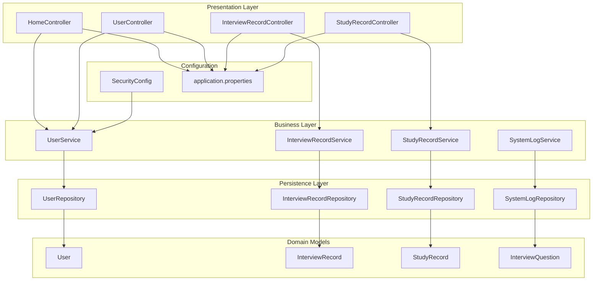
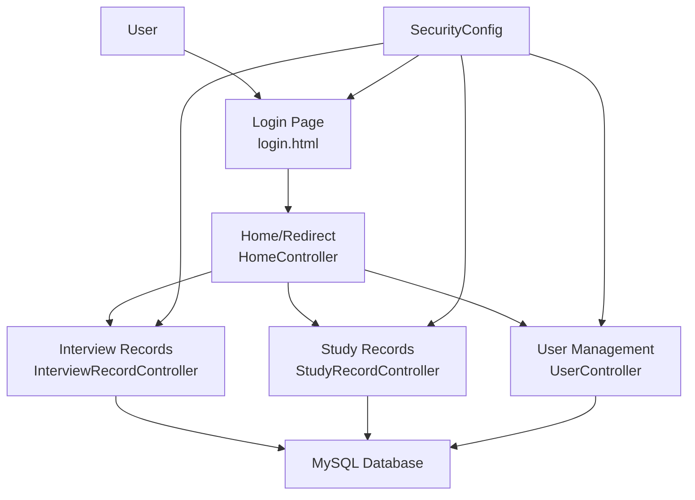
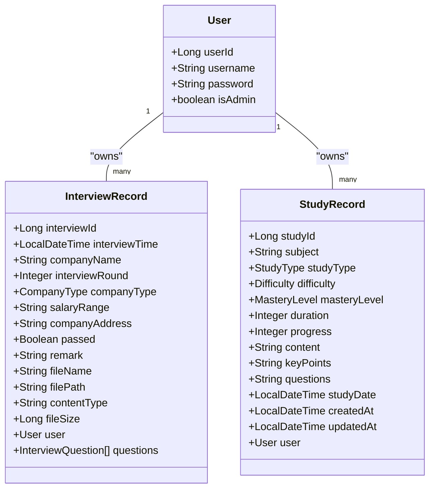
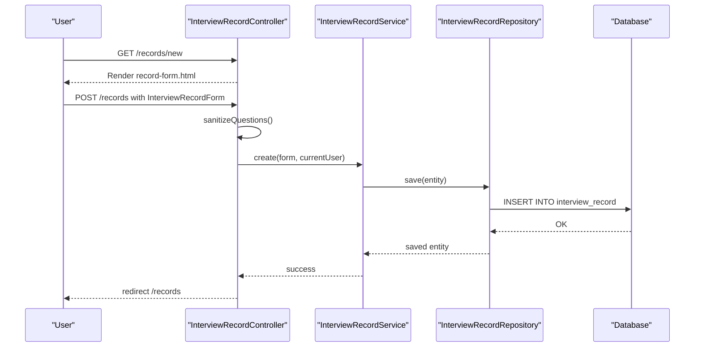
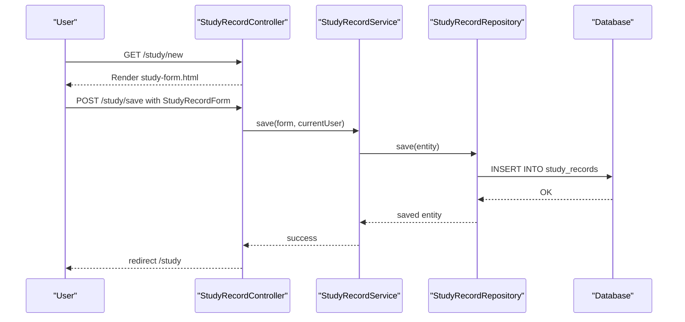
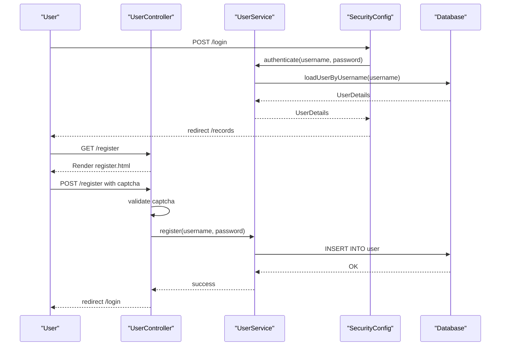
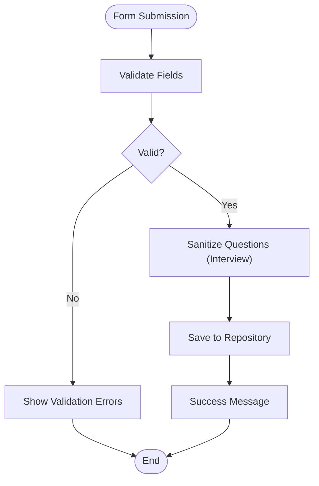
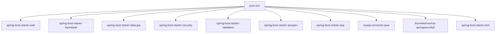

# Project Overview

<cite>
**Referenced Files in This Document**
- [InterviewRecordApplication.java](file://src/main/java/com/wu/InterviewRecordApplication.java)
- [pom.xml](file://pom.xml)
- [application.properties](file://src/main/resources/application.properties)
- [SecurityConfig.java](file://src/main/java/com/wu/config/SecurityConfig.java)
- [User.java](file://src/main/java/com/wu/model/User.java)
- [InterviewRecord.java](file://src/main/java/com/wu/model/InterviewRecord.java)
- [StudyRecord.java](file://src/main/java/com/wu/model/StudyRecord.java)
- [CompanyType.java](file://src/main/java/com/wu/model/CompanyType.java)
- [Difficulty.java](file://src/main/java/com/wu/model/Difficulty.java)
- [StudyType.java](file://src/main/java/com/wu/model/StudyType.java)
- [MasteryLevel.java](file://src/main/java/com/wu/model/MasteryLevel.java)
- [InterviewRecordForm.java](file://src/main/java/com/wu/web/dto/InterviewRecordForm.java)
- [StudyRecordForm.java](file://src/main/java/com/wu/web/dto/StudyRecordForm.java)
- [HomeController.java](file://src/main/java/com/wu/web/HomeController.java)
- [UserController.java](file://src/main/java/com/wu/web/UserController.java)
- [InterviewRecordController.java](file://src/main/java/com/wu/web/InterviewRecordController.java)
- [StudyRecordController.java](file://src/main/java/com/wu/web/StudyRecordController.java)
</cite>

## Table of Contents
1. [Introduction](#introduction)
2. [Project Structure](#project-structure)
3. [Core Components](#core-components)
4. [Architecture Overview](#architecture-overview)
5. [Detailed Component Analysis](#detailed-component-analysis)
6. [Dependency Analysis](#dependency-analysis)
7. [Performance Considerations](#performance-considerations)
8. [Troubleshooting Guide](#troubleshooting-guide)
9. [Conclusion](#conclusion)

## Introduction
The Interview Record Management System is a Spring Boot web application designed to help job seekers, interviewers, and students track interview experiences and monitor study progress. It provides a secure, user-friendly platform for recording interview details, managing study sessions, and maintaining administrative oversight. Built with modern Java technologies, the system emphasizes clean separation of concerns, robust security, and a responsive user interface powered by Thymeleaf templates.

Target audience:
- Job seekers: Track interview history, outcomes, and preparation materials.
- Interviewers: Manage candidate interactions and feedback within a controlled environment.
- Students: Monitor personal learning progress, difficulty levels, and mastery metrics.

Key features:
- User registration and authentication with role-based access control.
- Interview record creation, editing, viewing, and deletion with support for multiple interview questions.
- Study progress tracking with configurable difficulty and mastery levels.
- System administration capabilities for logs and user management.
- Captcha-based registration to prevent automated abuse.

Technology stack:
- Backend: Spring Boot 2.1.18.RELEASE, Spring MVC, Spring Data JPA, Spring Security, Spring Validation, Spring AOP.
- Frontend: Thymeleaf templates with Spring Security integration.
- Persistence: MySQL database with Hibernate/JPA.
- Build and packaging: Maven.

Business value:
- Centralized tracking reduces memory load and improves recall accuracy.
- Structured data enables trend analysis and performance insights.
- Role-based permissions ensure appropriate access control for sensitive data.
- Secure login and logout mechanisms protect user privacy.

## Project Structure
The project follows a layered architecture with clear separation between presentation, business logic, persistence, and configuration. Controllers handle HTTP requests, services encapsulate business rules, repositories manage data access, and models define domain entities. Thymeleaf templates render server-side views.

**Diagram sources**
- [HomeController.java:1-14](file://src/main/java/com/wu/web/HomeController.java#L1-L14)
- [UserController.java:1-58](file://src/main/java/com/wu/web/UserController.java#L1-L58)
- [InterviewRecordController.java:1-167](file://src/main/java/com/wu/web/InterviewRecordController.java#L1-L167)
- [StudyRecordController.java:1-166](file://src/main/java/com/wu/web/StudyRecordController.java#L1-L166)
- [UserService.java:1-10](file://src/main/java/com/wu/service/UserService.java#L1-L10)
- [InterviewRecordService.java](file://src/main/java/com/wu/service/InterviewRecordService.java)
- [StudyRecordService.java](file://src/main/java/com/wu/service/StudyRecordService.java)
- [SystemLogService.java](file://src/main/java/com/wu/service/SystemLogService.java)
- [UserRepository.java](file://src/main/java/com/wu/repository/UserRepository.java)
- [InterviewRecordRepository.java](file://src/main/java/com/wu/repo/InterviewRecordRepository.java)
- [StudyRecordRepository.java](file://src/main/java/com/wu/repo/StudyRecordRepository.java)
- [SystemLogRepository.java](file://src/main/java/com/wu/repo/SystemLogRepository.java)
- [User.java:1-58](file://src/main/java/com/wu/model/User.java#L1-L58)
- [InterviewRecord.java:1-202](file://src/main/java/com/wu/model/InterviewRecord.java#L1-L202)
- [StudyRecord.java:1-188](file://src/main/java/com/wu/model/StudyRecord.java#L1-L188)
- [SecurityConfig.java:1-60](file://src/main/java/com/wu/config/SecurityConfig.java#L1-L60)
- [application.properties:1-14](file://src/main/resources/application.properties#L1-L14)

**Section sources**
- [InterviewRecordApplication.java:1-12](file://src/main/java/com/wu/InterviewRecordApplication.java#L1-L12)
- [pom.xml:1-80](file://pom.xml#L1-L80)
- [application.properties:1-14](file://src/main/resources/application.properties#L1-L14)

## Core Components
- Application entry point: Initializes the Spring Boot application context.
- Security configuration: Defines authentication, authorization rules, and login/logout behavior.
- Data models: Represent core entities including users, interview records, study records, and enumerations for types and levels.
- Controllers: Expose REST-like endpoints and handle user interactions for interviews and study tracking.
- Services: Encapsulate business logic for user management, interview CRUD operations, study tracking, and logging.
- Repositories: Provide data access for entities using Spring Data JPA.
- DTOs: Transfer objects for forms and search criteria to decouple presentation from persistence.

**Section sources**
- [InterviewRecordApplication.java:1-12](file://src/main/java/com/wu/InterviewRecordApplication.java#L1-L12)
- [SecurityConfig.java:1-60](file://src/main/java/com/wu/config/SecurityConfig.java#L1-L60)
- [User.java:1-58](file://src/main/java/com/wu/model/User.java#L1-L58)
- [InterviewRecord.java:1-202](file://src/main/java/com/wu/model/InterviewRecord.java#L1-L202)
- [StudyRecord.java:1-188](file://src/main/java/com/wu/model/StudyRecord.java#L1-L188)
- [CompanyType.java:1-7](file://src/main/java/com/wu/model/CompanyType.java#L1-L7)
- [Difficulty.java:1-21](file://src/main/java/com/wu/model/Difficulty.java#L1-L21)
- [StudyType.java](file://src/main/java/com/wu/model/StudyType.java)
- [MasteryLevel.java](file://src/main/java/com/wu/model/MasteryLevel.java)
- [InterviewRecordController.java:1-167](file://src/main/java/com/wu/web/InterviewRecordController.java#L1-L167)
- [StudyRecordController.java:1-166](file://src/main/java/com/wu/web/StudyRecordController.java#L1-L166)
- [UserController.java:1-58](file://src/main/java/com/wu/web/UserController.java#L1-L58)
- [InterviewRecordForm.java:1-134](file://src/main/java/com/wu/web/dto/InterviewRecordForm.java#L1-L134)
- [StudyRecordForm.java:1-148](file://src/main/java/com/wu/web/dto/StudyRecordForm.java#L1-L148)

## Architecture Overview
The system employs a classic three-tier architecture:
- Presentation tier: Controllers and Thymeleaf templates.
- Business tier: Services implementing domain logic and validation.
- Data tier: JPA repositories backed by MySQL.

Security is enforced via Spring Security with form-based login, role-based access control, and CSRF disabled for simplicity. The application uses Thymeleaf for server-side rendering and integrates Spring Security tags for dynamic UI control.

**Diagram sources**
- [HomeController.java:1-14](file://src/main/java/com/wu/web/HomeController.java#L1-L14)
- [UserController.java:1-58](file://src/main/java/com/wu/web/UserController.java#L1-L58)
- [InterviewRecordController.java:1-167](file://src/main/java/com/wu/web/InterviewRecordController.java#L1-L167)
- [StudyRecordController.java:1-166](file://src/main/java/com/wu/web/StudyRecordController.java#L1-L166)
- [SecurityConfig.java:1-60](file://src/main/java/com/wu/config/SecurityConfig.java#L1-L60)
- [application.properties:1-14](file://src/main/resources/application.properties#L1-L14)

## Detailed Component Analysis

### Domain Models and Data Flow
The core entities capture interview and study data with relationships and enumerations for type safety and consistency.

**Diagram sources**
- [User.java:1-58](file://src/main/java/com/wu/model/User.java#L1-L58)
- [InterviewRecord.java:1-202](file://src/main/java/com/wu/model/InterviewRecord.java#L1-L202)
- [StudyRecord.java:1-188](file://src/main/java/com/wu/model/StudyRecord.java#L1-L188)
- [CompanyType.java:1-7](file://src/main/java/com/wu/model/CompanyType.java#L1-L7)
- [Difficulty.java:1-21](file://src/main/java/com/wu/model/Difficulty.java#L1-L21)
- [StudyType.java](file://src/main/java/com/wu/model/StudyType.java)
- [MasteryLevel.java](file://src/main/java/com/wu/model/MasteryLevel.java)

**Section sources**
- [User.java:1-58](file://src/main/java/com/wu/model/User.java#L1-L58)
- [InterviewRecord.java:1-202](file://src/main/java/com/wu/model/InterviewRecord.java#L1-L202)
- [StudyRecord.java:1-188](file://src/main/java/com/wu/model/StudyRecord.java#L1-L188)

### Interview Record Management Workflow
The interview record module supports full CRUD operations with form validation and question parsing.

**Diagram sources**
- [InterviewRecordController.java:1-167](file://src/main/java/com/wu/web/InterviewRecordController.java#L1-L167)
- [InterviewRecordForm.java:1-134](file://src/main/java/com/wu/web/dto/InterviewRecordForm.java#L1-L134)
- [InterviewRecord.java:1-202](file://src/main/java/com/wu/model/InterviewRecord.java#L1-L202)

**Section sources**
- [InterviewRecordController.java:1-167](file://src/main/java/com/wu/web/InterviewRecordController.java#L1-L167)
- [InterviewRecordForm.java:1-134](file://src/main/java/com/wu/web/dto/InterviewRecordForm.java#L1-L134)

### Study Record Management Workflow
The study record module provides similar CRUD operations with validation for duration and progress.

**Diagram sources**
- [StudyRecordController.java:1-166](file://src/main/java/com/wu/web/StudyRecordController.java#L1-L166)
- [StudyRecordForm.java:1-148](file://src/main/java/com/wu/web/dto/StudyRecordForm.java#L1-L148)
- [StudyRecord.java:1-188](file://src/main/java/com/wu/model/StudyRecord.java#L1-L188)

**Section sources**
- [StudyRecordController.java:1-166](file://src/main/java/com/wu/web/StudyRecordController.java#L1-L166)
- [StudyRecordForm.java:1-148](file://src/main/java/com/wu/web/dto/StudyRecordForm.java#L1-L148)

### Login and Registration Flow
The authentication flow leverages Spring Security with a custom UserDetailsService and form login.

**Diagram sources**
- [UserController.java:1-58](file://src/main/java/com/wu/web/UserController.java#L1-L58)
- [SecurityConfig.java:1-60](file://src/main/java/com/wu/config/SecurityConfig.java#L1-L60)
- [User.java:1-58](file://src/main/java/com/wu/model/User.java#L1-L58)

**Section sources**
- [UserController.java:1-58](file://src/main/java/com/wu/web/UserController.java#L1-L58)
- [SecurityConfig.java:1-60](file://src/main/java/com/wu/config/SecurityConfig.java#L1-L60)

### Data Validation and Sanitization
Validation ensures data integrity and user experience. The interview form sanitizes question input, while study form validates duration and progress ranges.

**Diagram sources**
- [InterviewRecordForm.java:1-134](file://src/main/java/com/wu/web/dto/InterviewRecordForm.java#L1-L134)
- [StudyRecordForm.java:1-148](file://src/main/java/com/wu/web/dto/StudyRecordForm.java#L1-L148)
- [InterviewRecordController.java:155-165](file://src/main/java/com/wu/web/InterviewRecordController.java#L155-L165)

**Section sources**
- [InterviewRecordForm.java:1-134](file://src/main/java/com/wu/web/dto/InterviewRecordForm.java#L1-L134)
- [StudyRecordForm.java:1-148](file://src/main/java/com/wu/web/dto/StudyRecordForm.java#L1-L148)
- [InterviewRecordController.java:155-165](file://src/main/java/com/wu/web/InterviewRecordController.java#L155-L165)

## Dependency Analysis
External libraries and their roles:
- Spring Boot starters: Web, Thymeleaf, JPA, Security, Validation, Actuator, AOP.
- MySQL Connector: JDBC driver for database connectivity.
- Thymeleaf Extras Spring Security: Security integration for templates.
- Test dependencies: Spring Boot Test for unit and integration tests.

**Diagram sources**
- [pom.xml:1-80](file://pom.xml#L1-L80)

**Section sources**
- [pom.xml:1-80](file://pom.xml#L1-L80)

## Performance Considerations
- Database tuning: Configure connection pooling, query optimization, and indexing for frequently accessed fields (e.g., user_id, study_date).
- Pagination: Implement pagination for large lists of records to reduce memory usage.
- Caching: Enable second-level caching for read-heavy entities if appropriate.
- Asynchronous tasks: Offload non-critical operations (e.g., audit logging) to background threads.
- Template rendering: Keep Thymeleaf expressions simple and avoid heavy computations in templates.

## Troubleshooting Guide
Common issues and resolutions:
- Login failures: Verify credentials and ensure the user exists. Check SecurityConfig authorization rules for permitted paths.
- Registration errors: Confirm captcha validation and unique username constraints. Review error flash attributes for user feedback.
- Access denied: Ensure the logged-in user has the required authority for protected endpoints (e.g., logs require ROLE_ADMIN).
- Database connectivity: Validate datasource URL, credentials, and port. Confirm MySQL service availability.
- Template rendering issues: Check Thymeleaf template names and paths. Disable cache during development for immediate feedback.

**Section sources**
- [SecurityConfig.java:1-60](file://src/main/java/com/wu/config/SecurityConfig.java#L1-L60)
- [UserController.java:1-58](file://src/main/java/com/wu/web/UserController.java#L1-L58)
- [application.properties:1-14](file://src/main/resources/application.properties#L1-L14)

## Conclusion
The Interview Record Management System delivers a robust foundation for tracking interview experiences and studying progress. Its layered architecture, strong security posture, and clean separation of concerns enable scalability and maintainability. By leveraging Spring Boot and Thymeleaf, the system offers a responsive and secure user experience tailored to job seekers, interviewers, and students.