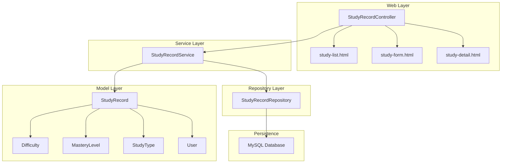
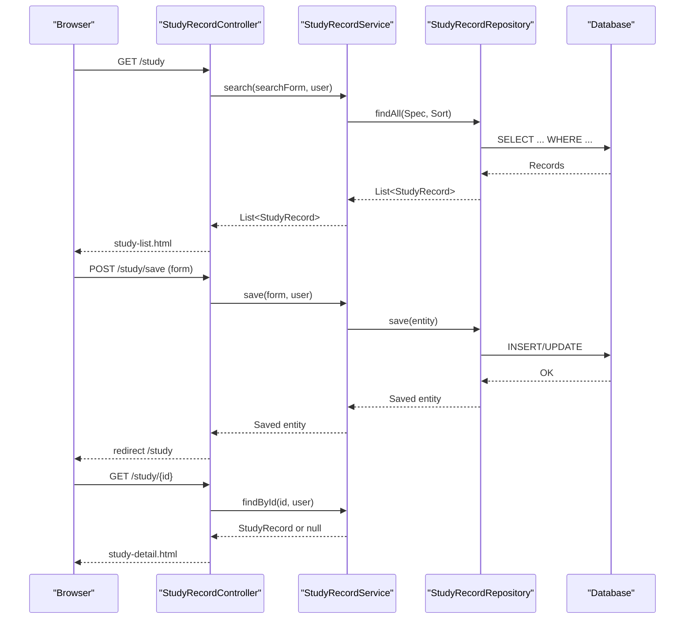
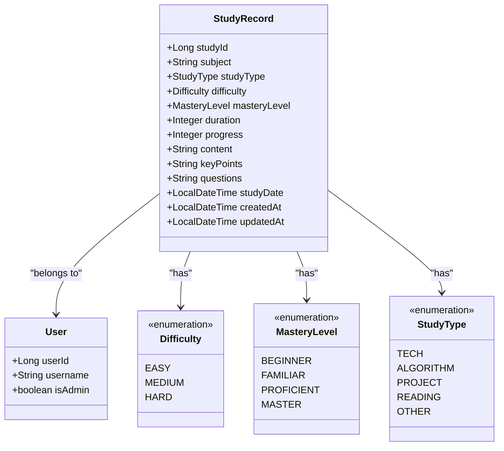
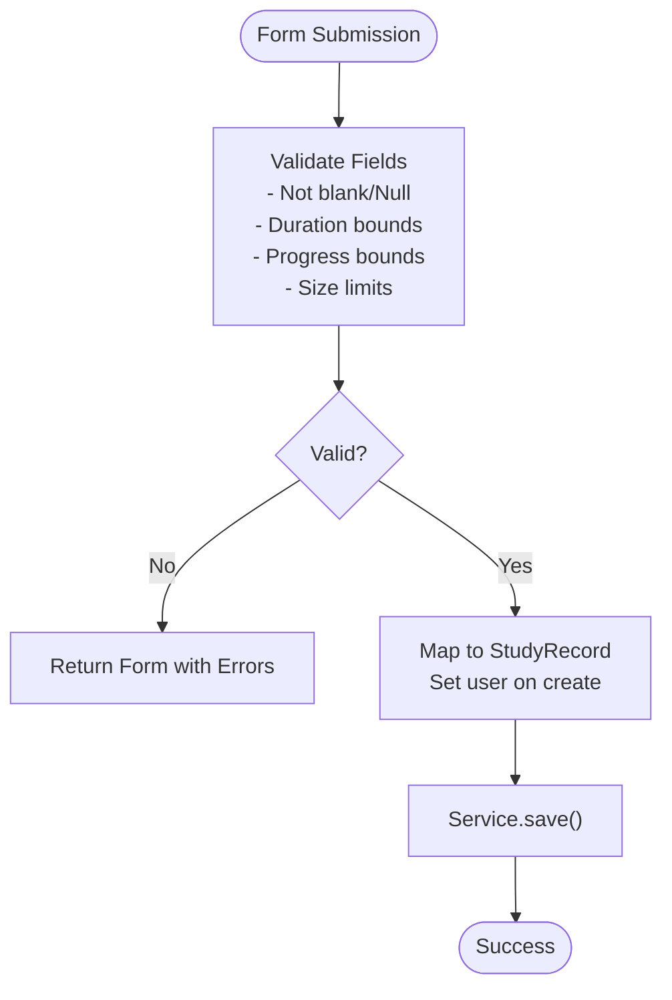
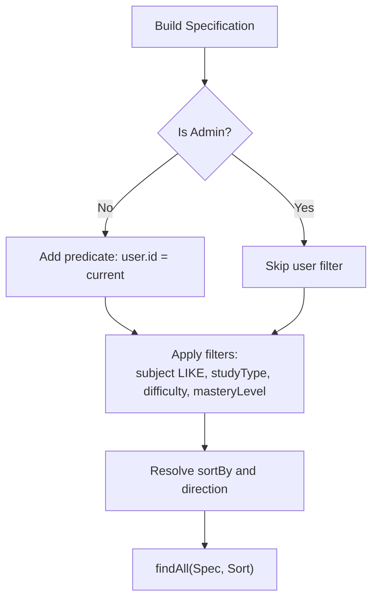
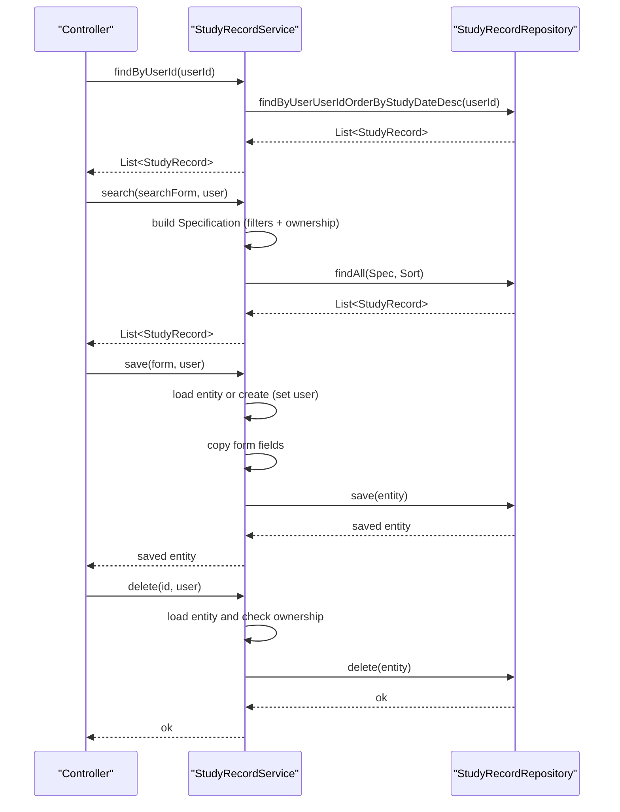
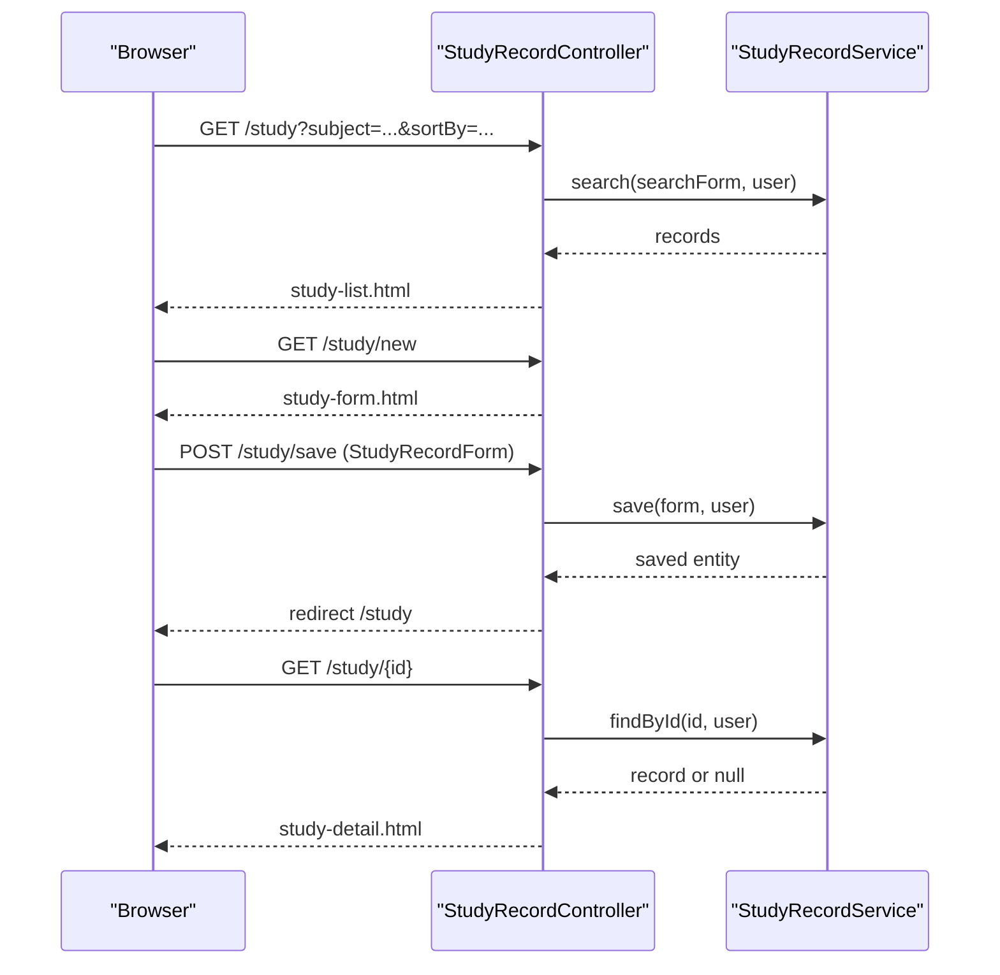
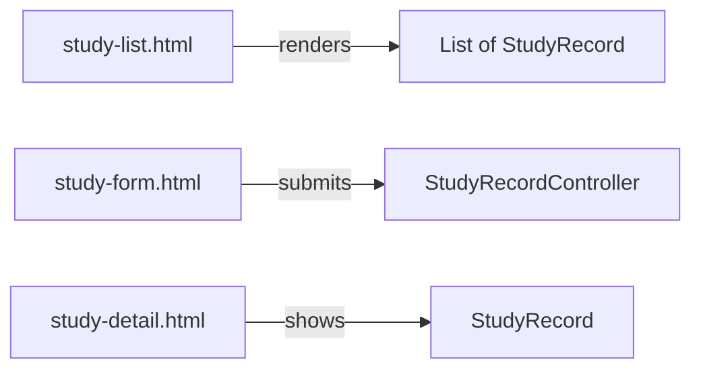
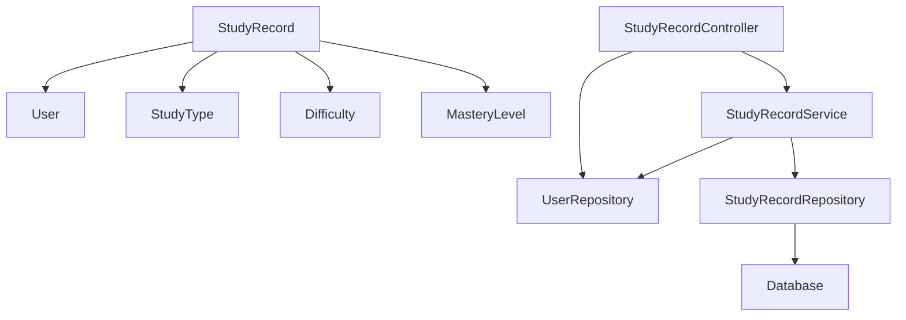

# Study Record Management

<cite>
**Referenced Files in This Document**
- [StudyRecord.java](file://src/main/java/com/wu/model/StudyRecord.java)
- [StudyRecordForm.java](file://src/main/java/com/wu/web/dto/StudyRecordForm.java)
- [StudySearchForm.java](file://src/main/java/com/wu/web/dto/StudySearchForm.java)
- [StudyRecordService.java](file://src/main/java/com/wu/service/StudyRecordService.java)
- [StudyRecordController.java](file://src/main/java/com/wu/web/StudyRecordController.java)
- [StudyRecordRepository.java](file://src/main/java/com/wu/repo/StudyRecordRepository.java)
- [Difficulty.java](file://src/main/java/com/wu/model/Difficulty.java)
- [MasteryLevel.java](file://src/main/java/com/wu/model/MasteryLevel.java)
- [StudyType.java](file://src/main/java/com/wu/model/StudyType.java)
- [study-list.html](file://src/main/resources/templates/study-list.html)
- [study-form.html](file://src/main/resources/templates/study-form.html)
- [study-detail.html](file://src/main/resources/templates/study-detail.html)
- [application.properties](file://src/main/resources/application.properties)
- [User.java](file://src/main/java/com/wu/model/User.java)
</cite>

## Table of Contents
1. [Introduction](#introduction)
2. [Project Structure](#project-structure)
3. [Core Components](#core-components)
4. [Architecture Overview](#architecture-overview)
5. [Detailed Component Analysis](#detailed-component-analysis)
6. [Dependency Analysis](#dependency-analysis)
7. [Performance Considerations](#performance-considerations)
8. [Troubleshooting Guide](#troubleshooting-guide)
9. [Conclusion](#conclusion)
10. [Appendices](#appendices)

## Introduction
This document explains the Study Record Management system, focusing on the StudyRecord entity and its surrounding workflow. It covers subject tracking, difficulty level categorization (Easy/Medium/Hard), mastery level assessment, progress monitoring, CRUD operations, search and filtering via StudySearchForm, form handling with StudyRecordForm, statistics calculation, and reporting features. Practical examples demonstrate how to manage study records, visualize progress, and analyze performance.

## Project Structure
The system follows a layered Spring MVC architecture:
- Model layer defines domain entities and enumerations
- Repository layer handles persistence
- Service layer implements business logic and permissions
- Web layer exposes controllers and Thymeleaf templates for UI
- Configuration sets up the database connection and JPA behavior

**Diagram sources**
- [StudyRecordController.java:23-165](file://src/main/java/com/wu/web/StudyRecordController.java#L23-L165)
- [StudyRecordService.java:21-164](file://src/main/java/com/wu/service/StudyRecordService.java#L21-L164)
- [StudyRecordRepository.java:17-44](file://src/main/java/com/wu/repo/StudyRecordRepository.java#L17-L44)
- [StudyRecord.java:11-187](file://src/main/java/com/wu/model/StudyRecord.java#L11-L187)
- [Difficulty.java:6-20](file://src/main/java/com/wu/model/Difficulty.java#L6-L20)
- [MasteryLevel.java:6-21](file://src/main/java/com/wu/model/MasteryLevel.java#L6-L21)
- [StudyType.java:6-22](file://src/main/java/com/wu/model/StudyType.java#L6-L22)
- [User.java:10-57](file://src/main/java/com/wu/model/User.java#L10-L57)

**Section sources**
- [StudyRecordController.java:23-165](file://src/main/java/com/wu/web/StudyRecordController.java#L23-L165)
- [StudyRecordService.java:21-164](file://src/main/java/com/wu/service/StudyRecordService.java#L21-L164)
- [StudyRecordRepository.java:17-44](file://src/main/java/com/wu/repo/StudyRecordRepository.java#L17-L44)
- [StudyRecord.java:11-187](file://src/main/java/com/wu/model/StudyRecord.java#L11-L187)
- [application.properties:1-14](file://src/main/resources/application.properties#L1-L14)

## Core Components
- StudyRecord entity: central domain object storing subject, type, difficulty, mastery level, duration, progress, content, key points, questions, timestamps, and user association
- StudyRecordForm: validated DTO for create/edit operations
- StudySearchForm: filter and sort criteria for listing
- StudyRecordService: business logic, permission checks, search/specifications, CRUD, and statistics
- StudyRecordRepository: JPA repository with custom queries and Specification support
- Enumerations: Difficulty, MasteryLevel, StudyType
- Controllers and templates: StudyRecordController and Thymeleaf pages for list, form, and detail views

**Section sources**
- [StudyRecord.java:11-187](file://src/main/java/com/wu/model/StudyRecord.java#L11-L187)
- [StudyRecordForm.java:14-147](file://src/main/java/com/wu/web/dto/StudyRecordForm.java#L14-L147)
- [StudySearchForm.java:10-67](file://src/main/java/com/wu/web/dto/StudySearchForm.java#L10-L67)
- [StudyRecordService.java:21-164](file://src/main/java/com/wu/service/StudyRecordService.java#L21-L164)
- [StudyRecordRepository.java:17-44](file://src/main/java/com/wu/repo/StudyRecordRepository.java#L17-L44)
- [Difficulty.java:6-20](file://src/main/java/com/wu/model/Difficulty.java#L6-L20)
- [MasteryLevel.java:6-21](file://src/main/java/com/wu/model/MasteryLevel.java#L6-L21)
- [StudyType.java:6-22](file://src/main/java/com/wu/model/StudyType.java#L6-L22)

## Architecture Overview
The system enforces per-record ownership: non-admin users can only access their own records. Search and CRUD operations are mediated by the controller and service layers, with Thymeleaf rendering the UI.

**Diagram sources**
- [StudyRecordController.java:45-99](file://src/main/java/com/wu/web/StudyRecordController.java#L45-L99)
- [StudyRecordService.java:56-96](file://src/main/java/com/wu/service/StudyRecordService.java#L56-L96)
- [StudyRecordRepository.java:18-44](file://src/main/java/com/wu/repo/StudyRecordRepository.java#L18-L44)

## Detailed Component Analysis

### StudyRecord Entity
StudyRecord captures:
- Identity and ownership: studyId, user relationship
- Subject and metadata: subject, studyType, difficulty, masteryLevel
- Activity metrics: duration (minutes), progress (0–100)
- Content fields: content, keyPoints, questions
- Timestamps: studyDate, createdAt, updatedAt
- Lifecycle hooks: automatic timestamps on create/update

**Diagram sources**
- [StudyRecord.java:11-187](file://src/main/java/com/wu/model/StudyRecord.java#L11-L187)
- [User.java:10-57](file://src/main/java/com/wu/model/User.java#L10-L57)
- [Difficulty.java:6-20](file://src/main/java/com/wu/model/Difficulty.java#L6-L20)
- [MasteryLevel.java:6-21](file://src/main/java/com/wu/model/MasteryLevel.java#L6-L21)
- [StudyType.java:6-22](file://src/main/java/com/wu/model/StudyType.java#L6-L22)

**Section sources**
- [StudyRecord.java:11-187](file://src/main/java/com/wu/model/StudyRecord.java#L11-L187)

### StudyRecordForm (Validation and Defaults)
StudyRecordForm validates and defaults:
- Required fields: subject, studyType, difficulty, masteryLevel, duration, progress, studyDate
- Constraints: duration range, progress range, size limits for content fields
- Defaults: progress initialized to 0, studyDate to current time

**Diagram sources**
- [StudyRecordForm.java:14-147](file://src/main/java/com/wu/web/dto/StudyRecordForm.java#L14-L147)
- [StudyRecordService.java:102-131](file://src/main/java/com/wu/service/StudyRecordService.java#L102-L131)

**Section sources**
- [StudyRecordForm.java:14-147](file://src/main/java/com/wu/web/dto/StudyRecordForm.java#L14-L147)

### StudySearchForm (Filtering and Sorting)
StudySearchForm supports:
- Filters: subject (like), studyType, difficulty, masteryLevel
- Sorting: sortBy among studyDate, subject, duration; direction asc/desc
- Ownership-aware: non-admins see only their records

**Diagram sources**
- [StudySearchForm.java:10-67](file://src/main/java/com/wu/web/dto/StudySearchForm.java#L10-L67)
- [StudyRecordService.java:56-96](file://src/main/java/com/wu/service/StudyRecordService.java#L56-L96)

**Section sources**
- [StudySearchForm.java:10-67](file://src/main/java/com/wu/web/dto/StudySearchForm.java#L10-L67)
- [StudyRecordService.java:56-96](file://src/main/java/com/wu/service/StudyRecordService.java#L56-L96)

### StudyRecordService (Business Logic)
Responsibilities:
- findByUserId: fetch records ordered by studyDate desc
- findById: permission check (admin or owned by user)
- search: build Specification and apply sorting
- save: create or update, enforce ownership
- delete: enforce ownership
- statistics: total study time and count per user

**Diagram sources**
- [StudyRecordService.java:33-145](file://src/main/java/com/wu/service/StudyRecordService.java#L33-L145)
- [StudyRecordRepository.java:18-44](file://src/main/java/com/wu/repo/StudyRecordRepository.java#L18-L44)

**Section sources**
- [StudyRecordService.java:33-145](file://src/main/java/com/wu/service/StudyRecordService.java#L33-L145)

### StudyRecordController (Endpoints and Views)
Endpoints:
- GET /study: list with search and pagination-ready template
- GET /study/new: show empty form
- GET /study/{id}/edit: show edit form
- GET /study/{id}: show detail
- POST /study/save: handle form submission
- POST /study/{id}/delete: delete record

Permissions:
- Uses getCurrentUser to resolve the authenticated user
- Delegates ownership checks to service

**Diagram sources**
- [StudyRecordController.java:45-145](file://src/main/java/com/wu/web/StudyRecordController.java#L45-L145)

**Section sources**
- [StudyRecordController.java:45-145](file://src/main/java/com/wu/web/StudyRecordController.java#L45-L145)

### UI Templates (List, Form, Detail)
- study-list.html: search form, filter controls, sortable columns, progress bars, action buttons
- study-form.html: structured form with validation feedback, progress slider, and responsive layout
- study-detail.html: summary cards for type/difficulty/mastery/time, progress visualization, content sections, and metadata

**Diagram sources**
- [study-list.html:455-567](file://src/main/resources/templates/study-list.html#L455-L567)
- [study-form.html:241-335](file://src/main/resources/templates/study-form.html#L241-L335)
- [study-detail.html:280-363](file://src/main/resources/templates/study-detail.html#L280-L363)

**Section sources**
- [study-list.html:455-567](file://src/main/resources/templates/study-list.html#L455-L567)
- [study-form.html:241-335](file://src/main/resources/templates/study-form.html#L241-L335)
- [study-detail.html:280-363](file://src/main/resources/templates/study-detail.html#L280-L363)

## Dependency Analysis
- StudyRecord depends on User (many-to-one), and on three enumerations (StudyType, Difficulty, MasteryLevel)
- StudyRecordController depends on StudyRecordService and UserRepository
- StudyRecordService depends on StudyRecordRepository and UserRepository
- StudyRecordRepository extends JPA repositories with Specification support

**Diagram sources**
- [StudyRecord.java:18-35](file://src/main/java/com/wu/model/StudyRecord.java#L18-L35)
- [StudyRecordController.java:27-31](file://src/main/java/com/wu/web/StudyRecordController.java#L27-L31)
- [StudyRecordService.java:24-28](file://src/main/java/com/wu/service/StudyRecordService.java#L24-L28)
- [StudyRecordRepository.java:18-23](file://src/main/java/com/wu/repo/StudyRecordRepository.java#L18-L23)

**Section sources**
- [StudyRecord.java:18-35](file://src/main/java/com/wu/model/StudyRecord.java#L18-L35)
- [StudyRecordController.java:27-31](file://src/main/java/com/wu/web/StudyRecordController.java#L27-L31)
- [StudyRecordService.java:24-28](file://src/main/java/com/wu/service/StudyRecordService.java#L24-L28)
- [StudyRecordRepository.java:18-23](file://src/main/java/com/wu/repo/StudyRecordRepository.java#L18-L23)

## Performance Considerations
- Use of JPA Specifications enables efficient server-side filtering and sorting without loading unnecessary data
- Sorting is constrained to safe fields to avoid expensive or unsupported sorts
- Pagination is not implemented in the current search; consider adding Pageable for large datasets
- Consider indexing on frequently filtered columns (e.g., user_id, subject) in the database for improved query performance

[No sources needed since this section provides general guidance]

## Troubleshooting Guide
Common issues and resolutions:
- Permission errors: ensure the logged-in user owns the record or is admin; service throws exceptions for unauthorized access
- Validation failures: StudyRecordForm enforces constraints; review error messages rendered in forms
- Empty lists: adjust search filters or verify data presence
- Database connectivity: verify datasource configuration and credentials

**Section sources**
- [StudyRecordService.java:46-50](file://src/main/java/com/wu/service/StudyRecordService.java#L46-L50)
- [StudyRecordService.java:109-112](file://src/main/java/com/wu/service/StudyRecordService.java#L109-L112)
- [StudyRecordService.java:141-143](file://src/main/java/com/wu/service/StudyRecordService.java#L141-L143)
- [StudyRecordController.java:110-125](file://src/main/java/com/wu/web/StudyRecordController.java#L110-L125)
- [application.properties:3-13](file://src/main/resources/application.properties#L3-L13)

## Conclusion
The Study Record Management system provides a robust foundation for tracking learning activities with strong separation of concerns, clear ownership semantics, and a user-friendly UI. It supports essential CRUD operations, flexible filtering and sorting, progress visualization, and basic statistics. Extending the system could include pagination, advanced analytics, and richer reporting dashboards.

[No sources needed since this section summarizes without analyzing specific files]

## Appendices

### CRUD Operations Summary
- Create: GET /study/new → submit StudyRecordForm → POST /study/save
- Read: GET /study → list with filters; GET /study/{id} → detail
- Update: GET /study/{id}/edit → submit StudyRecordForm → POST /study/save
- Delete: POST /study/{id}/delete

**Section sources**
- [StudyRecordController.java:59-83](file://src/main/java/com/wu/web/StudyRecordController.java#L59-L83)
- [StudyRecordController.java:104-126](file://src/main/java/com/wu/web/StudyRecordController.java#L104-L126)
- [StudyRecordController.java:131-145](file://src/main/java/com/wu/web/StudyRecordController.java#L131-L145)

### Search and Filtering Capabilities
- Filter by subject (partial match), studyType, difficulty, masteryLevel
- Sort by studyDate, subject, or duration with asc/desc direction
- Non-admin users restricted to their own records

**Section sources**
- [StudySearchForm.java:10-67](file://src/main/java/com/wu/web/dto/StudySearchForm.java#L10-L67)
- [StudyRecordService.java:56-96](file://src/main/java/com/wu/service/StudyRecordService.java#L56-L96)

### Statistics and Reporting Features
- Total study time: sum of duration across user’s records
- Study count: number of records per user

**Section sources**
- [StudyRecordService.java:150-163](file://src/main/java/com/wu/service/StudyRecordService.java#L150-L163)

### Practical Examples
- Adding a new study record:
  - Navigate to /study/new, fill the form, submit to /study/save
  - View confirmation and return to the list
- Editing an existing record:
  - Click Edit on the list or go to /study/{id}/edit, modify fields, submit
- Deleting a record:
  - Confirm deletion on the list or detail page
- Monitoring progress:
  - Use the progress bar in the list and detail views
- Analyzing performance:
  - Review total study time and counts via service statistics

**Section sources**
- [study-form.html:241-335](file://src/main/resources/templates/study-form.html#L241-L335)
- [study-list.html:524-567](file://src/main/resources/templates/study-list.html#L524-L567)
- [study-detail.html:334-339](file://src/main/resources/templates/study-detail.html#L334-L339)
- [StudyRecordService.java:150-163](file://src/main/java/com/wu/service/StudyRecordService.java#L150-L163)