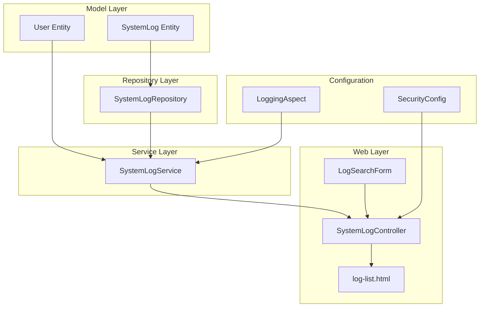
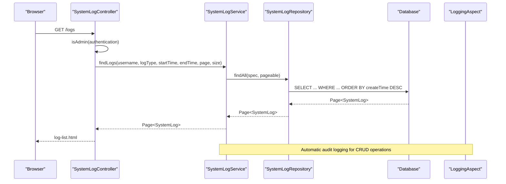
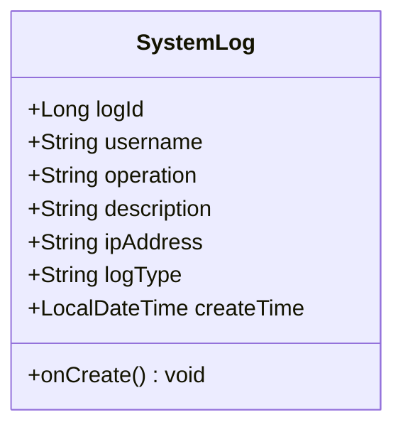
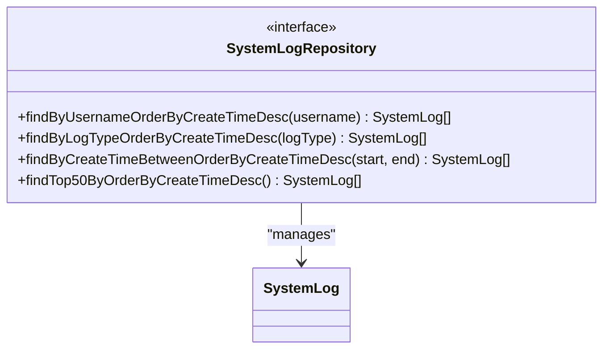
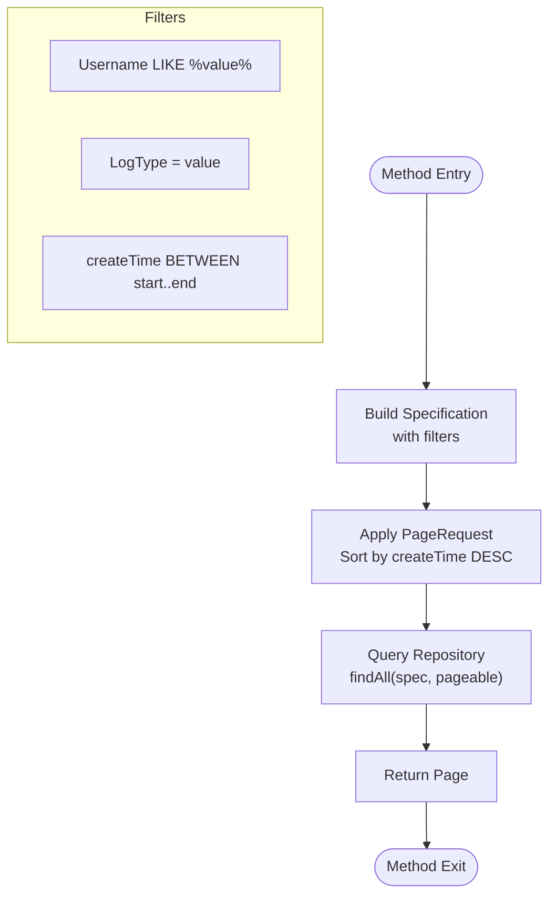
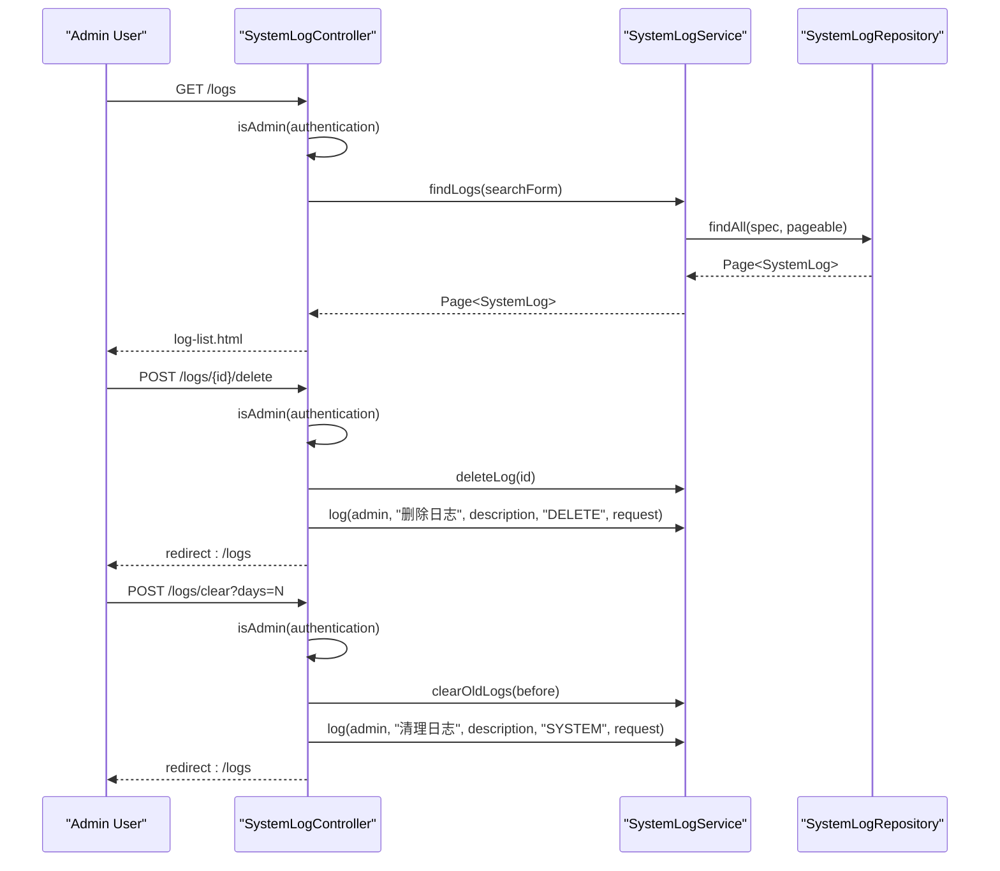
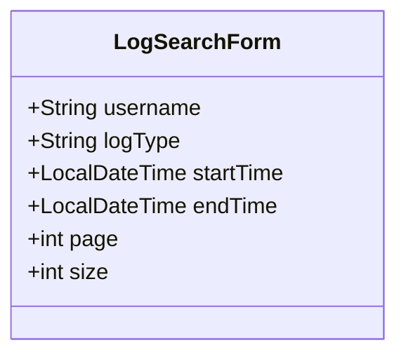
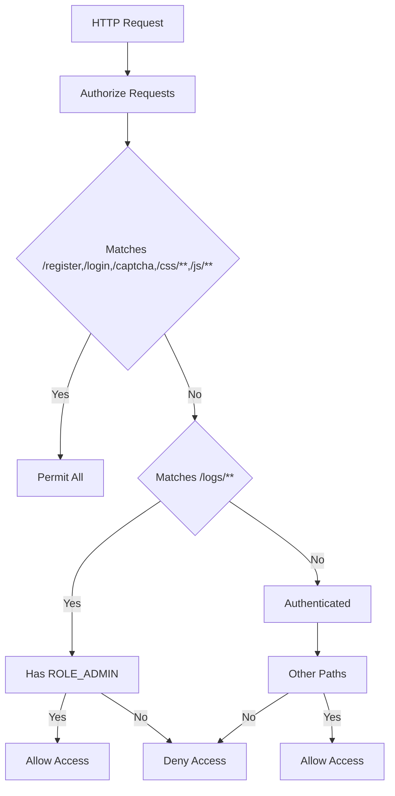
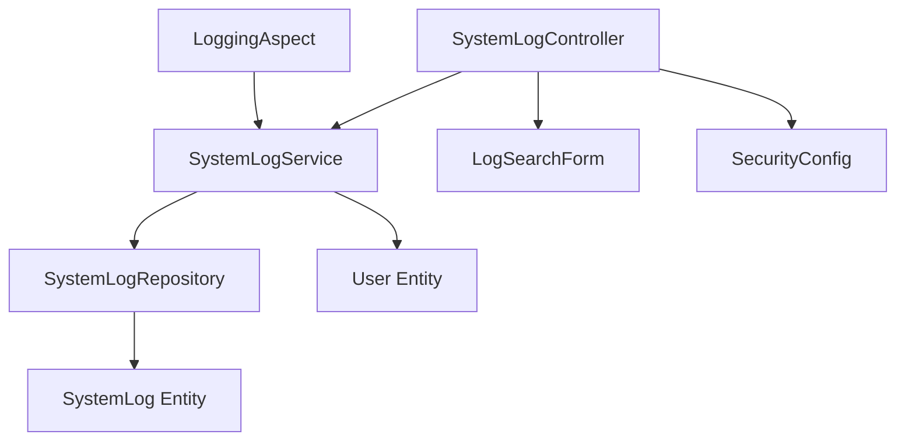

# System Administration

<cite>
**Referenced Files in This Document**
- [SystemLog.java](file://src/main/java/com/wu/model/SystemLog.java)
- [SystemLogService.java](file://src/main/java/com/wu/service/SystemLogService.java)
- [SystemLogRepository.java](file://src/main/java/com/wu/repo/SystemLogRepository.java)
- [SystemLogController.java](file://src/main/java/com/wu/web/SystemLogController.java)
- [LogSearchForm.java](file://src/main/java/com/wu/web/dto/LogSearchForm.java)
- [SecurityConfig.java](file://src/main/java/com/wu/config/SecurityConfig.java)
- [User.java](file://src/main/java/com/wu/model/User.java)
- [LoggingAspect.java](file://src/main/java/com/wu/config/LoggingAspect.java)
- [log-list.html](file://src/main/resources/templates/log-list.html)
- [application.properties](file://src/main/resources/application.properties)
</cite>

## Table of Contents
1. [Introduction](#introduction)
2. [Project Structure](#project-structure)
3. [Core Components](#core-components)
4. [Architecture Overview](#architecture-overview)
5. [Detailed Component Analysis](#detailed-component-analysis)
6. [Dependency Analysis](#dependency-analysis)
7. [Performance Considerations](#performance-considerations)
8. [Troubleshooting Guide](#troubleshooting-guide)
9. [Conclusion](#conclusion)

## Introduction
This document provides comprehensive documentation for the System Administration capabilities of the application, focusing on the SystemLog entity and its supporting infrastructure for tracking system activities, audit trails, and administrative oversight. It covers the SystemLogService implementation for log management, SystemLogRepository data access patterns, and SystemLogController endpoints for administrative viewing. The documentation also explains admin-only access controls, log filtering and searching, system monitoring capabilities, and user statistics reporting. Administrative workflows, security considerations for admin operations, and system maintenance procedures are included to support operational excellence.

## Project Structure
The System Administration subsystem is organized around a clear separation of concerns:
- Model layer defines the SystemLog entity representing audit records.
- Repository layer encapsulates data access patterns for logs.
- Service layer implements business logic for log creation, querying, deletion, and maintenance.
- Web layer exposes administrative endpoints and UI for log management.
- Configuration layer enforces security policies and integrates cross-cutting concerns like auditing.

**Diagram sources**
- [SystemLog.java:1-93](file://src/main/java/com/wu/model/SystemLog.java#L1-L93)
- [SystemLogRepository.java:1-22](file://src/main/java/com/wu/repo/SystemLogRepository.java#L1-L22)
- [SystemLogService.java:1-117](file://src/main/java/com/wu/service/SystemLogService.java#L1-L117)
- [SystemLogController.java:1-111](file://src/main/java/com/wu/web/SystemLogController.java#L1-L111)
- [LogSearchForm.java:1-69](file://src/main/java/com/wu/web/dto/LogSearchForm.java#L1-L69)
- [SecurityConfig.java:1-60](file://src/main/java/com/wu/config/SecurityConfig.java#L1-L60)
- [LoggingAspect.java:1-77](file://src/main/java/com/wu/config/LoggingAspect.java#L1-L77)
- [log-list.html:1-768](file://src/main/resources/templates/log-list.html#L1-L768)

**Section sources**
- [SystemLog.java:1-93](file://src/main/java/com/wu/model/SystemLog.java#L1-L93)
- [SystemLogRepository.java:1-22](file://src/main/java/com/wu/repo/SystemLogRepository.java#L1-L22)
- [SystemLogService.java:1-117](file://src/main/java/com/wu/service/SystemLogService.java#L1-L117)
- [SystemLogController.java:1-111](file://src/main/java/com/wu/web/SystemLogController.java#L1-L111)
- [LogSearchForm.java:1-69](file://src/main/java/com/wu/web/dto/LogSearchForm.java#L1-L69)
- [SecurityConfig.java:1-60](file://src/main/java/com/wu/config/SecurityConfig.java#L1-L60)
- [LoggingAspect.java:1-77](file://src/main/java/com/wu/config/LoggingAspect.java#L1-L77)
- [log-list.html:1-768](file://src/main/resources/templates/log-list.html#L1-L768)

## Core Components
This section documents the primary components involved in system administration and audit logging.

- SystemLog Entity
  - Represents a single audit record with fields for username, operation, description, IP address, log type, and creation time.
  - Uses JPA annotations for persistence and includes a pre-persist lifecycle hook to set the creation time.

- SystemLogRepository
  - Extends Spring Data JPA repositories to provide specialized query methods for logs, including username, log type, and time-range filters, as well as recent/top-N retrieval.

- SystemLogService
  - Implements log creation, filtering, pagination, deletion, and maintenance operations.
  - Provides IP address resolution from HTTP requests and supports both programmatic and request-aware logging.

- SystemLogController
  - Exposes administrative endpoints for listing logs, deleting individual logs, and clearing old logs.
  - Enforces admin-only access and integrates with the UI template for log management.

- LogSearchForm
  - DTO for capturing search criteria including username, log type, start/end times, and pagination parameters.

- SecurityConfig
  - Configures Spring Security to permit public access to registration, login, and static assets, while requiring ROLE_ADMIN for log management endpoints.

- User Entity
  - Defines user roles, including an isAdmin flag used to authorize administrative actions.

- LoggingAspect
  - Cross-cutting concern that automatically logs CRUD operations for interview and study records, enriching audit trails with module-specific details.

- log-list.html
  - Thymeleaf template providing the administrative UI for viewing, filtering, and managing logs, including statistics cards and pagination.

**Section sources**
- [SystemLog.java:1-93](file://src/main/java/com/wu/model/SystemLog.java#L1-L93)
- [SystemLogRepository.java:1-22](file://src/main/java/com/wu/repo/SystemLogRepository.java#L1-L22)
- [SystemLogService.java:1-117](file://src/main/java/com/wu/service/SystemLogService.java#L1-L117)
- [SystemLogController.java:1-111](file://src/main/java/com/wu/web/SystemLogController.java#L1-L111)
- [LogSearchForm.java:1-69](file://src/main/java/com/wu/web/dto/LogSearchForm.java#L1-L69)
- [SecurityConfig.java:1-60](file://src/main/java/com/wu/config/SecurityConfig.java#L1-L60)
- [User.java:1-58](file://src/main/java/com/wu/model/User.java#L1-L58)
- [LoggingAspect.java:1-77](file://src/main/java/com/wu/config/LoggingAspect.java#L1-L77)
- [log-list.html:1-768](file://src/main/resources/templates/log-list.html#L1-L768)

## Architecture Overview
The System Administration subsystem follows a layered architecture with clear boundaries between presentation, business logic, data access, and configuration. The controller layer handles HTTP requests and delegates to the service layer, which coordinates repository operations and cross-cutting concerns like IP resolution and automatic logging. Security enforcement occurs at the configuration layer, ensuring only administrators can access sensitive endpoints.

**Diagram sources**
- [SystemLogController.java:36-57](file://src/main/java/com/wu/web/SystemLogController.java#L36-L57)
- [SystemLogService.java:51-78](file://src/main/java/com/wu/service/SystemLogService.java#L51-L78)
- [SystemLogRepository.java:12-21](file://src/main/java/com/wu/repo/SystemLogRepository.java#L12-L21)
- [LoggingAspect.java:28-62](file://src/main/java/com/wu/config/LoggingAspect.java#L28-L62)

## Detailed Component Analysis

### SystemLog Entity
The SystemLog entity models audit records with the following characteristics:
- Unique identifier and timestamps for creation.
- User identity, operation description, and IP address for traceability.
- Log type classification to categorize events (e.g., LOGIN, LOGOUT, CREATE, UPDATE, DELETE, VIEW, SYSTEM).
- Pre-persist lifecycle ensures creation time is captured automatically.

**Diagram sources**
- [SystemLog.java:6-35](file://src/main/java/com/wu/model/SystemLog.java#L6-L35)

**Section sources**
- [SystemLog.java:1-93](file://src/main/java/com/wu/model/SystemLog.java#L1-L93)

### SystemLogRepository
The repository layer provides:
- Standard CRUD operations via JpaRepository.
- JPA Specification support for dynamic query building.
- Specialized finder methods for username, log type, and time-range filtering.
- Top-N retrieval for recent logs.

**Diagram sources**
- [SystemLogRepository.java:12-21](file://src/main/java/com/wu/repo/SystemLogRepository.java#L12-L21)

**Section sources**
- [SystemLogRepository.java:1-22](file://src/main/java/com/wu/repo/SystemLogRepository.java#L1-L22)

### SystemLogService
The service layer implements:
- Log creation with optional IP capture from HTTP requests.
- Dynamic filtering using JPA Specifications with username, log type, and time bounds.
- Pagination and sorting by creation time (descending).
- Recent logs retrieval and top-N listing.
- Deletion of individual logs and batch deletion of old logs.
- IP address resolution considering forwarded headers and remote address.

**Diagram sources**
- [SystemLogService.java:51-78](file://src/main/java/com/wu/service/SystemLogService.java#L51-L78)

**Section sources**
- [SystemLogService.java:1-117](file://src/main/java/com/wu/service/SystemLogService.java#L1-L117)

### SystemLogController
The controller layer:
- Enforces admin-only access using authentication and user role checks.
- Supports listing logs with filtering and pagination.
- Handles deletion of individual logs with audit logging.
- Provides endpoint to clear old logs with configurable retention periods.
- Integrates with the UI template for displaying statistics and pagination.

**Diagram sources**
- [SystemLogController.java:36-101](file://src/main/java/com/wu/web/SystemLogController.java#L36-L101)
- [SystemLogService.java:91-101](file://src/main/java/com/wu/service/SystemLogService.java#L91-L101)

**Section sources**
- [SystemLogController.java:1-111](file://src/main/java/com/wu/web/SystemLogController.java#L1-L111)

### LogSearchForm
The form DTO captures:
- Username for filtering by user identity.
- Log type selection from predefined categories.
- Start and end times for temporal filtering.
- Page and size parameters for pagination.

**Diagram sources**
- [LogSearchForm.java:7-68](file://src/main/java/com/wu/web/dto/LogSearchForm.java#L7-L68)

**Section sources**
- [LogSearchForm.java:1-69](file://src/main/java/com/wu/web/dto/LogSearchForm.java#L1-L69)

### Security Configuration
Security is configured to:
- Permit public access to registration, login, captcha, and static resources.
- Require ROLE_ADMIN for log management endpoints.
- Enforce authentication for all other endpoints.
- Disable CSRF for simplicity in this context.

**Diagram sources**
- [SecurityConfig.java:37-58](file://src/main/java/com/wu/config/SecurityConfig.java#L37-L58)

**Section sources**
- [SecurityConfig.java:1-60](file://src/main/java/com/wu/config/SecurityConfig.java#L1-L60)

### User Statistics Reporting
The UI template provides statistics cards showing:
- Total log count.
- Total pages.
- Current page number.

These values are populated from the paginated response and rendered in the template for quick overview.

**Section sources**
- [log-list.html:615-629](file://src/main/resources/templates/log-list.html#L615-L629)

### Administrative Workflows
- Viewing Logs: Admin navigates to the logs page, applies filters, and browses paginated results.
- Deleting Logs: Admin selects a log entry and confirms deletion; the action is audited.
- Clearing Old Logs: Admin chooses a retention period; the system deletes logs older than the threshold and audits the cleanup.

**Section sources**
- [SystemLogController.java:36-101](file://src/main/java/com/wu/web/SystemLogController.java#L36-L101)
- [log-list.html:716-735](file://src/main/resources/templates/log-list.html#L716-L735)

### System Monitoring Capabilities
- Real-time audit trail: Automatic logging of CRUD operations for interview and study records.
- Centralized log management: Unified endpoint for viewing, filtering, and maintenance.
- IP attribution: Logs capture client IP addresses for traceability.

**Section sources**
- [LoggingAspect.java:28-75](file://src/main/java/com/wu/config/LoggingAspect.java#L28-L75)
- [SystemLogService.java:30-49](file://src/main/java/com/wu/service/SystemLogService.java#L30-L49)

### Security Considerations for Admin Operations
- Role-based access control: Only users with ROLE_ADMIN can access log management endpoints.
- Session-based authentication: Access checks rely on the authenticated principal.
- Audit of administrative actions: All admin actions (delete, clear) are logged for accountability.
- IP capture: Client IP addresses are recorded to aid forensic analysis.

**Section sources**
- [SecurityConfig.java:41](file://src/main/java/com/wu/config/SecurityConfig.java#L41)
- [SystemLogController.java:103-109](file://src/main/java/com/wu/web/SystemLogController.java#L103-L109)
- [SystemLogService.java:103-115](file://src/main/java/com/wu/service/SystemLogService.java#L103-L115)

### System Maintenance Procedures
- Log cleanup: Administrators can remove logs older than a specified number of days.
- Batch deletion: Efficient removal of historical entries to control storage growth.
- Retention policy: Configurable cleanup intervals to balance compliance and performance.

**Section sources**
- [SystemLogService.java:96-101](file://src/main/java/com/wu/service/SystemLogService.java#L96-L101)
- [SystemLogController.java:80-101](file://src/main/java/com/wu/web/SystemLogController.java#L80-L101)

## Dependency Analysis
The following diagram illustrates the dependencies among components:

**Diagram sources**
- [SystemLogController.java:25-34](file://src/main/java/com/wu/web/SystemLogController.java#L25-L34)
- [SystemLogService.java:23-28](file://src/main/java/com/wu/service/SystemLogService.java#L23-L28)
- [SystemLogRepository.java:12](file://src/main/java/com/wu/repo/SystemLogRepository.java#L12)
- [SystemLog.java:6-35](file://src/main/java/com/wu/model/SystemLog.java#L6-L35)
- [SecurityConfig.java:37-58](file://src/main/java/com/wu/config/SecurityConfig.java#L37-L58)
- [LoggingAspect.java:21-26](file://src/main/java/com/wu/config/LoggingAspect.java#L21-L26)
- [User.java:10-58](file://src/main/java/com/wu/model/User.java#L10-L58)

**Section sources**
- [SystemLogController.java:1-111](file://src/main/java/com/wu/web/SystemLogController.java#L1-L111)
- [SystemLogService.java:1-117](file://src/main/java/com/wu/service/SystemLogService.java#L1-L117)
- [SystemLogRepository.java:1-22](file://src/main/java/com/wu/repo/SystemLogRepository.java#L1-L22)
- [SystemLog.java:1-93](file://src/main/java/com/wu/model/SystemLog.java#L1-L93)
- [SecurityConfig.java:1-60](file://src/main/java/com/wu/config/SecurityConfig.java#L1-L60)
- [LoggingAspect.java:1-77](file://src/main/java/com/wu/config/LoggingAspect.java#L1-L77)
- [User.java:1-58](file://src/main/java/com/wu/model/User.java#L1-L58)

## Performance Considerations
- Pagination: Filtering and pagination reduce memory overhead for large datasets.
- Indexing: Ensure database indexes exist on frequently queried columns (username, logType, createTime) to optimize query performance.
- IP Resolution: Client IP resolution involves header parsing; cache or memoize where appropriate to minimize overhead.
- Batch Operations: Use repository-provided batch deletion methods to efficiently remove large sets of old logs.
- Template Rendering: The UI template renders paginated results; keep page sizes reasonable to avoid excessive DOM rendering.

## Troubleshooting Guide
Common issues and resolutions:
- Access Denied Errors: Ensure the authenticated user has ROLE_ADMIN. Verify security configuration and user role mapping.
- Empty Results: Confirm filter criteria are appropriate and that logs exist within the specified time range.
- IP Address Not Recorded: Verify reverse proxy headers are correctly forwarded; adjust IP resolution logic if needed.
- CSRF Disabled: CSRF is disabled in the configuration; ensure this aligns with deployment security posture.
- Database Connectivity: Check datasource configuration and credentials in application properties.

**Section sources**
- [SecurityConfig.java:41](file://src/main/java/com/wu/config/SecurityConfig.java#L41)
- [SystemLogController.java:38-40](file://src/main/java/com/wu/web/SystemLogController.java#L38-L40)
- [SystemLogService.java:103-115](file://src/main/java/com/wu/service/SystemLogService.java#L103-L115)
- [application.properties:3-13](file://src/main/resources/application.properties#L3-L13)

## Conclusion
The System Administration subsystem provides a robust foundation for audit logging, administrative oversight, and system maintenance. The SystemLog entity, repository, service, and controller components work together to enable secure, traceable, and manageable operations. Security configurations enforce admin-only access, while automatic logging and UI-driven workflows streamline day-to-day administrative tasks. Proper indexing, pagination, and maintenance procedures ensure long-term performance and reliability.