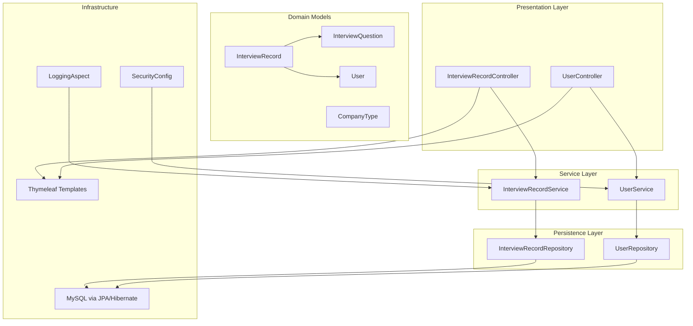
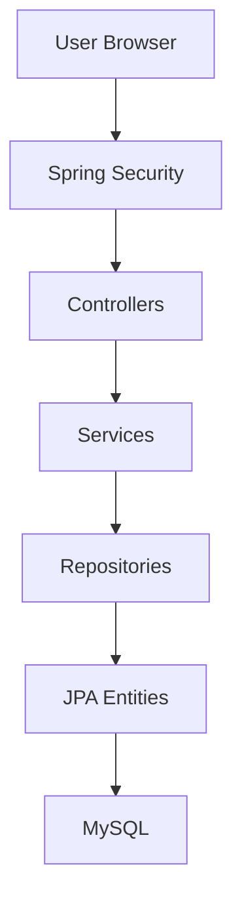
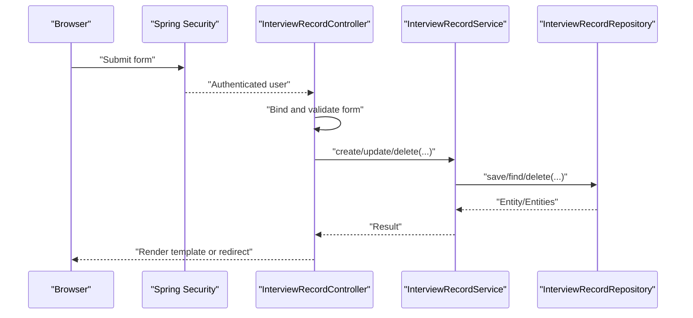
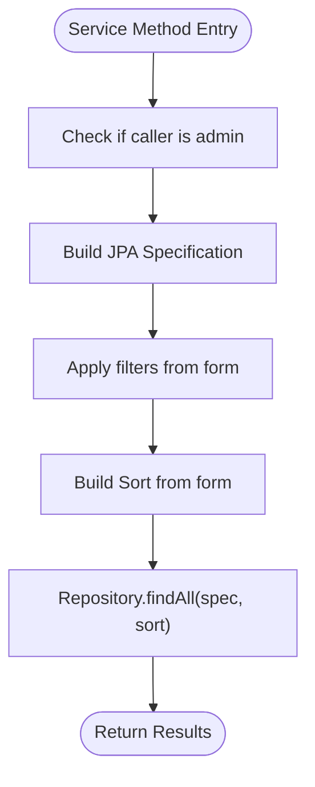
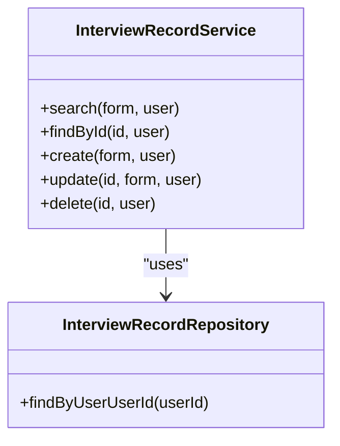
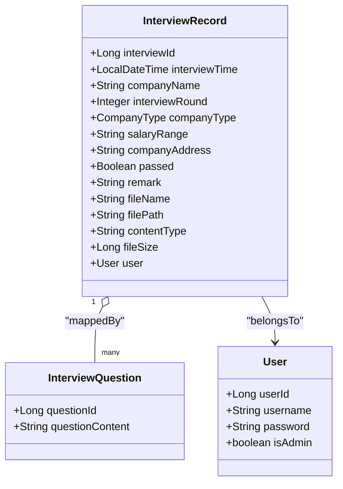
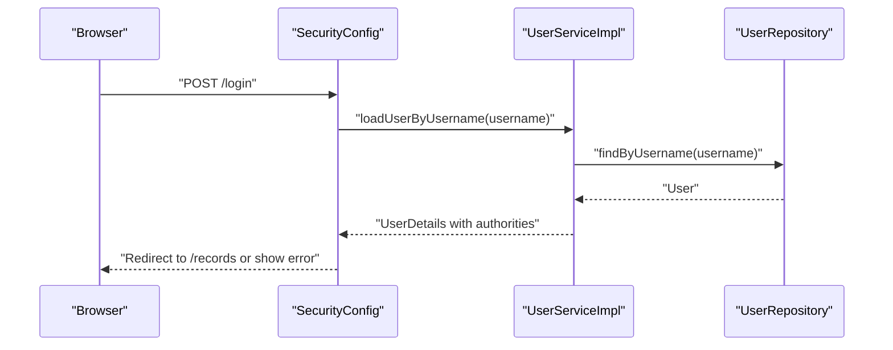
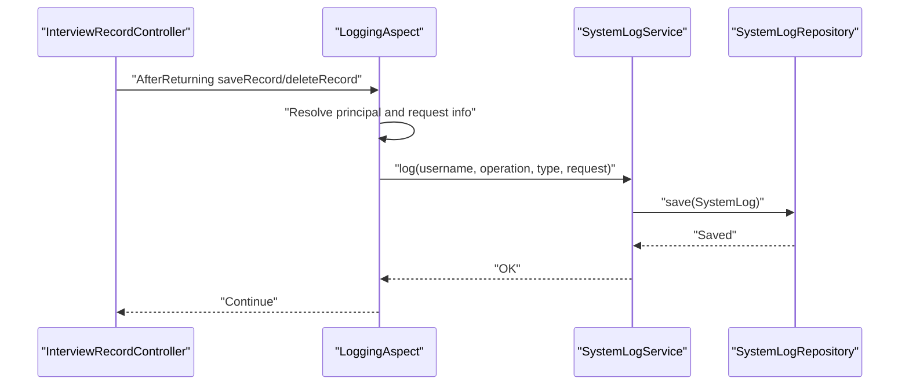
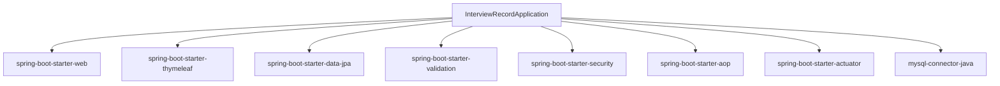
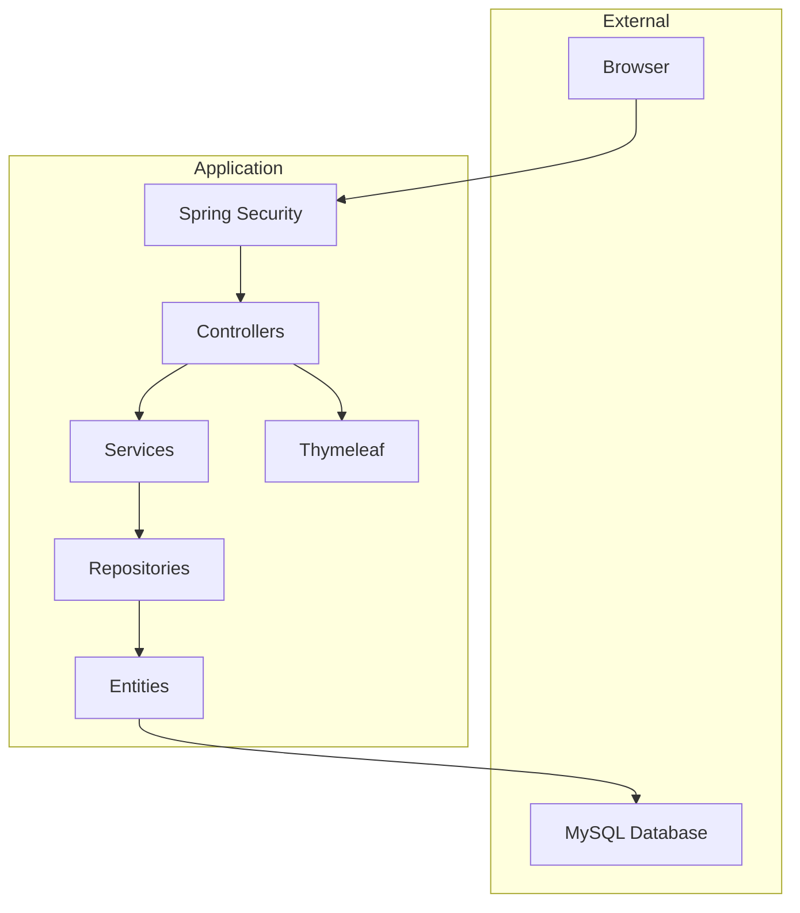

# System Architecture

<cite>
**Referenced Files in This Document**
- [InterviewRecordApplication.java](file://src/main/java/com/wu/InterviewRecordApplication.java)
- [SecurityConfig.java](file://src/main/java/com/wu/config/SecurityConfig.java)
- [LoggingAspect.java](file://src/main/java/com/wu/config/LoggingAspect.java)
- [User.java](file://src/main/java/com/wu/model/User.java)
- [InterviewRecord.java](file://src/main/java/com/wu/model/InterviewRecord.java)
- [CompanyType.java](file://src/main/java/com/wu/model/CompanyType.java)
- [InterviewQuestion.java](file://src/main/java/com/wu/model/InterviewQuestion.java)
- [UserRepository.java](file://src/main/java/com/wu/repository/UserRepository.java)
- [InterviewRecordRepository.java](file://src/main/java/com/wu/repo/InterviewRecordRepository.java)
- [UserService.java](file://src/main/java/com/wu/service/UserService.java)
- [UserServiceImpl.java](file://src/main/java/com/wu/service/impl/UserServiceImpl.java)
- [InterviewRecordService.java](file://src/main/java/com/wu/service/InterviewRecordService.java)
- [InterviewRecordController.java](file://src/main/java/com/wu/web/InterviewRecordController.java)
- [UserController.java](file://src/main/java/com/wu/web/UserController.java)
- [InterviewRecordForm.java](file://src/main/java/com/wu/web/dto/InterviewRecordForm.java)
- [application.properties](file://src/main/resources/application.properties)
- [pom.xml](file://pom.xml)
</cite>

## Table of Contents
1. [Introduction](#introduction)
2. [Project Structure](#project-structure)
3. [Core Components](#core-components)
4. [Architecture Overview](#architecture-overview)
5. [Detailed Component Analysis](#detailed-component-analysis)
6. [Dependency Analysis](#dependency-analysis)
7. [Performance Considerations](#performance-considerations)
8. [Troubleshooting Guide](#troubleshooting-guide)
9. [Conclusion](#conclusion)
10. [Appendices](#appendices)

## Introduction
This document describes the architectural design of the Interview Record Management System. The system follows a layered architecture aligned with Model-View-Controller (MVC), Repository pattern, and a Service layer. It integrates Spring Security for authentication and authorization, Spring Data JPA/Hibernate for persistence, and Thymeleaf for server-side rendering. Cross-cutting concerns such as logging and auditing are handled via Aspect-Oriented Programming (AOP) and a dedicated logging service.

## Project Structure
The project is organized into packages reflecting clean architecture layers:
- config: Security configuration and logging aspect
- model: JPA entities and enumerations
- repository: Spring Data JPA repositories
- service: business logic and service interfaces
- web: controllers and DTOs
- resources: templates and application configuration

**Diagram sources**
- [InterviewRecordController.java:28-167](file://src/main/java/com/wu/web/InterviewRecordController.java#L28-L167)
- [UserController.java:15-58](file://src/main/java/com/wu/web/UserController.java#L15-L58)
- [InterviewRecordService.java:19-153](file://src/main/java/com/wu/service/InterviewRecordService.java#L19-L153)
- [UserServiceImpl.java:16-86](file://src/main/java/com/wu/service/impl/UserServiceImpl.java#L16-L86)
- [InterviewRecordRepository.java:1-11](file://src/main/java/com/wu/repo/InterviewRecordRepository.java#L1-L11)
- [UserRepository.java:1-10](file://src/main/java/com/wu/repository/UserRepository.java#L1-L10)
- [InterviewRecord.java:21-202](file://src/main/java/com/wu/model/InterviewRecord.java#L21-L202)
- [User.java:10-58](file://src/main/java/com/wu/model/User.java#L10-L58)
- [InterviewQuestion.java](file://src/main/java/com/wu/model/InterviewQuestion.java)
- [CompanyType.java](file://src/main/java/com/wu/model/CompanyType.java)
- [SecurityConfig.java:15-60](file://src/main/java/com/wu/config/SecurityConfig.java#L15-L60)
- [LoggingAspect.java:17-77](file://src/main/java/com/wu/config/LoggingAspect.java#L17-L77)
- [application.properties:1-14](file://src/main/resources/application.properties#L1-L14)

**Section sources**
- [pom.xml:25-70](file://pom.xml#L25-L70)
- [application.properties:1-14](file://src/main/resources/application.properties#L1-L14)

## Core Components
- Application bootstrap: Declares the Spring Boot entry point.
- Security configuration: Defines authentication provider, password encoder, and HTTP security rules.
- Logging aspect: Intercepts controller operations to record system logs.
- Domain models: Entities representing users, interview records, and related enumerations.
- Repositories: JPA repositories extending Spring Data for data access.
- Services: Business logic for user management and interview record operations.
- Controllers: MVC endpoints handling HTTP requests and delegating to services.
- DTOs: Form objects for request binding and validation.

Key implementation patterns:
- MVC: Controllers handle HTTP requests, delegate to services, and render views.
- Repository pattern: Repositories encapsulate persistence operations.
- Service layer: Encapsulates business rules and transaction boundaries.
- Security: Spring Security configured via Java config with form login and role-based access.
- Persistence: JPA/Hibernate with MySQL and Spring Data JPA specifications.
- Templating: Thymeleaf for HTML rendering.

**Section sources**
- [InterviewRecordApplication.java:6-11](file://src/main/java/com/wu/InterviewRecordApplication.java#L6-L11)
- [SecurityConfig.java:15-60](file://src/main/java/com/wu/config/SecurityConfig.java#L15-L60)
- [LoggingAspect.java:17-77](file://src/main/java/com/wu/config/LoggingAspect.java#L17-L77)
- [User.java:10-58](file://src/main/java/com/wu/model/User.java#L10-L58)
- [InterviewRecord.java:21-202](file://src/main/java/com/wu/model/InterviewRecord.java#L21-L202)
- [InterviewRecordRepository.java:1-11](file://src/main/java/com/wu/repo/InterviewRecordRepository.java#L1-L11)
- [UserRepository.java:1-10](file://src/main/java/com/wu/repository/UserRepository.java#L1-L10)
- [UserService.java:6-10](file://src/main/java/com/wu/service/UserService.java#L6-L10)
- [UserServiceImpl.java:16-86](file://src/main/java/com/wu/service/impl/UserServiceImpl.java#L16-L86)
- [InterviewRecordService.java:19-153](file://src/main/java/com/wu/service/InterviewRecordService.java#L19-L153)
- [InterviewRecordController.java:28-167](file://src/main/java/com/wu/web/InterviewRecordController.java#L28-L167)
- [InterviewRecordForm.java:14-134](file://src/main/java/com/wu/web/dto/InterviewRecordForm.java#L14-L134)

## Architecture Overview
The system enforces clear separation of concerns across layers. HTTP requests enter via controllers, which validate inputs and delegate to services. Services encapsulate business logic, enforce authorization, and manage transactions. Repositories abstract persistence using Spring Data JPA. Security is enforced centrally, and logging is applied cross-cuttingly.

**Diagram sources**
- [SecurityConfig.java:37-59](file://src/main/java/com/wu/config/SecurityConfig.java#L37-L59)
- [InterviewRecordController.java:28-167](file://src/main/java/com/wu/web/InterviewRecordController.java#L28-L167)
- [InterviewRecordService.java:19-153](file://src/main/java/com/wu/service/InterviewRecordService.java#L19-L153)
- [InterviewRecordRepository.java:1-11](file://src/main/java/com/wu/repo/InterviewRecordRepository.java#L1-L11)
- [InterviewRecord.java:21-202](file://src/main/java/com/wu/model/InterviewRecord.java#L21-L202)
- [application.properties:3-13](file://src/main/resources/application.properties#L3-L13)

## Detailed Component Analysis

### MVC Pattern and Controller Responsibilities
Controllers handle HTTP requests, bind and validate forms, and render Thymeleaf templates. They retrieve the current user from security context and delegate to services for CRUD operations.

**Diagram sources**
- [InterviewRecordController.java:67-136](file://src/main/java/com/wu/web/InterviewRecordController.java#L67-L136)
- [InterviewRecordService.java:28-95](file://src/main/java/com/wu/service/InterviewRecordService.java#L28-L95)
- [InterviewRecordRepository.java:1-11](file://src/main/java/com/wu/repo/InterviewRecordRepository.java#L1-L11)

**Section sources**
- [InterviewRecordController.java:28-167](file://src/main/java/com/wu/web/InterviewRecordController.java#L28-L167)
- [InterviewRecordForm.java:14-134](file://src/main/java/com/wu/web/dto/InterviewRecordForm.java#L14-L134)

### Service Layer Implementation
The service layer manages business rules, transactions, and authorization checks. It constructs dynamic JPA Specifications for filtering and sorting, ensures users can only access their own records, and validates inputs.

**Diagram sources**
- [InterviewRecordService.java:36-60](file://src/main/java/com/wu/service/InterviewRecordService.java#L36-L60)

**Section sources**
- [InterviewRecordService.java:19-153](file://src/main/java/com/wu/service/InterviewRecordService.java#L19-L153)

### Repository Pattern and Data Access
Repositories extend Spring Data JPA interfaces to provide CRUD and derived query methods. The InterviewRecordRepository adds a method to filter by user ID and supports JPA Specifications for advanced queries.

**Diagram sources**
- [InterviewRecordRepository.java:1-11](file://src/main/java/com/wu/repo/InterviewRecordRepository.java#L1-L11)
- [InterviewRecordService.java:19-153](file://src/main/java/com/wu/service/InterviewRecordService.java#L19-L153)

**Section sources**
- [InterviewRecordRepository.java:1-11](file://src/main/java/com/wu/repo/InterviewRecordRepository.java#L1-L11)
- [UserRepository.java:1-10](file://src/main/java/com/wu/repository/UserRepository.java#L1-L10)

### Domain Model and Relationships
The domain model centers around User and InterviewRecord, with InterviewRecord containing a collection of InterviewQuestion. Relationships are mapped via JPA annotations.

**Diagram sources**
- [User.java:10-58](file://src/main/java/com/wu/model/User.java#L10-L58)
- [InterviewRecord.java:21-202](file://src/main/java/com/wu/model/InterviewRecord.java#L21-L202)
- [InterviewQuestion.java](file://src/main/java/com/wu/model/InterviewQuestion.java)
- [CompanyType.java](file://src/main/java/com/wu/model/CompanyType.java)

**Section sources**
- [User.java:10-58](file://src/main/java/com/wu/model/User.java#L10-L58)
- [InterviewRecord.java:21-202](file://src/main/java/com/wu/model/InterviewRecord.java#L21-L202)

### Security Integration
Spring Security is configured to:
- Use a custom UserDetailsService implementation for authentication.
- Enforce role-based access control for endpoints.
- Configure form login, logout, and CSRF settings.

**Diagram sources**
- [SecurityConfig.java:32-34](file://src/main/java/com/wu/config/SecurityConfig.java#L32-L34)
- [UserServiceImpl.java:39-48](file://src/main/java/com/wu/service/impl/UserServiceImpl.java#L39-L48)
- [UserRepository.java:1-10](file://src/main/java/com/wu/repository/UserRepository.java#L1-L10)

**Section sources**
- [SecurityConfig.java:15-60](file://src/main/java/com/wu/config/SecurityConfig.java#L15-L60)
- [UserServiceImpl.java:16-86](file://src/main/java/com/wu/service/impl/UserServiceImpl.java#L16-L86)
- [UserService.java:6-10](file://src/main/java/com/wu/service/UserService.java#L6-L10)

### Logging and Auditing
AOP logging aspect intercepts specific controller operations to capture user actions and persist audit logs through a logging service.

**Diagram sources**
- [LoggingAspect.java:28-75](file://src/main/java/com/wu/config/LoggingAspect.java#L28-L75)

**Section sources**
- [LoggingAspect.java:17-77](file://src/main/java/com/wu/config/LoggingAspect.java#L17-L77)

## Dependency Analysis
External dependencies include Spring Boot starters for web, Thymeleaf, JPA, validation, security, AOP, and MySQL connector. Internal dependencies reflect the layered architecture with controllers depending on services, services on repositories, and repositories on JPA/Hibernate.

**Diagram sources**
- [pom.xml:25-70](file://pom.xml#L25-L70)

**Section sources**
- [pom.xml:25-70](file://pom.xml#L25-L70)

## Performance Considerations
- Lazy loading: Bidirectional collections are fetched lazily to avoid unnecessary joins.
- Sorting and filtering: JPA Specifications enable efficient filtering and controlled sorting.
- Transaction boundaries: Services annotate methods with appropriate propagation to minimize long-running transactions.
- Validation: DTO validation prevents invalid data from entering the persistence layer.
- Template caching: Disabled during development for rapid iteration; can be enabled in production.

[No sources needed since this section provides general guidance]

## Troubleshooting Guide
Common issues and resolutions:
- Authentication failures: Verify credentials and ensure the user exists in the database.
- Authorization errors: Confirm user roles and endpoint security rules.
- Validation errors: Inspect DTO constraints and error messages returned to the view.
- Transaction errors: Review service method annotations and ensure proper rollback conditions.
- Logging not recorded: Confirm aspect bean initialization and SystemLogService wiring.

**Section sources**
- [SecurityConfig.java:37-59](file://src/main/java/com/wu/config/SecurityConfig.java#L37-L59)
- [InterviewRecordController.java:72-86](file://src/main/java/com/wu/web/InterviewRecordController.java#L72-L86)
- [InterviewRecordService.java:74-95](file://src/main/java/com/wu/service/InterviewRecordService.java#L74-L95)
- [LoggingAspect.java:64-75](file://src/main/java/com/wu/config/LoggingAspect.java#L64-L75)

## Conclusion
The Interview Record Management System employs a clean, layered architecture with clear separation between presentation, service, and persistence concerns. Spring Security and Thymeleaf integrate seamlessly with JPA/Hibernate to deliver a secure, maintainable, and extensible solution. Cross-cutting concerns like logging are handled via AOP, ensuring consistent auditing without cluttering business logic.

## Appendices

### System Context Diagram

**Diagram sources**
- [SecurityConfig.java:37-59](file://src/main/java/com/wu/config/SecurityConfig.java#L37-L59)
- [InterviewRecordController.java:28-167](file://src/main/java/com/wu/web/InterviewRecordController.java#L28-L167)
- [InterviewRecordService.java:19-153](file://src/main/java/com/wu/service/InterviewRecordService.java#L19-L153)
- [InterviewRecordRepository.java:1-11](file://src/main/java/com/wu/repo/InterviewRecordRepository.java#L1-L11)
- [InterviewRecord.java:21-202](file://src/main/java/com/wu/model/InterviewRecord.java#L21-L202)
- [application.properties:3-13](file://src/main/resources/application.properties#L3-L13)