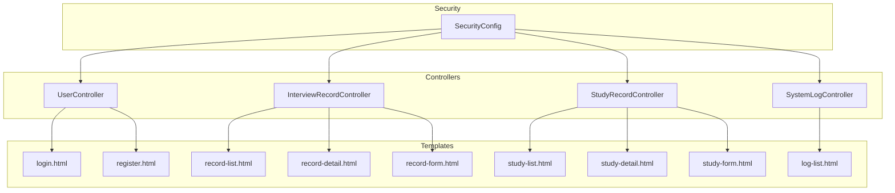
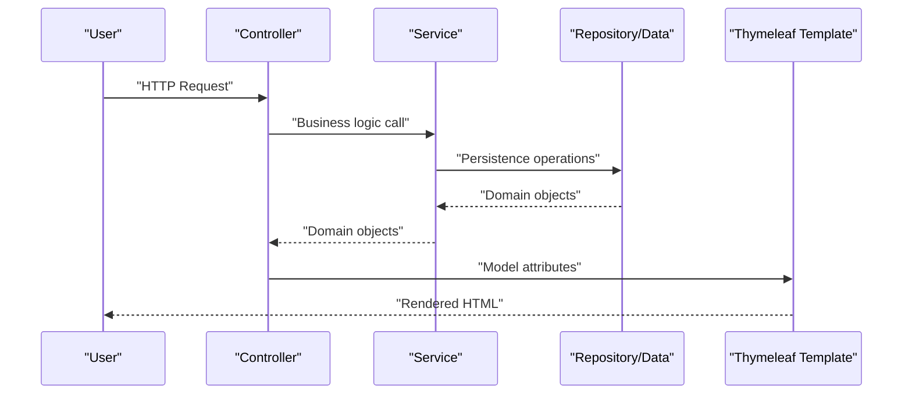
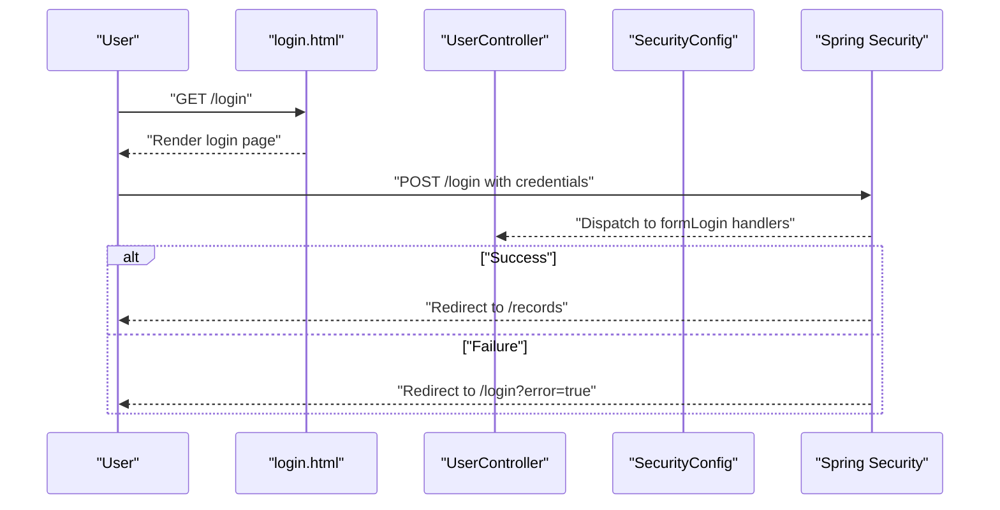
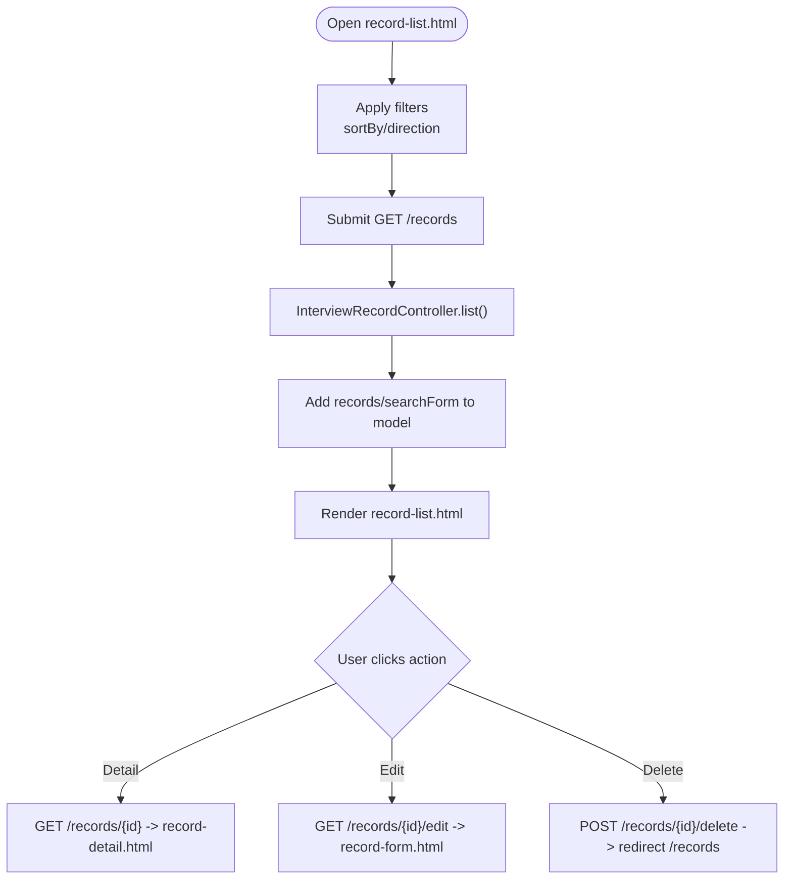
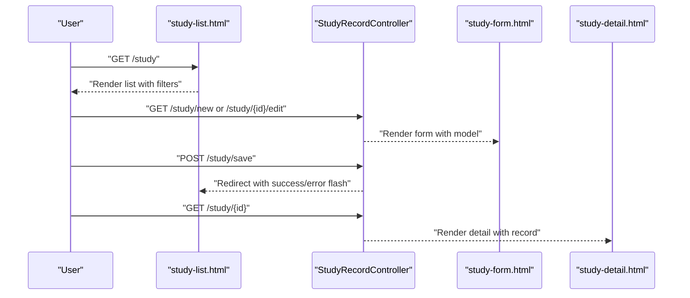
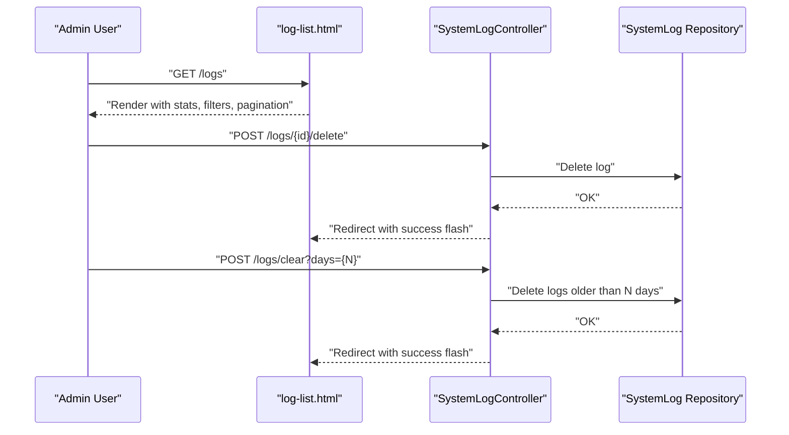
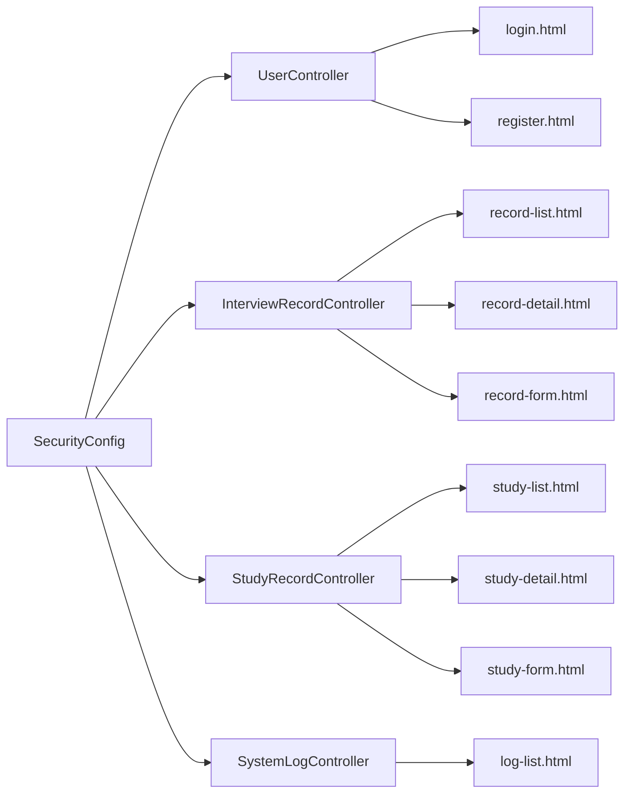

# Template System & UI

<cite>
**Referenced Files in This Document**
- [login.html](file://src/main/resources/templates/login.html)
- [register.html](file://src/main/resources/templates/register.html)
- [record-list.html](file://src/main/resources/templates/record-list.html)
- [record-detail.html](file://src/main/resources/templates/record-detail.html)
- [record-form.html](file://src/main/resources/templates/record-form.html)
- [study-list.html](file://src/main/resources/templates/study-list.html)
- [study-detail.html](file://src/main/resources/templates/study-detail.html)
- [study-form.html](file://src/main/resources/templates/study-form.html)
- [log-list.html](file://src/main/resources/templates/log-list.html)
- [SecurityConfig.java](file://src/main/java/com/wu/config/SecurityConfig.java)
- [UserController.java](file://src/main/java/com/wu/web/UserController.java)
- [InterviewRecordController.java](file://src/main/java/com/wu/web/InterviewRecordController.java)
- [StudyRecordController.java](file://src/main/java/com/wu/web/StudyRecordController.java)
- [SystemLogController.java](file://src/main/java/com/wu/web/SystemLogController.java)
- [InterviewRecordForm.java](file://src/main/java/com/wu/web/dto/InterviewRecordForm.java)
- [StudyRecordForm.java](file://src/main/java/com/wu/web/dto/StudyRecordForm.java)
- [InterviewRecord.java](file://src/main/java/com/wu/model/InterviewRecord.java)
- [StudyRecord.java](file://src/main/java/com/wu/model/StudyRecord.java)
- [SystemLog.java](file://src/main/java/com/wu/model/SystemLog.java)
</cite>

## Table of Contents
1. [Introduction](#introduction)
2. [Project Structure](#project-structure)
3. [Core Components](#core-components)
4. [Architecture Overview](#architecture-overview)
5. [Detailed Component Analysis](#detailed-component-analysis)
6. [Dependency Analysis](#dependency-analysis)
7. [Performance Considerations](#performance-considerations)
8. [Troubleshooting Guide](#troubleshooting-guide)
9. [Conclusion](#conclusion)

## Introduction
This document explains the Thymeleaf template system and user interface components used in the interview management application. It covers the complete template structure for login, registration, interview record lists, detail views, forms, study management pages, and the system log interface. It also documents Thymeleaf syntax usage, Spring Security integration with thymeleaf-extras-springsecurity5, form binding patterns, dynamic content rendering, responsive design principles, form validation display, error handling in templates, and user interaction patterns across all interface components.

## Project Structure
The UI is built with Thymeleaf templates located under src/main/resources/templates. Each major feature area has dedicated templates:
- Authentication: login.html, register.html
- Interview Records: record-list.html, record-detail.html, record-form.html
- Study Records: study-list.html, study-detail.html, study-form.html
- System Logs: log-list.html

Controllers render these templates and pass models for dynamic content. Spring Security controls access and integrates with Thymeleaf via the spring-security dialect for role-based UI elements.

**Diagram sources**
- [login.html](file://src/main/resources/templates/login.html)
- [register.html](file://src/main/resources/templates/register.html)
- [record-list.html](file://src/main/resources/templates/record-list.html)
- [record-detail.html](file://src/main/resources/templates/record-detail.html)
- [record-form.html](file://src/main/resources/templates/record-form.html)
- [study-list.html](file://src/main/resources/templates/study-list.html)
- [study-detail.html](file://src/main/resources/templates/study-detail.html)
- [study-form.html](file://src/main/resources/templates/study-form.html)
- [log-list.html](file://src/main/resources/templates/log-list.html)
- [UserController.java](file://src/main/java/com/wu/web/UserController.java)
- [InterviewRecordController.java](file://src/main/java/com/wu/web/InterviewRecordController.java)
- [StudyRecordController.java](file://src/main/java/com/wu/web/StudyRecordController.java)
- [SystemLogController.java](file://src/main/java/com/wu/web/SystemLogController.java)
- [SecurityConfig.java](file://src/main/java/com/wu/config/SecurityConfig.java)

**Section sources**
- [login.html](file://src/main/resources/templates/login.html)
- [register.html](file://src/main/resources/templates/register.html)
- [record-list.html](file://src/main/resources/templates/record-list.html)
- [record-detail.html](file://src/main/resources/templates/record-detail.html)
- [record-form.html](file://src/main/resources/templates/record-form.html)
- [study-list.html](file://src/main/resources/templates/study-list.html)
- [study-detail.html](file://src/main/resources/templates/study-detail.html)
- [study-form.html](file://src/main/resources/templates/study-form.html)
- [log-list.html](file://src/main/resources/templates/log-list.html)
- [SecurityConfig.java](file://src/main/java/com/wu/config/SecurityConfig.java)

## Core Components
- Login and Registration Templates: Provide secure entry points with flash messages, form validation, and CAPTCHA integration.
- Interview Record Templates: Offer CRUD operations with search, sorting, and dynamic badges for statuses.
- Study Record Templates: Provide comprehensive learning tracking with progress bars, difficulty badges, and rich content areas.
- System Log Template: Admin-only interface with filtering, pagination, and batch deletion/cleanup actions.
- Controllers: Render templates, bind forms, enforce validation, manage redirects with flash attributes, and handle errors.
- Security: Configure form login/logout, permitAll paths, role-based access, and CSRF disabled for simplicity.

Key Thymeleaf features used:
- Attribute preprocessing: th:action, th:object, th:field, th:href
- Conditional rendering: th:if, th:unless, th:fragment
- Iteration: th:each
- Formatting: th:text, th:utext, #temporals.format
- Collections: #lists.isEmpty
- Strings and conditionals: #strings, switch/case, ternary-like expressions
- Security dialect: sec:authorize, sec:authentication

**Section sources**
- [login.html](file://src/main/resources/templates/login.html)
- [register.html](file://src/main/resources/templates/register.html)
- [record-list.html](file://src/main/resources/templates/record-list.html)
- [record-detail.html](file://src/main/resources/templates/record-detail.html)
- [record-form.html](file://src/main/resources/templates/record-form.html)
- [study-list.html](file://src/main/resources/templates/study-list.html)
- [study-detail.html](file://src/main/resources/templates/study-detail.html)
- [study-form.html](file://src/main/resources/templates/study-form.html)
- [log-list.html](file://src/main/resources/templates/log-list.html)
- [UserController.java](file://src/main/java/com/wu/web/UserController.java)
- [InterviewRecordController.java](file://src/main/java/com/wu/web/InterviewRecordController.java)
- [StudyRecordController.java](file://src/main/java/com/wu/web/StudyRecordController.java)
- [SystemLogController.java](file://src/main/java/com/wu/web/SystemLogController.java)
- [SecurityConfig.java](file://src/main/java/com/wu/config/SecurityConfig.java)

## Architecture Overview
The UI architecture follows a layered MVC pattern:
- Controllers expose endpoints and render Thymeleaf templates.
- Forms are bound to DTOs validated by Bean Validation annotations.
- SecurityConfig defines authentication, authorization, and login/logout behavior.
- Thymeleaf renders dynamic content, handles navigation, and displays validation and error messages.

**Diagram sources**
- [UserController.java](file://src/main/java/com/wu/web/UserController.java)
- [InterviewRecordController.java](file://src/main/java/com/wu/web/InterviewRecordController.java)
- [StudyRecordController.java](file://src/main/java/com/wu/web/StudyRecordController.java)
- [SystemLogController.java](file://src/main/java/com/wu/web/SystemLogController.java)
- [login.html](file://src/main/resources/templates/login.html)
- [record-list.html](file://src/main/resources/templates/record-list.html)
- [study-list.html](file://src/main/resources/templates/study-list.html)
- [log-list.html](file://src/main/resources/templates/log-list.html)

## Detailed Component Analysis

### Authentication Templates and Flow
- login.html: Renders login page with optional error messages from Spring Security param.error and flash attributes errorMessage/successMessage. Uses th:action for form submission and links to registration.
- register.html: Provides registration form with CAPTCHA image refresh via JavaScript and server endpoint. Validates inputs and displays flash messages.
- SecurityConfig: Configures formLogin with loginPage, loginProcessingUrl, defaultSuccessUrl, failureUrl, logout, and permits unauthenticated access to specific paths.

**Diagram sources**
- [login.html](file://src/main/resources/templates/login.html)
- [UserController.java](file://src/main/java/com/wu/web/UserController.java)
- [SecurityConfig.java](file://src/main/java/com/wu/config/SecurityConfig.java)

**Section sources**
- [login.html](file://src/main/resources/templates/login.html)
- [register.html](file://src/main/resources/templates/register.html)
- [UserController.java](file://src/main/java/com/wu/web/UserController.java)
- [SecurityConfig.java](file://src/main/java/com/wu/config/SecurityConfig.java)

### Interview Record Management
- record-list.html: Lists records with search filters (companyName, passed, salaryRange, companyAddress), sort options, and action buttons. Uses sec:authorize for admin-only nav item and sec:authentication for displaying current user. Displays success/error flash messages and iterates over records with badges for passed status.
- record-detail.html: Shows detailed record with formatted timestamps, company type mapping, result badges, remarks, and ordered questions list. Includes navigation and action buttons.
- record-form.html: Supports creation/editing of records with validation feedback via th:errors and th:fields. Accepts multiple questions separated by a delimiter and sanitizes them server-side.

**Diagram sources**
- [record-list.html](file://src/main/resources/templates/record-list.html)
- [record-detail.html](file://src/main/resources/templates/record-detail.html)
- [record-form.html](file://src/main/resources/templates/record-form.html)
- [InterviewRecordController.java](file://src/main/java/com/wu/web/InterviewRecordController.java)

**Section sources**
- [record-list.html](file://src/main/resources/templates/record-list.html)
- [record-detail.html](file://src/main/resources/templates/record-detail.html)
- [record-form.html](file://src/main/resources/templates/record-form.html)
- [InterviewRecordController.java](file://src/main/java/com/wu/web/InterviewRecordController.java)
- [InterviewRecordForm.java](file://src/main/java/com/wu/web/dto/InterviewRecordForm.java)
- [InterviewRecord.java](file://src/main/java/com/wu/model/InterviewRecord.java)

### Study Record Management
- study-list.html: Displays study records with filters (subject, studyType, difficulty, masteryLevel), sorting, and progress bars. Uses th:switch for badges and dynamic styles. Includes sidebar navigation and admin-accessible logs link.
- study-detail.html: Presents comprehensive details including type badges, difficulty indicators, mastery level labels, content sections, meta info with timestamps, and action buttons.
- study-form.html: Handles creation/editing with validation, range slider for progress, and responsive grid layout. Uses th:field for binding and th:errors for validation messages.

**Diagram sources**
- [study-list.html](file://src/main/resources/templates/study-list.html)
- [study-detail.html](file://src/main/resources/templates/study-detail.html)
- [study-form.html](file://src/main/resources/templates/study-form.html)
- [StudyRecordController.java](file://src/main/java/com/wu/web/StudyRecordController.java)

**Section sources**
- [study-list.html](file://src/main/resources/templates/study-list.html)
- [study-detail.html](file://src/main/resources/templates/study-detail.html)
- [study-form.html](file://src/main/resources/templates/study-form.html)
- [StudyRecordController.java](file://src/main/java/com/wu/web/StudyRecordController.java)
- [StudyRecordForm.java](file://src/main/java/com/wu/web/dto/StudyRecordForm.java)
- [StudyRecord.java](file://src/main/java/com/wu/model/StudyRecord.java)

### System Log Interface
- log-list.html: Admin-only interface with statistics cards, search filters (username, logType, startTime, endTime), paginated results, and action buttons. Includes modal for clearing old logs with configurable retention periods. Uses sec:authorize for admin-only access and sec:authentication for user identity.
- SystemLogController: Enforces admin-only access, retrieves paged logs, supports deletion and bulk cleanup, and logs administrative actions.

**Diagram sources**
- [log-list.html](file://src/main/resources/templates/log-list.html)
- [SystemLogController.java](file://src/main/java/com/wu/web/SystemLogController.java)
- [SystemLog.java](file://src/main/java/com/wu/model/SystemLog.java)

**Section sources**
- [log-list.html](file://src/main/resources/templates/log-list.html)
- [SystemLogController.java](file://src/main/java/com/wu/web/SystemLogController.java)
- [SystemLog.java](file://src/main/java/com/wu/model/SystemLog.java)

## Dependency Analysis
- Template-to-Controller dependencies:
  - login.html and register.html depend on UserController for rendering and handling submissions.
  - record-* templates depend on InterviewRecordController for search, CRUD, and detail views.
  - study-* templates depend on StudyRecordController for listing, editing, and viewing.
  - log-list.html depends on SystemLogController for admin-only access and log management.
- Security integration:
  - SecurityConfig configures formLogin, logout, and antMatcher-based authorization. Thymeleaf sec dialect is used in templates for conditional rendering based on roles and authentication state.
- Form binding and validation:
  - DTOs define validation constraints; controllers apply @Valid and BindingResult to render validation errors in templates.

**Diagram sources**
- [SecurityConfig.java](file://src/main/java/com/wu/config/SecurityConfig.java)
- [UserController.java](file://src/main/java/com/wu/web/UserController.java)
- [InterviewRecordController.java](file://src/main/java/com/wu/web/InterviewRecordController.java)
- [StudyRecordController.java](file://src/main/java/com/wu/web/StudyRecordController.java)
- [SystemLogController.java](file://src/main/java/com/wu/web/SystemLogController.java)
- [login.html](file://src/main/resources/templates/login.html)
- [register.html](file://src/main/resources/templates/register.html)
- [record-list.html](file://src/main/resources/templates/record-list.html)
- [record-detail.html](file://src/main/resources/templates/record-detail.html)
- [record-form.html](file://src/main/resources/templates/record-form.html)
- [study-list.html](file://src/main/resources/templates/study-list.html)
- [study-detail.html](file://src/main/resources/templates/study-detail.html)
- [study-form.html](file://src/main/resources/templates/study-form.html)
- [log-list.html](file://src/main/resources/templates/log-list.html)

**Section sources**
- [SecurityConfig.java](file://src/main/java/com/wu/config/SecurityConfig.java)
- [UserController.java](file://src/main/java/com/wu/web/UserController.java)
- [InterviewRecordController.java](file://src/main/java/com/wu/web/InterviewRecordController.java)
- [StudyRecordController.java](file://src/main/java/com/wu/web/StudyRecordController.java)
- [SystemLogController.java](file://src/main/java/com/wu/web/SystemLogController.java)

## Performance Considerations
- Pagination: log-list.html uses pagination to limit rendered rows and reduce DOM size.
- Minimal client-side logic: Templates rely on server-side rendering and simple JS for toggles and sliders.
- Efficient queries: Controllers fetch filtered and sorted lists; ensure repositories implement proper indexing for filter fields.
- Static assets: Keep CSS/JS externalized and cached where applicable.

## Troubleshooting Guide
Common issues and resolutions:
- Login failures: Verify formLogin configuration and ensure failureUrl is correct. Check for session invalidation after logout.
- Flash messages not visible: Confirm RedirectAttributes usage in controllers and th:if checks in templates for errorMessage/successMessage.
- Validation errors not shown: Ensure @Valid and BindingResult are present in controller methods and th:errors/th:fields are used in templates.
- Role-based UI not rendering: Confirm thymeleaf-extras-springsecurity5 is on the classpath and sec namespace is declared in templates.
- Admin-only pages inaccessible: Check SecurityConfig antMatchers for /logs/** and ensure user has ROLE_ADMIN.

**Section sources**
- [SecurityConfig.java](file://src/main/java/com/wu/config/SecurityConfig.java)
- [UserController.java](file://src/main/java/com/wu/web/UserController.java)
- [InterviewRecordController.java](file://src/main/java/com/wu/web/InterviewRecordController.java)
- [StudyRecordController.java](file://src/main/java/com/wu/web/StudyRecordController.java)
- [SystemLogController.java](file://src/main/java/com/wu/web/SystemLogController.java)
- [login.html](file://src/main/resources/templates/login.html)
- [record-form.html](file://src/main/resources/templates/record-form.html)
- [study-form.html](file://src/main/resources/templates/study-form.html)
- [log-list.html](file://src/main/resources/templates/log-list.html)

## Conclusion
The Thymeleaf template system delivers a cohesive, responsive UI with robust form binding, validation, and security integration. Templates leverage Thymeleaf’s powerful expression language and Spring Security dialect to render dynamic content, enforce access control, and provide intuitive user interactions across authentication, interview records, study management, and system logging. Controllers orchestrate data flow and error handling, while templates focus on presentation and UX.