# User Management System

<cite>
**Referenced Files in This Document**
- [User.java](file://src/main/java/com/wu/model/User.java)
- [UserController.java](file://src/main/java/com/wu/web/UserController.java)
- [UserService.java](file://src/main/java/com/wu/service/UserService.java)
- [UserServiceImpl.java](file://src/main/java/com/wu/service/impl/UserServiceImpl.java)
- [UserRepository.java](file://src/main/java/com/wu/repository/UserRepository.java)
- [SecurityConfig.java](file://src/main/java/com/wu/config/SecurityConfig.java)
- [CaptchaUtil.java](file://src/main/java/com/wu/util/CaptchaUtil.java)
- [CaptchaController.java](file://src/main/java/com/wu/web/CaptchaController.java)
- [InterviewRecordController.java](file://src/main/java/com/wu/web/InterviewRecordController.java)
- [SystemLogController.java](file://src/main/java/com/wu/web/SystemLogController.java)
- [application.properties](file://src/main/resources/application.properties)
- [login.html](file://src/main/resources/templates/login.html)
- [register.html](file://src/main/resources/templates/register.html)
</cite>

## Table of Contents
1. [Introduction](#introduction)
2. [Project Structure](#project-structure)
3. [Core Components](#core-components)
4. [Architecture Overview](#architecture-overview)
5. [Detailed Component Analysis](#detailed-component-analysis)
6. [Dependency Analysis](#dependency-analysis)
7. [Performance Considerations](#performance-considerations)
8. [Troubleshooting Guide](#troubleshooting-guide)
9. [Conclusion](#conclusion)

## Introduction
This document describes the User Management System of the Interview Record application. It covers the user registration process with CAPTCHA verification, Spring Security-based authentication and authorization, role-based access control (USER/Admin roles), the User entity structure, password encoding, session management, and security configurations. It also documents the UserController endpoints, UserService implementation, and UserRepository data access patterns, along with user workflow scenarios, security best practices, and administrative capabilities.

## Project Structure
The User Management System spans several layers:
- Model: JPA entity representing users
- Repository: Data access layer for users
- Service: Business logic for user operations and Spring Security integration
- Web: Controllers for user registration, login, and CAPTCHA generation
- Security: Spring Security configuration for authentication and authorization
- Templates: Thymeleaf pages for login and registration forms

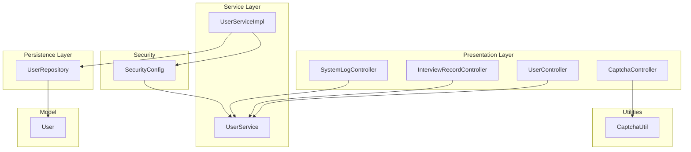

**Diagram sources**
- [UserController.java:1-58](file://src/main/java/com/wu/web/UserController.java#L1-L58)
- [CaptchaController.java:1-28](file://src/main/java/com/wu/web/CaptchaController.java#L1-L28)
- [InterviewRecordController.java:1-167](file://src/main/java/com/wu/web/InterviewRecordController.java#L1-L167)
- [SystemLogController.java:1-111](file://src/main/java/com/wu/web/SystemLogController.java#L1-L111)
- [UserService.java:1-10](file://src/main/java/com/wu/service/UserService.java#L1-L10)
- [UserServiceImpl.java:1-86](file://src/main/java/com/wu/service/impl/UserServiceImpl.java#L1-L86)
- [UserRepository.java:1-10](file://src/main/java/com/wu/repository/UserRepository.java#L1-L10)
- [User.java:1-58](file://src/main/java/com/wu/model/User.java#L1-L58)
- [SecurityConfig.java:1-60](file://src/main/java/com/wu/config/SecurityConfig.java#L1-L60)
- [CaptchaUtil.java:1-59](file://src/main/java/com/wu/util/CaptchaUtil.java#L1-L59)

**Section sources**
- [application.properties:1-14](file://src/main/resources/application.properties#L1-L14)

## Core Components
- User entity: Defines user identity, credentials, and role flag persisted via JPA.
- UserRepository: Provides JPA CRUD and username lookup.
- UserService and UserServiceImpl: Implement Spring Security’s UserDetailsService, handle registration, password encoding, and admin initialization.
- SecurityConfig: Configures form login, logout, permit-all paths, and role-based authorization.
- UserController: Exposes GET/POST endpoints for login and registration, integrates CAPTCHA verification.
- CaptchaController and CaptchaUtil: Generate and serve random CAPTCHA images and store the expected code in session.
- Controllers for protected resources: InterviewRecordController and SystemLogController enforce access control based on roles.

**Section sources**
- [User.java:1-58](file://src/main/java/com/wu/model/User.java#L1-L58)
- [UserRepository.java:1-10](file://src/main/java/com/wu/repository/UserRepository.java#L1-L10)
- [UserService.java:1-10](file://src/main/java/com/wu/service/UserService.java#L1-L10)
- [UserServiceImpl.java:1-86](file://src/main/java/com/wu/service/impl/UserServiceImpl.java#L1-L86)
- [SecurityConfig.java:1-60](file://src/main/java/com/wu/config/SecurityConfig.java#L1-L60)
- [UserController.java:1-58](file://src/main/java/com/wu/web/UserController.java#L1-L58)
- [CaptchaController.java:1-28](file://src/main/java/com/wu/web/CaptchaController.java#L1-L28)
- [CaptchaUtil.java:1-59](file://src/main/java/com/wu/util/CaptchaUtil.java#L1-L59)
- [InterviewRecordController.java:1-167](file://src/main/java/com/wu/web/InterviewRecordController.java#L1-L167)
- [SystemLogController.java:1-111](file://src/main/java/com/wu/web/SystemLogController.java#L1-L111)

## Architecture Overview
The system uses Spring MVC with Spring Security configured via Java config. Authentication is handled by a custom UserDetailsService backed by UserServiceImpl. Authorization is enforced using ant matchers and role authorities. Session management is standard servlet session-backed.

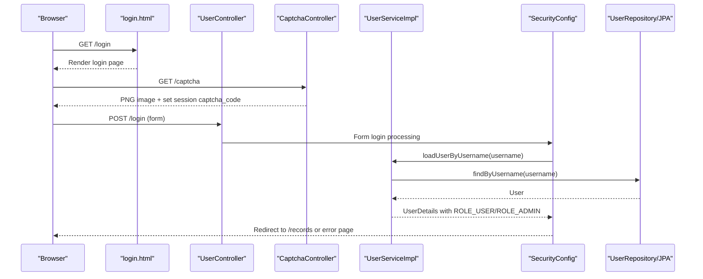

**Diagram sources**
- [login.html:1-136](file://src/main/resources/templates/login.html#L1-L136)
- [UserController.java:26-29](file://src/main/java/com/wu/web/UserController.java#L26-L29)
- [CaptchaController.java:17-27](file://src/main/java/com/wu/web/CaptchaController.java#L17-L27)
- [UserServiceImpl.java:40-48](file://src/main/java/com/wu/service/impl/UserServiceImpl.java#L40-L48)
- [SecurityConfig.java:37-58](file://src/main/java/com/wu/config/SecurityConfig.java#L37-L58)
- [UserRepository.java:8-10](file://src/main/java/com/wu/repository/UserRepository.java#L8-L10)

## Detailed Component Analysis

### User Entity
The User entity maps to the database table and includes:
- Primary key: userId (auto-generated)
- Unique username and password fields
- Role flag: isAdmin indicating admin privileges

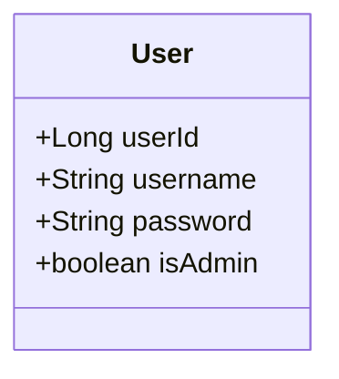

**Diagram sources**
- [User.java:10-58](file://src/main/java/com/wu/model/User.java#L10-L58)

**Section sources**
- [User.java:10-58](file://src/main/java/com/wu/model/User.java#L10-L58)

### User Registration Workflow with CAPTCHA
End-to-end flow:
- User visits /register and submits username, password, and CAPTCHA.
- UserController retrieves the expected CAPTCHA from session and compares it to the submitted value.
- On success, UserController delegates to UserService.register, which encodes the password and persists the user.
- On failure, an error message is flashed and the user is redirected back to the registration page.

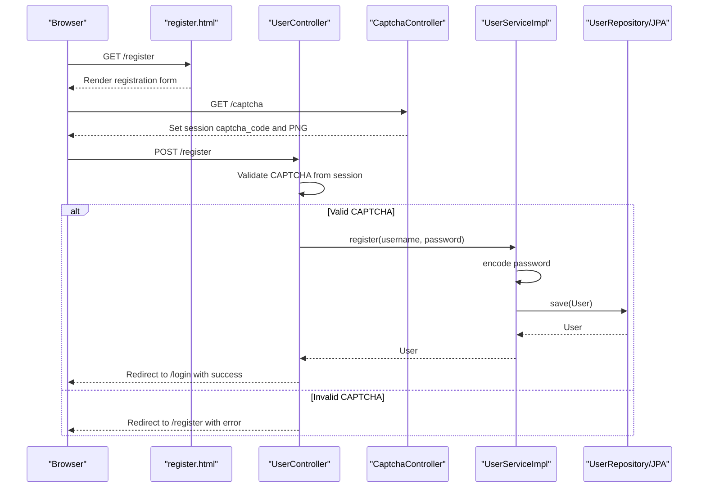

**Diagram sources**
- [register.html:1-150](file://src/main/resources/templates/register.html#L1-L150)
- [UserController.java:36-57](file://src/main/java/com/wu/web/UserController.java#L36-L57)
- [CaptchaController.java:15-27](file://src/main/java/com/wu/web/CaptchaController.java#L15-L27)
- [UserServiceImpl.java:50-64](file://src/main/java/com/wu/service/impl/UserServiceImpl.java#L50-L64)
- [UserRepository.java:8-10](file://src/main/java/com/wu/repository/UserRepository.java#L8-L10)

**Section sources**
- [UserController.java:36-57](file://src/main/java/com/wu/web/UserController.java#L36-L57)
- [CaptchaController.java:15-27](file://src/main/java/com/wu/web/CaptchaController.java#L15-L27)
- [CaptchaUtil.java:34-59](file://src/main/java/com/wu/util/CaptchaUtil.java#L34-L59)
- [UserServiceImpl.java:50-64](file://src/main/java/com/wu/service/impl/UserServiceImpl.java#L50-L64)

### Authentication and Authorization
- Authentication: Form login with loginPage, loginProcessingUrl, success/failure URLs.
- Authorization: Public endpoints for registration, login, and CAPTCHA; authenticated access for records and study; admin-only access for logs.
- Roles: ROLE_USER for regular users; ROLE_ADMIN for administrators.

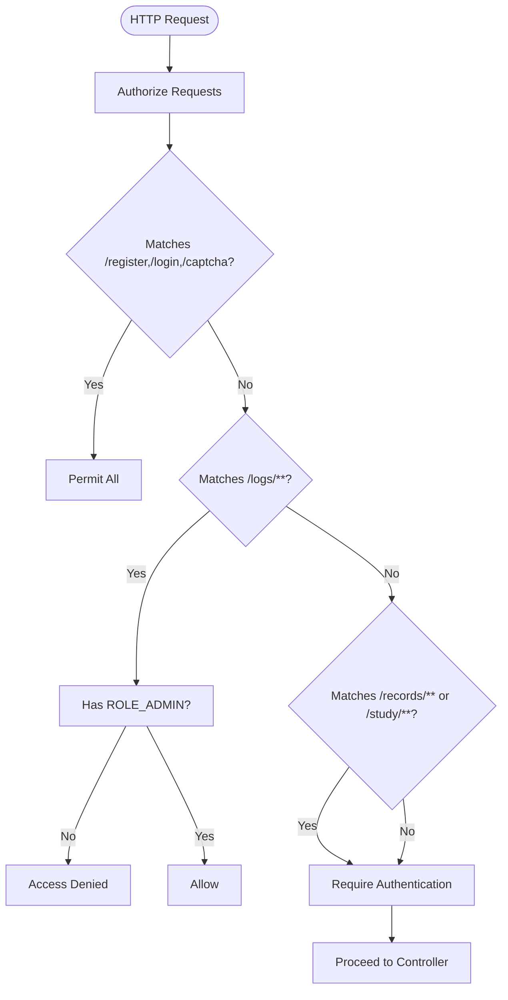

**Diagram sources**
- [SecurityConfig.java:37-58](file://src/main/java/com/wu/config/SecurityConfig.java#L37-L58)

**Section sources**
- [SecurityConfig.java:31-58](file://src/main/java/com/wu/config/SecurityConfig.java#L31-L58)

### Password Encoding
- PasswordEncoder bean uses BCrypt.
- UserServiceImpl encodes passwords during registration and admin creation.
- Spring Security uses the same encoder for authentication.

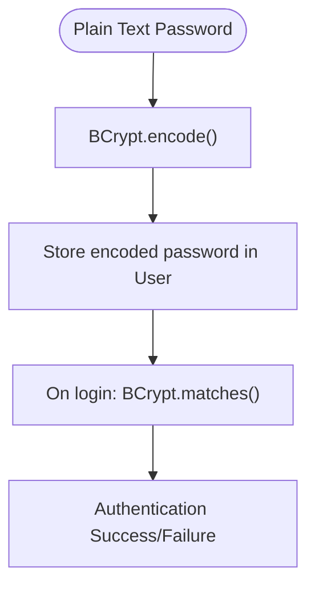

**Diagram sources**
- [SecurityConfig.java:26-29](file://src/main/java/com/wu/config/SecurityConfig.java#L26-L29)
- [UserServiceImpl.java:60](file://src/main/java/com/wu/service/impl/UserServiceImpl.java#L60)

**Section sources**
- [SecurityConfig.java:26-29](file://src/main/java/com/wu/config/SecurityConfig.java#L26-L29)
- [UserServiceImpl.java:60](file://src/main/java/com/wu/service/impl/UserServiceImpl.java#L60)

### Session Management
- CAPTCHA code is stored in the HTTP session under a fixed key.
- UserController validates the CAPTCHA against the session value and clears it after successful validation.
- Standard form login manages session automatically via Spring Security.

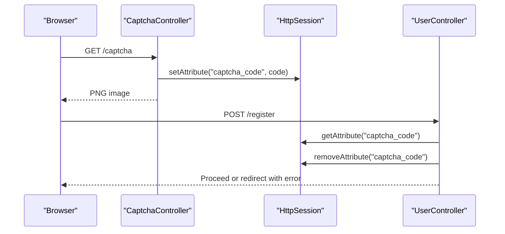

**Diagram sources**
- [CaptchaController.java:15-27](file://src/main/java/com/wu/web/CaptchaController.java#L15-L27)
- [UserController.java:43-48](file://src/main/java/com/wu/web/UserController.java#L43-L48)

**Section sources**
- [CaptchaController.java:15-27](file://src/main/java/com/wu/web/CaptchaController.java#L15-L27)
- [UserController.java:43-48](file://src/main/java/com/wu/web/UserController.java#L43-L48)

### Administrative User Management Capabilities
- Admin user initialization: UserServiceImpl ensures an admin user exists on startup.
- System log administration: SystemLogController enforces ROLE_ADMIN for viewing and managing logs, including deletion and clearing old logs.

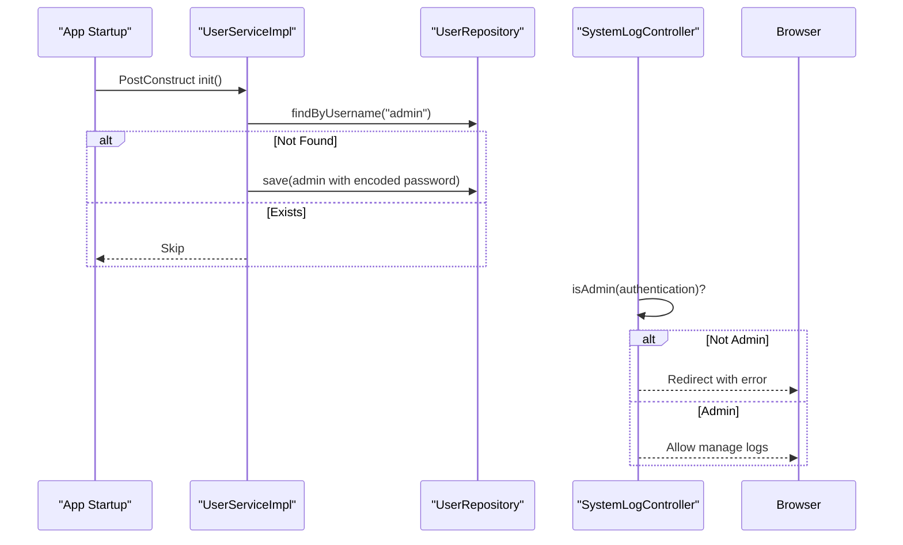

**Diagram sources**
- [UserServiceImpl.java:28-37](file://src/main/java/com/wu/service/impl/UserServiceImpl.java#L28-L37)
- [UserServiceImpl.java:72-85](file://src/main/java/com/wu/service/impl/UserServiceImpl.java#L72-L85)
- [SystemLogController.java:37-109](file://src/main/java/com/wu/web/SystemLogController.java#L37-L109)

**Section sources**
- [UserServiceImpl.java:28-37](file://src/main/java/com/wu/service/impl/UserServiceImpl.java#L28-L37)
- [UserServiceImpl.java:72-85](file://src/main/java/com/wu/service/impl/UserServiceImpl.java#L72-L85)
- [SystemLogController.java:37-109](file://src/main/java/com/wu/web/SystemLogController.java#L37-L109)

### UserController Endpoints
- GET /login: Renders the login page.
- GET /register: Renders the registration page.
- POST /register: Validates CAPTCHA, registers the user, and redirects appropriately.

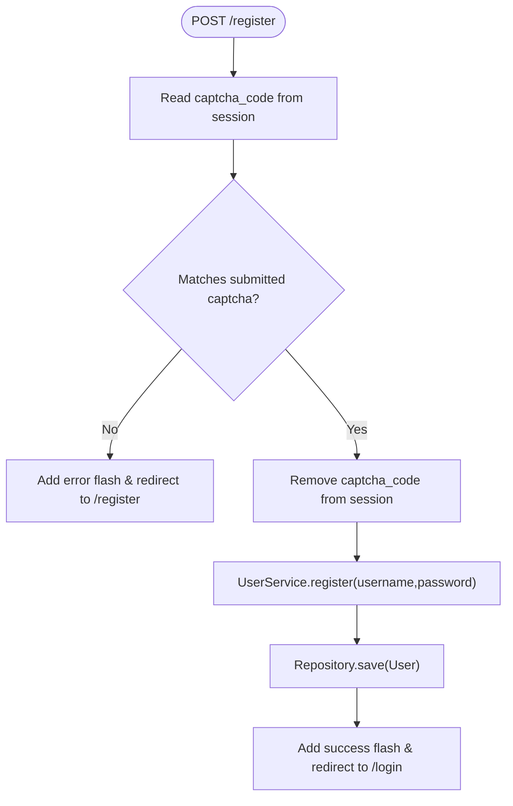

**Diagram sources**
- [UserController.java:36-57](file://src/main/java/com/wu/web/UserController.java#L36-L57)
- [UserServiceImpl.java:50-64](file://src/main/java/com/wu/service/impl/UserServiceImpl.java#L50-L64)
- [UserRepository.java:8-10](file://src/main/java/com/wu/repository/UserRepository.java#L8-L10)

**Section sources**
- [UserController.java:26-57](file://src/main/java/com/wu/web/UserController.java#L26-L57)

### UserService Implementation Details
- Implements UserDetailsService to integrate with Spring Security.
- Loads user by username, constructs UserDetails with appropriate authority based on isAdmin flag.
- Handles registration: uniqueness check, password encoding, persistence.
- Initializes admin user if not present.

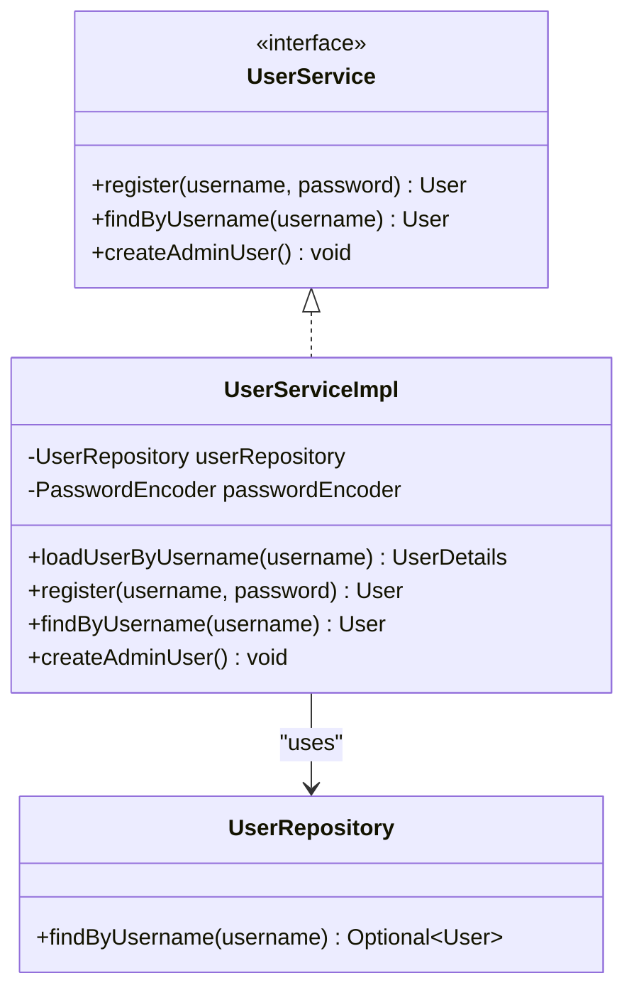

**Diagram sources**
- [UserService.java:6-10](file://src/main/java/com/wu/service/UserService.java#L6-L10)
- [UserServiceImpl.java:16-86](file://src/main/java/com/wu/service/impl/UserServiceImpl.java#L16-L86)
- [UserRepository.java:8-10](file://src/main/java/com/wu/repository/UserRepository.java#L8-L10)

**Section sources**
- [UserService.java:6-10](file://src/main/java/com/wu/service/UserService.java#L6-L10)
- [UserServiceImpl.java:39-48](file://src/main/java/com/wu/service/impl/UserServiceImpl.java#L39-L48)
- [UserServiceImpl.java:50-64](file://src/main/java/com/wu/service/impl/UserServiceImpl.java#L50-L64)
- [UserServiceImpl.java:72-85](file://src/main/java/com/wu/service/impl/UserServiceImpl.java#L72-L85)

### UserRepository Data Access Patterns
- Extends JpaRepository for basic CRUD operations.
- Provides findByUsername for user lookup by unique username.

**Section sources**
- [UserRepository.java:8-10](file://src/main/java/com/wu/repository/UserRepository.java#L8-L10)

### Security Best Practices Observed
- Passwords are hashed using BCrypt.
- Form login with explicit login and failure URLs.
- Role-based access control for sensitive paths (/logs/**).
- CSRF disabled; consider enabling CSRF protection in production environments.

**Section sources**
- [SecurityConfig.java:26-29](file://src/main/java/com/wu/config/SecurityConfig.java#L26-L29)
- [SecurityConfig.java:58](file://src/main/java/com/wu/config/SecurityConfig.java#L58)

## Dependency Analysis
Key dependencies and relationships:
- UserController depends on UserService and uses session for CAPTCHA.
- UserServiceImpl depends on UserRepository and PasswordEncoder.
- SecurityConfig wires UserDetailsService and defines authorizeRequests and formLogin.
- Controllers for protected resources depend on UserService to resolve current user and enforce admin checks.

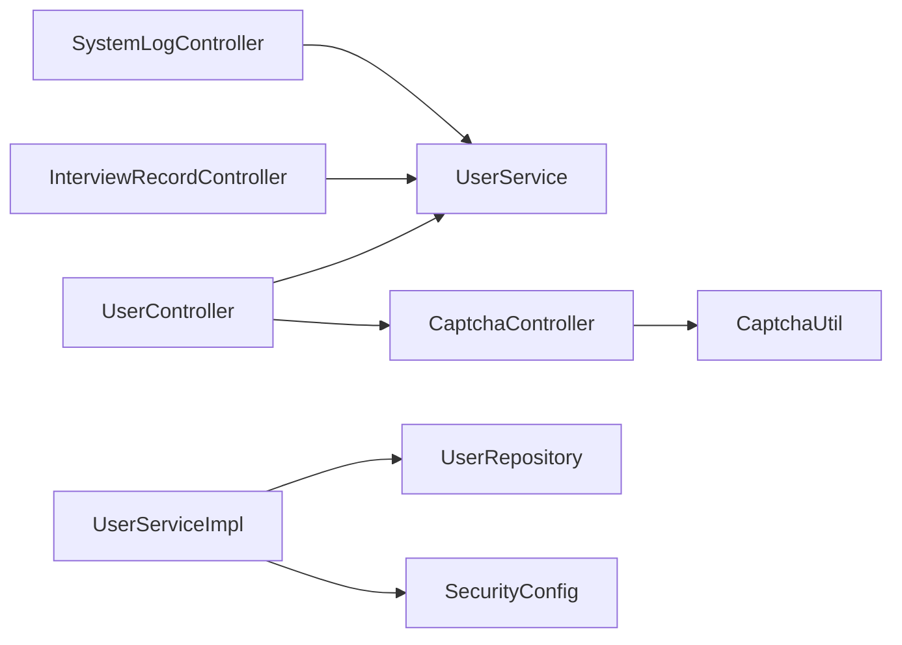

**Diagram sources**
- [UserController.java:19-24](file://src/main/java/com/wu/web/UserController.java#L19-L24)
- [UserServiceImpl.java:19-26](file://src/main/java/com/wu/service/impl/UserServiceImpl.java#L19-L26)
- [SecurityConfig.java:19-24](file://src/main/java/com/wu/config/SecurityConfig.java#L19-L24)
- [InterviewRecordController.java:32-38](file://src/main/java/com/wu/web/InterviewRecordController.java#L32-L38)
- [SystemLogController.java:25-34](file://src/main/java/com/wu/web/SystemLogController.java#L25-L34)
- [CaptchaController.java:13-15](file://src/main/java/com/wu/web/CaptchaController.java#L13-L15)
- [CaptchaUtil.java:9-32](file://src/main/java/com/wu/util/CaptchaUtil.java#L9-L32)

**Section sources**
- [UserController.java:19-24](file://src/main/java/com/wu/web/UserController.java#L19-L24)
- [UserServiceImpl.java:19-26](file://src/main/java/com/wu/service/impl/UserServiceImpl.java#L19-L26)
- [SecurityConfig.java:19-24](file://src/main/java/com/wu/config/SecurityConfig.java#L19-L24)
- [InterviewRecordController.java:32-38](file://src/main/java/com/wu/web/InterviewRecordController.java#L32-L38)
- [SystemLogController.java:25-34](file://src/main/java/com/wu/web/SystemLogController.java#L25-L34)
- [CaptchaController.java:13-15](file://src/main/java/com/wu/web/CaptchaController.java#L13-L15)
- [CaptchaUtil.java:9-32](file://src/main/java/com/wu/util/CaptchaUtil.java#L9-L32)

## Performance Considerations
- Password hashing is computationally intensive; ensure reasonable password policies and consider rate limiting for registration/login endpoints.
- CAPTCHA generation is lightweight but avoid excessive regeneration; the UI refreshes the image efficiently.
- Database queries for user lookup are simple; ensure proper indexing on username for scalability.

## Troubleshooting Guide
Common issues and resolutions:
- Registration fails with "用户名已存在": Ensure the username is unique; the service prevents duplicates.
- CAPTCHA validation errors: Verify the session contains the expected code and that the client-side image refresh is functioning.
- Login failures: Confirm the user exists and the password matches the encoded value; check form action and login processing URL.
- Access denied to /logs: Verify the current user has isAdmin set to true; confirm the role authority mapping.

**Section sources**
- [UserServiceImpl.java:53-55](file://src/main/java/com/wu/service/impl/UserServiceImpl.java#L53-L55)
- [UserController.java:44-47](file://src/main/java/com/wu/web/UserController.java#L44-L47)
- [SecurityConfig.java:41](file://src/main/java/com/wu/config/SecurityConfig.java#L41)
- [SystemLogController.java:103-109](file://src/main/java/com/wu/web/SystemLogController.java#L103-L109)

## Conclusion
The User Management System integrates Spring Security with a clean separation of concerns across model, repository, service, and web layers. It implements secure password handling, robust session-based CAPTCHA validation, and role-based access control. The design supports extensibility for administrative features and can be hardened further with CSRF protection and additional rate-limiting measures.