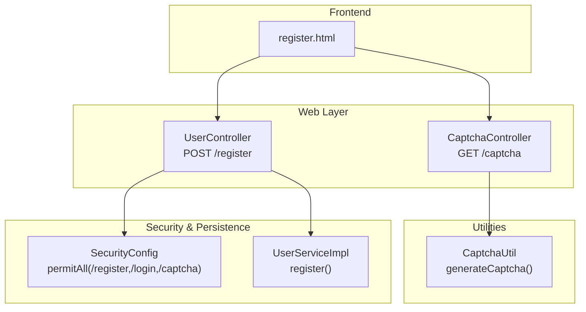
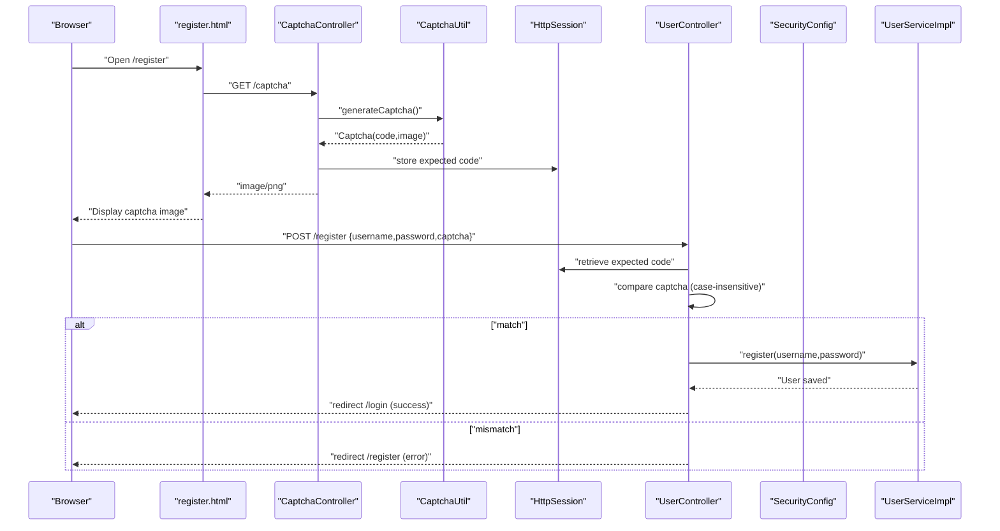
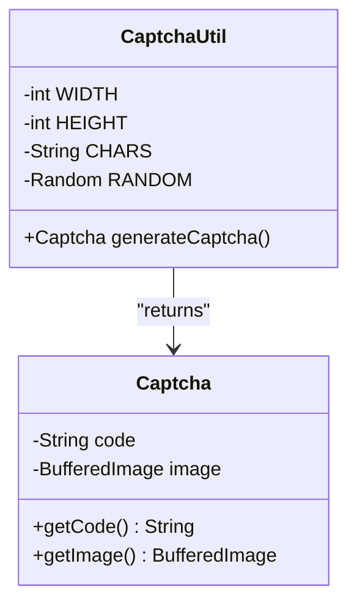
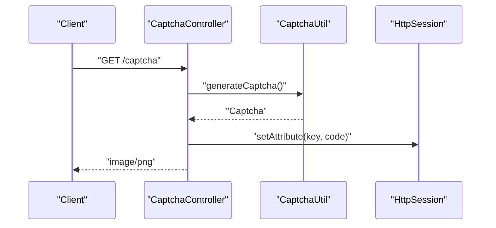
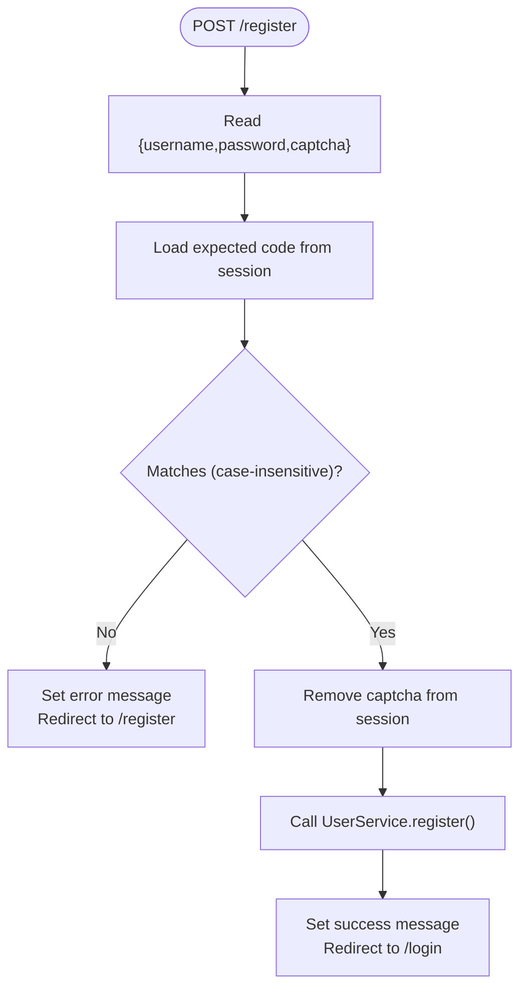
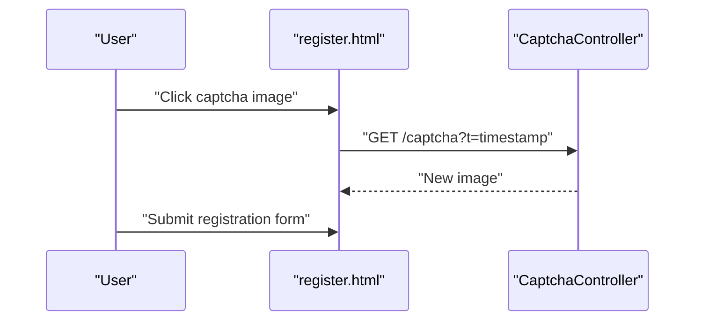
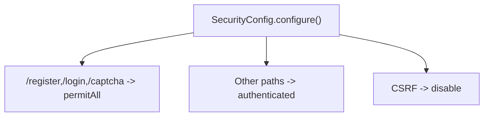
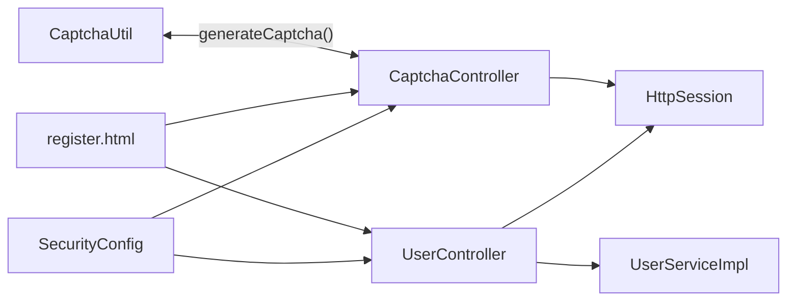

# Utility Components

<cite>
**Referenced Files in This Document**
- [CaptchaUtil.java](file://src/main/java/com/wu/util/CaptchaUtil.java)
- [CaptchaController.java](file://src/main/java/com/wu/web/CaptchaController.java)
- [UserController.java](file://src/main/java/com/wu/web/UserController.java)
- [register.html](file://src/main/resources/templates/register.html)
- [application.properties](file://src/main/resources/application.properties)
- [SecurityConfig.java](file://src/main/java/com/wu/config/SecurityConfig.java)
- [UserServiceImpl.java](file://src/main/java/com/wu/service/impl/UserServiceImpl.java)
</cite>

## Table of Contents
1. [Introduction](#introduction)
2. [Project Structure](#project-structure)
3. [Core Components](#core-components)
4. [Architecture Overview](#architecture-overview)
5. [Detailed Component Analysis](#detailed-component-analysis)
6. [Dependency Analysis](#dependency-analysis)
7. [Performance Considerations](#performance-considerations)
8. [Troubleshooting Guide](#troubleshooting-guide)
9. [Conclusion](#conclusion)

## Introduction
This document explains the utility components that power the captcha generation and validation system. It focuses on:
- CaptchaUtil: Securely generates randomized captcha images and associated codes
- CaptchaController: Serves captcha images via HTTP and stores the expected code in the user session
- UserController: Integrates captcha validation into the user registration workflow
- Frontend integration: How the registration page fetches and validates captcha images
- Security features, customization options, and integration patterns

## Project Structure
The captcha system spans three layers:
- Utilities: CaptchaUtil encapsulates image generation and code creation
- Web Controllers: CaptchaController serves the captcha image; UserController integrates validation into registration
- Templates: register.html renders the form, displays validation feedback, and refreshes captcha images

**Diagram sources**
- [CaptchaController.java:17-27](file://src/main/java/com/wu/web/CaptchaController.java#L17-L27)
- [CaptchaUtil.java:34-58](file://src/main/java/com/wu/util/CaptchaUtil.java#L34-L58)
- [UserController.java:36-57](file://src/main/java/com/wu/web/UserController.java#L36-L57)
- [register.html:108-140](file://src/main/resources/templates/register.html#L108-L140)
- [SecurityConfig.java:40](file://src/main/java/com/wu/config/SecurityConfig.java#L40)
- [UserServiceImpl.java:51-64](file://src/main/java/com/wu/service/impl/UserServiceImpl.java#L51-L64)

**Section sources**
- [CaptchaUtil.java:1-59](file://src/main/java/com/wu/util/CaptchaUtil.java#L1-L59)
- [CaptchaController.java:1-28](file://src/main/java/com/wu/web/CaptchaController.java#L1-L28)
- [UserController.java:1-58](file://src/main/java/com/wu/web/UserController.java#L1-L58)
- [register.html:1-150](file://src/main/resources/templates/register.html#L1-L150)
- [SecurityConfig.java:1-60](file://src/main/java/com/wu/config/SecurityConfig.java#L1-L60)
- [UserServiceImpl.java:1-86](file://src/main/java/com/wu/service/impl/UserServiceImpl.java#L1-L86)

## Core Components
- CaptchaUtil: Generates a 4-character alphanumeric code and draws it onto a buffered image with noise lines. Returns both the code and the image for rendering.
- CaptchaController: Produces PNG images for client consumption, sets cache-control headers, and stores the expected code in the HTTP session under a dedicated key.
- UserController: Validates the user-submitted captcha against the session-stored value during registration, enforces case-insensitive comparison, and proceeds with user creation upon success.
- register.html: Provides the registration form, displays flash messages, embeds the captcha image, and allows refreshing via a JavaScript function that requests a new captcha.

**Section sources**
- [CaptchaUtil.java:16-58](file://src/main/java/com/wu/util/CaptchaUtil.java#L16-L58)
- [CaptchaController.java:15-27](file://src/main/java/com/wu/web/CaptchaController.java#L15-L27)
- [UserController.java:36-57](file://src/main/java/com/wu/web/UserController.java#L36-L57)
- [register.html:108-140](file://src/main/resources/templates/register.html#L108-L140)

## Architecture Overview
The captcha flow integrates frontend, backend, and persistence/security layers:

**Diagram sources**
- [CaptchaController.java:17-27](file://src/main/java/com/wu/web/CaptchaController.java#L17-L27)
- [CaptchaUtil.java:34-58](file://src/main/java/com/wu/util/CaptchaUtil.java#L34-L58)
- [UserController.java:36-57](file://src/main/java/com/wu/web/UserController.java#L36-L57)
- [register.html:122-142](file://src/main/resources/templates/register.html#L122-L142)
- [SecurityConfig.java:40](file://src/main/java/com/wu/config/SecurityConfig.java#L40)
- [UserServiceImpl.java:51-64](file://src/main/java/com/wu/service/impl/UserServiceImpl.java#L51-L64)

## Detailed Component Analysis

### CaptchaUtil
Responsibilities:
- Builds a fixed-size RGB image buffer
- Draws a 4-character code using a restricted character set to avoid ambiguous glyphs
- Adds random colored noise lines to increase OCR resistance
- Returns a small inner class encapsulating both the code and the image

Security and customization considerations:
- Character set excludes easily confused characters (e.g., 0/O, 1/l/I)
- Randomized colors and positions for each character and line
- Fixed image dimensions enable predictable rendering and scanning difficulty
- The code is returned as a simple string; case-insensitive comparison is recommended at validation time

**Diagram sources**
- [CaptchaUtil.java:11-14](file://src/main/java/com/wu/util/CaptchaUtil.java#L11-L14)
- [CaptchaUtil.java:16-32](file://src/main/java/com/wu/util/CaptchaUtil.java#L16-L32)
- [CaptchaUtil.java:34-58](file://src/main/java/com/wu/util/CaptchaUtil.java#L34-L58)

**Section sources**
- [CaptchaUtil.java:9-59](file://src/main/java/com/wu/util/CaptchaUtil.java#L9-L59)

### CaptchaController
Responsibilities:
- Serves PNG images for the captcha endpoint
- Sets appropriate headers to prevent caching
- Generates a captcha via CaptchaUtil and stores the expected code in the HTTP session
- Streams the image bytes to the client

Integration details:
- Uses a constant session key for storing the expected code
- Exposes the endpoint publicly so clients can fetch a fresh captcha per request

**Diagram sources**
- [CaptchaController.java:17-27](file://src/main/java/com/wu/web/CaptchaController.java#L17-L27)
- [CaptchaUtil.java:34-58](file://src/main/java/com/wu/util/CaptchaUtil.java#L34-L58)

**Section sources**
- [CaptchaController.java:12-28](file://src/main/java/com/wu/web/CaptchaController.java#L12-L28)

### UserController (Registration Workflow)
Responsibilities:
- Validates the submitted captcha against the session-stored expected code
- Enforces case-insensitive comparison
- Clears the session captcha after successful validation
- Delegates user creation to UserServiceImpl
- Handles validation errors via flash attributes and redirects

**Diagram sources**
- [UserController.java:36-57](file://src/main/java/com/wu/web/UserController.java#L36-L57)
- [UserServiceImpl.java:51-64](file://src/main/java/com/wu/service/impl/UserServiceImpl.java#L51-L64)

**Section sources**
- [UserController.java:36-57](file://src/main/java/com/wu/web/UserController.java#L36-L57)
- [UserServiceImpl.java:51-64](file://src/main/java/com/wu/service/impl/UserServiceImpl.java#L51-L64)

### Frontend Integration (register.html)
Responsibilities:
- Renders the registration form with fields for username, password, and captcha
- Displays flash messages for success/error feedback
- Embeds the captcha image and enables refresh via a JavaScript function that appends a timestamp to bypass browser caching
- Submits the form to the server for processing

**Diagram sources**
- [register.html:108-140](file://src/main/resources/templates/register.html#L108-L140)
- [CaptchaController.java:17-27](file://src/main/java/com/wu/web/CaptchaController.java#L17-L27)

**Section sources**
- [register.html:108-140](file://src/main/resources/templates/register.html#L108-L140)

### Security Configuration
- Public endpoints: Registration, login, and captcha endpoints are permitted without authentication
- CSRF disabled globally in the configuration
- Password encoding handled by BCryptPasswordEncoder in SecurityConfig
- Authentication and authorization rules apply to other endpoints

**Diagram sources**
- [SecurityConfig.java:37-58](file://src/main/java/com/wu/config/SecurityConfig.java#L37-L58)

**Section sources**
- [SecurityConfig.java:37-58](file://src/main/java/com/wu/config/SecurityConfig.java#L37-L58)

## Dependency Analysis
Key relationships:
- CaptchaController depends on CaptchaUtil to produce images and codes
- UserController depends on HttpSession to validate the captcha and on UserServiceImpl to persist the user
- register.html depends on the captcha endpoint and the registration endpoint
- SecurityConfig permits access to the captcha endpoint and registration/login pages

**Diagram sources**
- [CaptchaUtil.java:34-58](file://src/main/java/com/wu/util/CaptchaUtil.java#L34-L58)
- [CaptchaController.java:23-24](file://src/main/java/com/wu/web/CaptchaController.java#L23-L24)
- [UserController.java:43-48](file://src/main/java/com/wu/web/UserController.java#L43-L48)
- [UserServiceImpl.java:51-64](file://src/main/java/com/wu/service/impl/UserServiceImpl.java#L51-L64)
- [register.html:122-142](file://src/main/resources/templates/register.html#L122-L142)
- [SecurityConfig.java:40](file://src/main/java/com/wu/config/SecurityConfig.java#L40)

**Section sources**
- [CaptchaController.java:3,15](file://src/main/java/com/wu/web/CaptchaController.java#L3,L15)
- [UserController.java:3,13](file://src/main/java/com/wu/web/UserController.java#L3,L13)
- [UserServiceImpl.java:3,11](file://src/main/java/com/wu/service/impl/UserServiceImpl.java#L3,L11)
- [SecurityConfig.java:12,16](file://src/main/java/com/wu/config/SecurityConfig.java#L12,L16)

## Performance Considerations
- Image generation cost: CaptchaUtil performs lightweight drawing operations; overhead is minimal for typical loads
- Caching policy: CaptchaController disables caching to ensure freshness; consider CDN or reverse proxy caching with short TTLs if scaling
- Session storage: Storing a single string per session is negligible; ensure session timeout aligns with UX expectations
- Rendering: The fixed image size keeps bandwidth low; adjust dimensions carefully to balance readability and OCR resistance

[No sources needed since this section provides general guidance]

## Troubleshooting Guide
Common issues and resolutions:
- Captcha mismatch errors: Ensure the frontend sends the exact expected code; the comparison is case-insensitive but still requires an exact match
- Expired or missing session code: Verify that the captcha endpoint is called before submitting the registration form; the session attribute is cleared after successful validation
- No-cache headers: If the browser caches the image, force-refresh the captcha image or append a timestamp parameter as implemented in the frontend
- Endpoint permissions: Confirm that the captcha endpoint is permitted by the security configuration; otherwise, clients cannot fetch images
- Password encoding: User passwords are encoded before persistence; ensure the encoder bean is configured correctly

**Section sources**
- [UserController.java:43-48](file://src/main/java/com/wu/web/UserController.java#L43-L48)
- [CaptchaController.java:19-21](file://src/main/java/com/wu/web/CaptchaController.java#L19-L21)
- [SecurityConfig.java:40](file://src/main/java/com/wu/config/SecurityConfig.java#L40)
- [UserServiceImpl.java:60](file://src/main/java/com/wu/service/impl/UserServiceImpl.java#L60)

## Conclusion
The captcha system combines a compact image generator, a simple HTTP endpoint, and a straightforward validation flow embedded in the registration controller. Its design emphasizes simplicity, readability, and basic anti-bot characteristics through randomized visuals and explicit user interaction. For production deployments, consider adding rate limiting, stronger anti-automation controls, and centralized configuration for captcha parameters.